# targil0
# מיני פרויקט בבסיסי נתונים - אגף עיצוב וייצור

**מגישות:** שרי אדלר, מיכל גרינבלט וחני כהן  

**קורס:** מיני פרויקט בבסיסי נתונים  
**נושא האגף:** עיצוב וייצור (דגמים, חומרי גלם, מוצרים, ספקים ועובדים)
---
## שלב א – תכנון, עיצוב וייצור בסיס הנתונים
<details>
<summary><b> מבוא וניתוח המערכת</b></summary>

### 1. ניתוח מערכת TOP-DOWN
בשלב זה תוכננו מסכי המערכת הראשוניים בעזרת Google AI Studio. המטרה היא להמחיש את זרימת המידע בין הישויות השונות (מוצרים, חומרי גלם ועיצובים) בממשק המשתמש.

#### סקיצות ממשק (Wireframes):

**לוח בקרה (Dashboard):**
מציג סטטיסטיקות על תהליכי הייצור ומלאי חומרי הגלם.
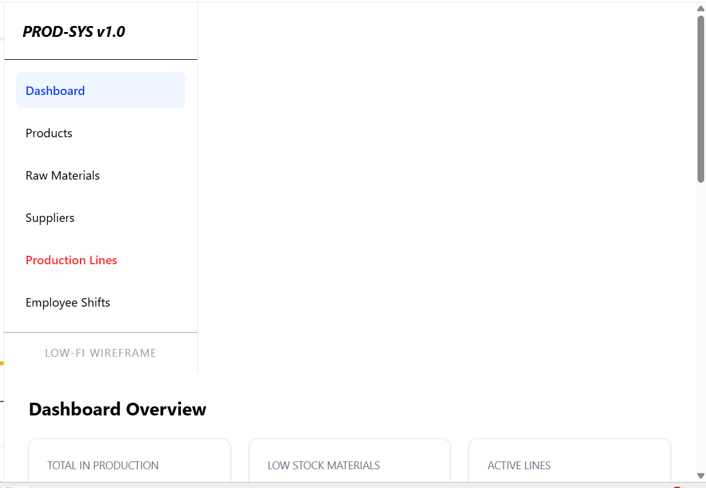

**ניהול מוצרים:**
טבלת מעקב אחר מוצרים קיימים והקשר שלהם לדגמי העיצוב.
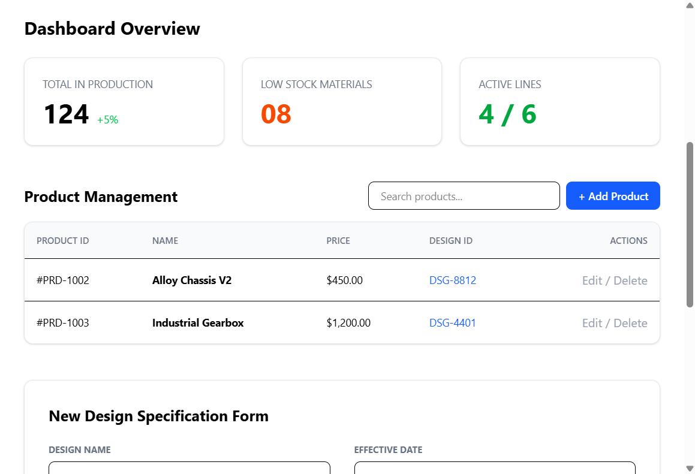

**טופס הזנת עיצוב חדש:**
ממשק להזנת מפרטים טכניים כולל תמיכה בפורמט JSON.
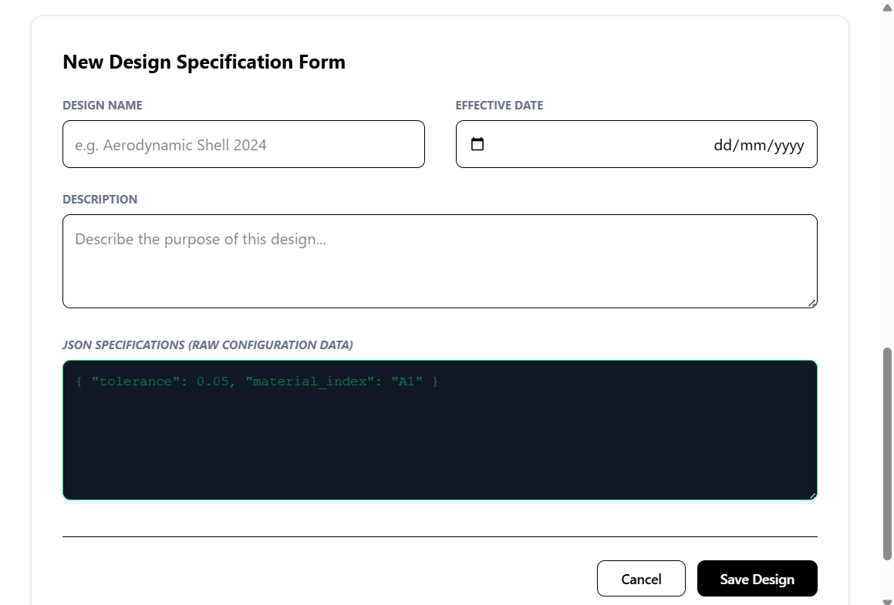

**ניהול ספקים:**
מסך לניהול ספקים, כולל צפייה, הוספה ועדכון פרטי ספקים במערכת.
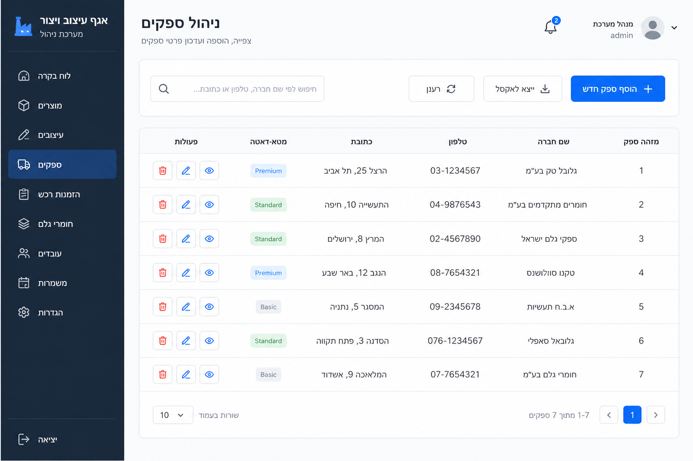

### מבוא ותיאור המערכת
פרויקט זה מתמקד ב**אגף עיצוב וייצור** כחלק ממערכת כוללת לניהול רשת חנויות. 
האגף אחראי על ניהול מחזור החיים של המוצר מרמת הרעיון והעיצוב ועד לייצורו בפועל, תוך תיאום עם ספקים לניהול חומרי הגלם ושיבוץ עובדים למשמרות הייצור.

**תחומי אחריות באגף:**
* **אגף מחקר ופיתוח (R&D):** ניהול דגמים (Designs) ומפרטי JSON טכניים.
* **לוגיסטיקה ורכש פנים-אגפי:** מעקב אחר חומרי גלם (Raw Materials) והזמנות רכש מול ספקים.
* **ייצור:** ניהול קווי ייצור (Production Lines) והפיכת דגמים למוצרים (Products) סופיים המוכנים למכירה בחנות.
* **ניהול כוח אדם:** שיוך עובדים (Employees) למחלקות ושיבוצם במשמרות (Work Shifts)..
</details>

<details>
<summary><b>  ERD תכנון לוגי - דיאגרמת </b></summary>
<br>
## 2. תכנון לוגי - דיאגרמת ERD
המערכת מורכבת מ-**9 ישויות מרכזיות**. לכל ישות הוגדרו לפחות 5 תכונות (Attributes) כדי להבטיח פירוט נתונים מרבי ודיוק בתהליכי העבודה.

### דיאגרמת ERD:


### מאפייני המודל הלוגי

כל ישות במערכת כוללת לפחות 5 תכונות בהתאם לדרישות המטלה.
הוגדרו קשרים בין הישויות עם עוצמות (Cardinality), כגון:
- קשר מסוג 1:N (לדוגמה: Department – Employee, Supplier – SupplyOrder)
- קשר מסוג M:N (לדוגמה: Design – RawMaterial, SupplyOrder – RawMaterial)
נעשה שימוש בסוגי נתונים מגוונים:
- שדות מסוג Date (לדוגמה: P_date, D_date, Order_date, WS_date)
- שדות מסוג JSON (לדוגמה: JSON_Specs, Supplier_Metadata)
קיימים מספר שדות תאריך במערכת, לצורך שימוש בשאילתות בשלבים מתקדמים.

</details>

<details>
<summary><b> נירמול ותלויות פונקציונליות (BCNF)</b></summary>
<br>
## 3. נירמול ותלויות פונקציונליות (Normalization & Functional Dependencies)

כל הטבלאות במערכת תוכננו כך שיעמדו ברמת נירמול **BCNF** (Boyce-Codd Normal Form). להלן פירוט התלויות והנירמול עבור כל סכמה:

### ישויות מרכזיות

* **Product (מוצר):**
    * **תלויות פונקציונליות:** $P\_id \rightarrow P\_name, P\_price, P\_weight, P\_date, D\_id, PL\_id$
    * **רמת נירמול:** BCNF.
    * **הסבר:** המפתח הראשי $P\_id$ הוא המכריע הפונקציונלי היחיד בטבלה. כל שאר השדות תלויים בו באופן מלא ואין תלויות טרנזיטיביות.

* **Employee (עובד):**
    * **תלויות פונקציונליות:** $E\_id \rightarrow E\_name, E\_familyName, E\_date, Role, DE\_id$
    * **רמת נירמול:** BCNF.
    * **הסבר:** כל פרטי העובד והמחלקה אליה הוא שייך נקבעים אך ורק לפי המזהה הייחודי $E\_id$.

* **Department (מחלקה):**
    * **תלויות פונקציונליות:** $DE\_id \rightarrow DE\_name, Location, Budget, Manager\_Name$
    * **רמת נירמול:** BCNF.
    * **הסבר:** אין שדות שאינם מפתחות שקובעים שדות אחרים (למשל, המיקום לא קובע את שם המחלקה).

* **SupplyOrder (הזמנת רכש):**
    * **תלויות פונקציונליות:** $Order\_id \rightarrow Order\_date, Total, Order\_status, Shipping\_Method, S\_id$
    * **רמת נירמול:** BCNF.
    * **הסבר:** למרות ש-$Total$ הוא אטריביוט נגזר, בבסיס הנתונים הפיזי הוא תלוי ב-$Order\_id$ בלבד.

* **Supplier (ספק):**
    * **תלויות פונקציונליות:** $S\_id \rightarrow Company\_Name, Phone, Address, Supplier\_MetaData$
    * **רמת נירמול:** BCNF.

* **Design, RawMaterial, Product_Line, Work_Ship:**
    * כל הטבלאות הללו נמצאות ב-BCNF מכיוון שלכל אחת מפתח ראשי יחיד ($D\_id, R\_id, PL\_id, WS\_id$ בהתאמה) המהווה את המכריע היחיד לכל שאר תכונות הישות.

---

### טבלאות קשר (Many-to-Many)

בטבלאות אלו המפתח מורכב משני שדות (Composite Primary Key).

* **Includes, Requires, Employee_WorkShip:**
    * **רמת נירמול:** BCNF.
    * **הסבר:** בטבלאות אלו אין תכונות נוספות מעבר למפתחות הזרים המרכיבים את המפתח הראשי. לכן, אין תלויות פונקציונליות שאינן טריוויאליות, והן עומדות בהגדרה המחמירה של BCNF.

---

### סיכום רמת הנירמול
המערכת כולה נמצאת ברמת נירמול **BCNF** מהסיבות הבאות:
1.  כל הטבלאות בנרמול ראשון (ערכים אטומיים, כולל שדות JSON המטופלים כאובייקט שלם).
2.  אין תלויות חלקיות (כל השדות תלויים במפתח הראשי במלואו).
3.  אין תלויות טרנזיטיביות (שדה שאינו מפתח לא קובע שדה אחר שאינו מפתח).
4.  לכל תלות פונקציונלית $X \rightarrow Y$, $X$ הוא מפתח-על (Superkey).

</details>

<details>
<summary><b>  מימוש פיזי, מילוי נתונים וגיבוי המערכת </b></summary>
<br>

### מעבר מהתכנון הלוגי למימוש הפיזי

המעבר מהתכנון הלוגי למימוש הפיזי בוצע על בסיס דיאגרמת ה-ERD.  
פקודות CREATE TABLE נכתבו בהתאם למבנה הישויות, התכונות והקשרים שהוגדרו בתכנון, ולאחר מכן הורצו ב-pgAdmin ליצירת הסכמה המלאה.

### DSD - Data Structure Diagram

לאחר בניית הטבלאות ב-PostgreSQL, הופק תרשים ה-DSD (Data Structure Diagram) המשקף את מבנה הנתונים הסופי. התרשים מציג את טיפוסי הנתונים המדויקים, המפתחות הראשיים והקשרים הפיזיים (Foreign Keys) בין הישויות באגף הייצור.

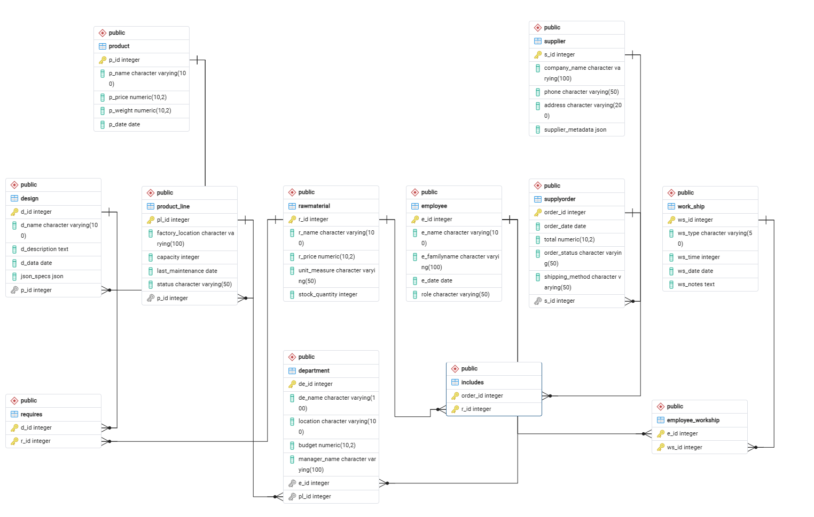

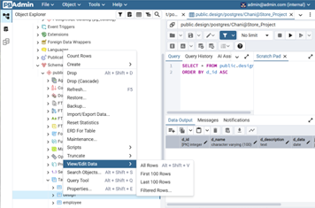

<details>
<summary><b>שיטת Python</b></summary>
<br>

---

***💻 א. מימוש פיזי בבסיס הנתונים***
בשלב זה הפכנו את המודל הלוגי (ERD) לבסיס נתונים פיזי מתפקד בתוך סביבת המערכת ב-pgAdmin.

**תיאור המימוש:**
באמצעות ממשק ה-pgAdmin, הרצנו סקריפטים של SQL ליצירת הסכימה המלאה הכוללת את כל הטבלאות והקשרים. התמונה להלן מציגה את מבנה הטבלאות כפי שנוצרו:


ניתן לראות כי כל הטבלאות שהוגדרו בתכנון אכן נוצרו בהצלחה בבסיס הנתונים.

* **אימות מימוש**: ניתן לראות כי כל הישויות שהוגדרו בתכנון נוצרו בהצלחה תחת הסכימה הציבורית (public).
* **אילוצים וקשרים**: המימוש כולל הגדרת מפתחות ראשיים (PK) ומפתחות זרים (FK) המבטיחים את שלמות הנתונים.

---

***🐍 ב. מילוי נתונים (Data Population) - אסטרטגיה וביצוע***

כדי לעמוד בדרישה של מעל **500 רשומות** בטבלאות המרכזיות ולשמור על דיוק מקצועי, בחרנו להשתמש באוטומציה של סקריפטים ב-Python. התהליך בוצע בסדר כרונולוגי מחייב כדי למנוע שגיאות של מפתחות זרים.

---

#### 🛠 שלב 1: יצירת תשתית המוצרים (`fill_products.py`)
בשלב הראשון כתבנו קוד Python שמייצר נתונים רנדומליים אך הגיוניים עבור המוצרים שלנו. הקוד יוצר קובץ SQL מוכן להרצה.


---

#### 🎨 שלב 2: יצירת פקודות ה-Insert
כאן ניתן לראות את קובץ ה-SQL שנוצר (`insert_products.sql`) עם פקודות ה-INSERT המוכנות. כללנו לוגיקה שיוצרת גם ערכי **NULL** באופן רנדומלי כדי לעמוד בדרישות הפרויקט לטיפול בנתונים חסרים.


---

#### 🚀 שלב 3: ייבוא ואימות ב-pgAdmin
העתקנו את פקודות ה-Insert לתוך ה-Query Tool ב-**pgAdmin** והרצנו אותן כדי למלא את הטבלאות בפועל.

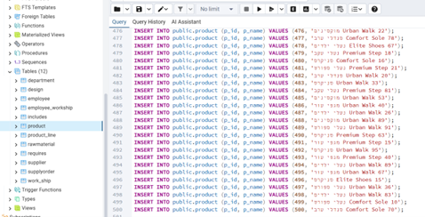

בסיום התהליך, ביצענו שאילתת **COUNT** על טבלת העיצובים (design) כדי לוודא שכל 500 הרשומות נקלטו בהצלחה בבסיס הנתונים.


הנתונים שנוצרו באמצעות סקריפט Python הוזנו בהצלחה לבסיס הנתונים כפי שניתן לראות בתוצאה.

</details>

<details>
<summary><b>שיטת Mockaroo (SQL Export) - טבלת Supplier</b></summary>
<br>

בשיטה זו השתמשנו באתר [Mockaroo](https://www.mockaroo.com/) כדי למלא 500 רשומות לטבלת הספקים. זה עזר לנו לייצר נתונים שנראים אמיתיים בצורה מהירה ומדויקת.

**כך נראה התהליך שעשינו:**

**1. הגדרת הנתונים באתר:**
בצילום המסך אפשר לראות איך התאמנו את סוגי השדות (שם חברה, כתובת, טלפון) למבנה הטבלה שלנו. כדי לעמוד בדרישה של המטלה לערכים חסרים, הגדרנו אחוזי **Blank** (ערכי NULL) בשדות הטלפון והכתובת.


---

**2. בדיקת הנתונים לפני ההורדה:**
כאן אפשר לראות בתצוגה המקדימה שהאתר אכן ייצר נתונים בפורמט הנכון, כולל שמות חברות באנגלית ונתוני ה-JSON, מה שמוודא שהקובץ יהיה תקין לפני הייבוא.


---

**3. שמירה וניהול ב-VS Code:**
הורדנו את הנתונים כקובץ SQL ושמרנו אותו בתיקיית הפרויקט שלנו. בתמונה רואים איך הקוד נראה בתוך ה-**VS Code** – שמירת הקובץ כאן מאפשרת לכל הבנות בצוות למשוך את הקובץ מה-GitHub ולהשתמש בו בבסיס הנתונים המקומי שלהן.


---

**4. הרצה ב-pgAdmin:**
העתקנו את פקודות ה-Insert מהקובץ והרצנו אותן ב-Query Tool. התמונה מראה את רגע ההרצה בתוך התוכנה והזנת הנתונים למחסן הנתונים הפיזי.

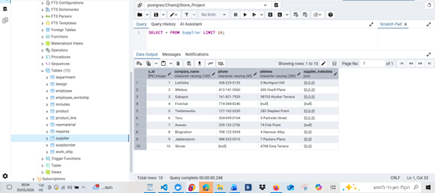

---

**5. התוצאה הסופית:**
בבדיקה בבסיס הנתונים אפשר לראות שהטבלה התמלאה ב-500 שורות. ניתן לראות בבירור את ערכי ה-**NULL** (השדות הריקים) שנוצרו רנדומלית, בדיוק לפי דרישות הפרויקט.

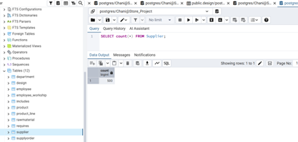
ניתן לראות כי חלק מהשדות מכילים ערכי NULL בהתאם לדרישות המטלה.

</details>

</details>

<details>
<summary><b>שיטת Mockaroo (SQL Export) - טבלאות Product ו־Design</b></summary>

כדי למלא 500 רשומות בטבלאות המרכזיות, השתמשנו באתר Mockaroo ליצירת נתונים אקראיים בצורה מהירה ואמינה.

בשלב הראשון הגדרנו את השדות בהתאם למבנה הטבלאות, ולאחר מכן ייצאנו את הנתונים בפורמט SQL.

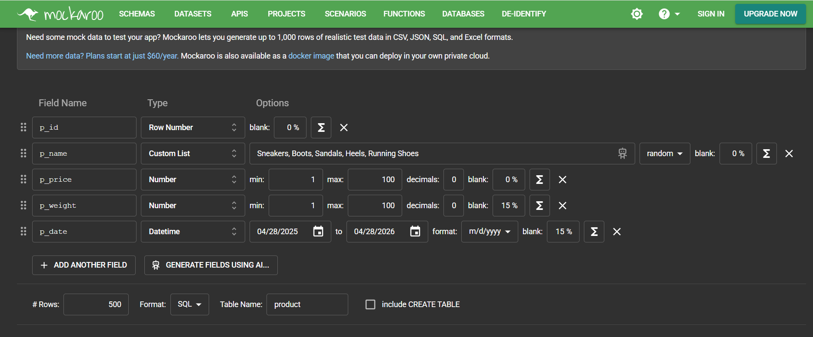

את קובצי ה־SQL הרצנו ב־pgAdmin, וכך הוזנו הנתונים לטבלאות Product ו־Design.

לאחר ההרצה ביצענו בדיקת COUNT על מנת לוודא שכל הנתונים הוכנסו בהצלחה.

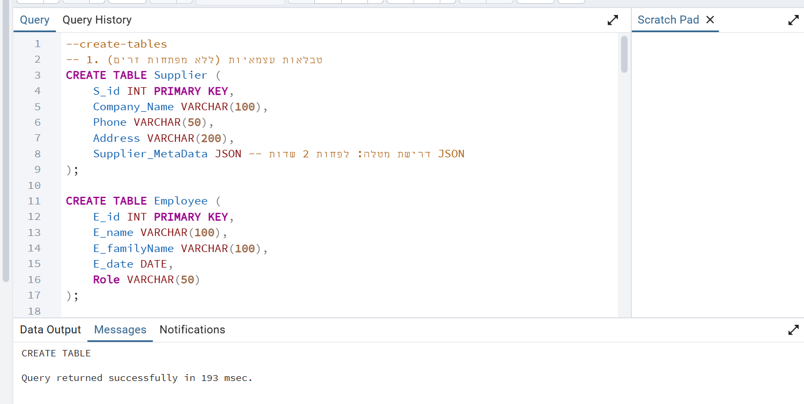
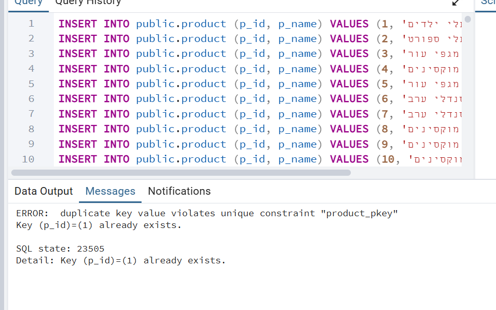
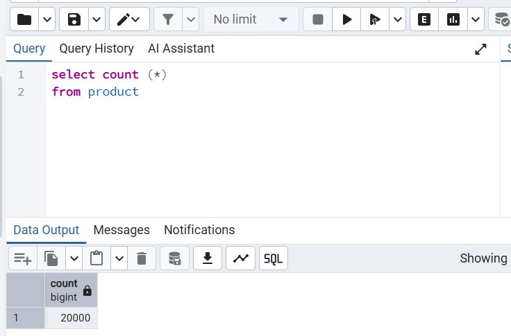
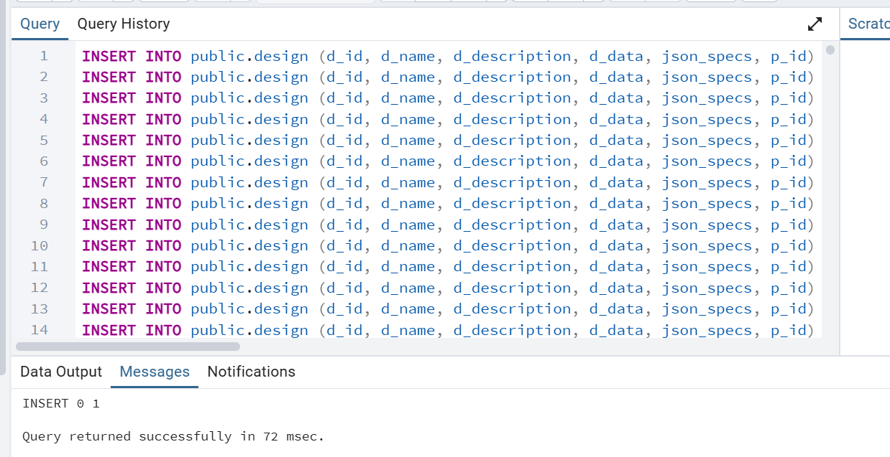


</details>

---

<details>
<summary><b>שיטת SQL (Generate Series) - טבלת RawMaterial</b></summary>

בטבלה זו השתמשנו בפקודת SQL מובנית של PostgreSQL בשם generate_series כדי ליצור כמות גדולה של נתונים בצורה אוטומטית.

בתחילה הוכנסו מספר רשומות ידניות לצורך בדיקה, ולאחר מכן בוצעה הכנסת נתונים אוטומטית באמצעות generate_series יחד עם פונקציות random ליצירת מחירים וכמויות.

השיטה אפשרה יצירה מהירה ויעילה של 500 רשומות ללא שימוש בכלים חיצוניים.

לאחר ההרצה ביצענו בדיקת COUNT כדי לוודא שהנתונים הוכנסו בהצלחה.

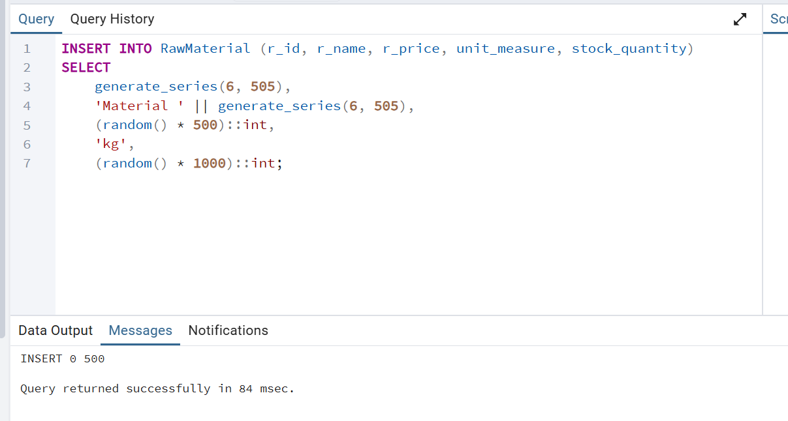


בתמונה הבאה ניתן לראות בדיקה מרוכזת של כמות הרשומות בכל הטבלאות לאחר הכנסת הנתונים:
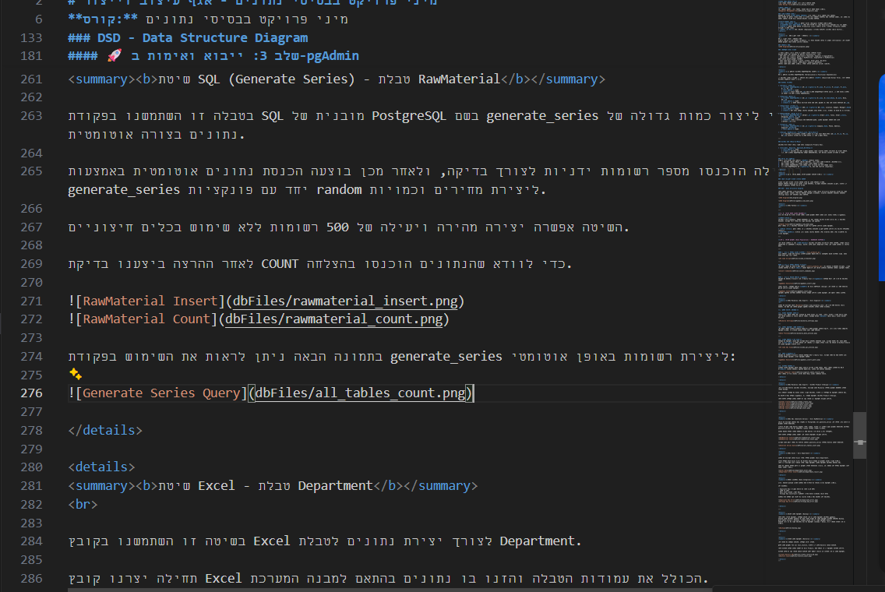

</details>

<details>
<summary><b>שיטת Excel - טבלת Department</b></summary>
<br>

בשיטה זו השתמשנו בקובץ Excel לצורך יצירת נתונים לטבלת Department.

תחילה נבנה קובץ Excel הכולל את כל העמודות בהתאם למבנה הטבלה במערכת:
DE_id, DE_name, Location, Budget, Manager_Name, E_id, PL_id.

הנתונים נוצרו בצורה אוטומטית באמצעות גרירה (fill) באקסל, כך שנוצרו רשומות רבות בצורה מהירה ויעילה.

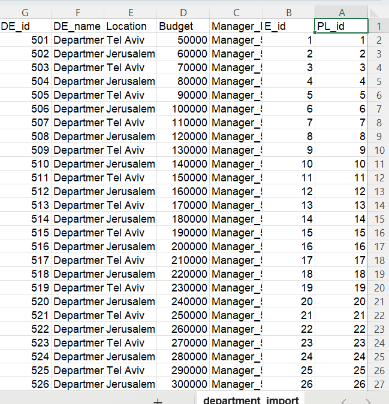

לאחר מכן שמרנו את הקובץ בפורמט CSV (UTF-8), והשתמשנו ב־pgAdmin כדי לייבא את הנתונים לטבלה באמצעות האפשרות Import.

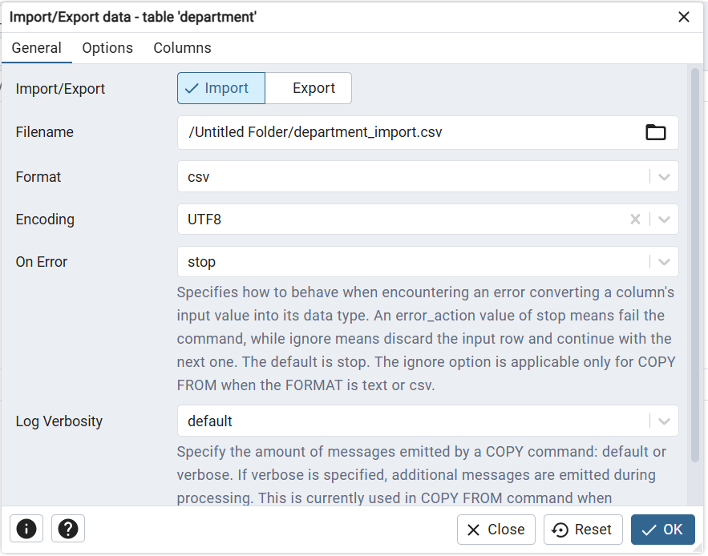

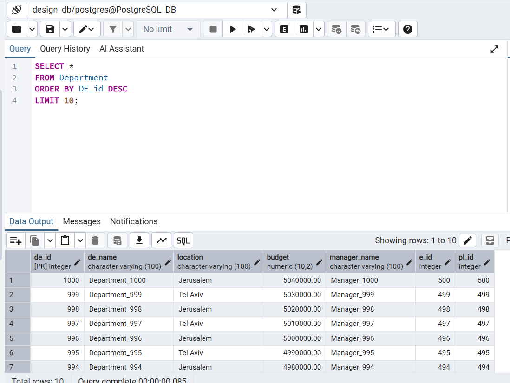

שיטה זו מאפשרת יצירת נתונים בצורה ידידותית ונוחה למשתמש, תוך הפרדה בין יצירת הנתונים לבין הכנסת הנתונים בפועל למערכת.

</details>

<details>
<summary><b>טיפול בשגיאות (Data Integrity)</b></summary>

במהלך העבודה נתקלנו במספר שגיאות אשר המחישו את חשיבות שלמות הנתונים במערכת.

בין השגיאות:

- Duplicate Key – הכנסת רשומה עם מזהה שכבר קיים
- JSON לא תקין
- NULL בשדה שמוגדר כ־NOT NULL
- Foreign Key Constraint – ניסיון למחוק רשומה שמקושרת לטבלה אחרת

שגיאות אלו סייעו לנו להבין את מגבלות המערכת ואת הקשרים בין הטבלאות.


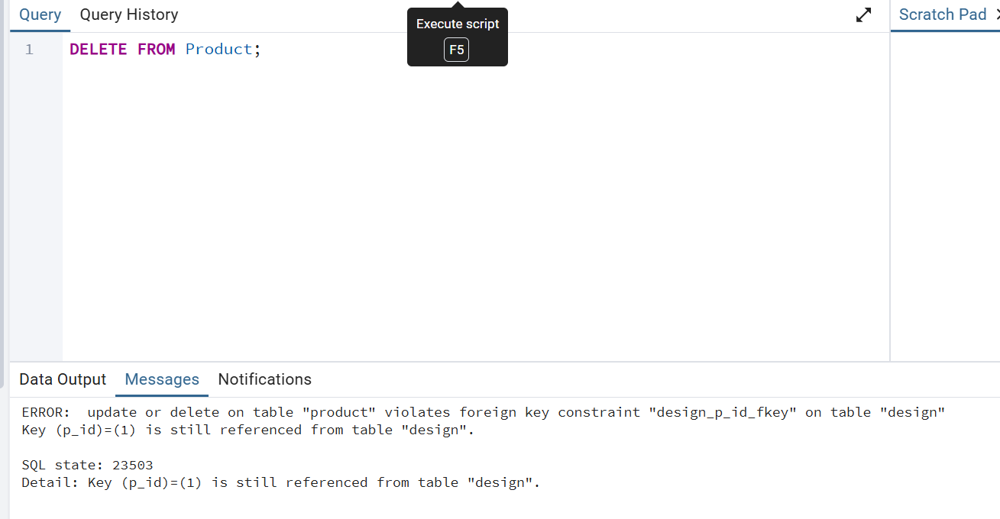


</details>

---

<details>
<summary><b>גיבוי בסיס הנתונים (Backup)</b></summary>

לאחר סיום מילוי הנתונים, ביצענו גיבוי מלא של בסיס הנתונים באמצעות pgAdmin.
הגיבוי בוצע באמצעות pgAdmin על ידי לחיצה ימנית על בסיס הנתונים ובחירה באפשרות Backup.  
נבחר פורמט Custom (.backup), המאפשר גיבוי מלא של מבנה הנתונים והתוכן.
הגיבוי כולל גם את מבנה הטבלאות וגם את הנתונים (Schema + Data), ולכן מאפשר שחזור מלא של המערכת.


בנוסף לגיבוי שבוצע באמצעות pgAdmin, בוצע גיבוי נוסף באמצעות שורת פקודה (pg_dump) מתוך Docker container.
הגיבוי בוצע בהצלחה והקובץ נשמר בתיקיית backup של הפרויקט.

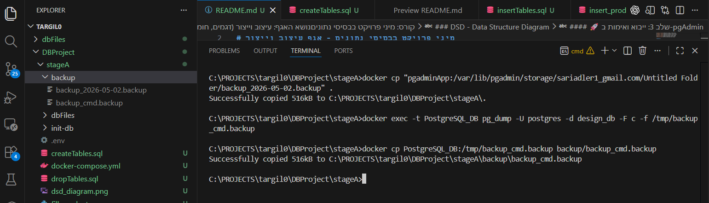

</details>

---

<details>
<summary><b>שחזור בסיס הנתונים (Restore)</b></summary>

כדי לוודא את תקינות הגיבוי, ביצענו תהליך שחזור.

נוצר בסיס נתונים חדש בשם test_restore, ולאחר מכן בוצע Restore מקובץ הגיבוי.

לאחר השחזור בוצעה בדיקת COUNT על טבלת Product, אשר הראתה כי כל הנתונים שוחזרו בהצלחה.

השחזור בוצע על מנת לוודא שקובץ הגיבוי תקין וניתן להשתמש בו לשחזור מלא של בסיס הנתונים.


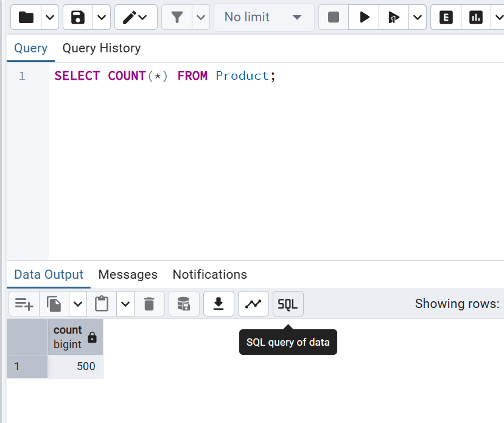

</details>
---

## שלב ב – שאילתות ואילוצים

<details>
<summary><b>▶ שאילתות SELECT</b></summary>
<br>

## הקדמה
בשלב זה ביצענו שאילתות SQL מורכבות על בסיס הנתונים, כולל:
- SELECT מורכבות עם JOIN
- תתי שאילתות
- GROUP BY ו־ORDER BY
- שימוש בשדות תאריכים
- שאילתות UPDATE ו־DELETE
- שימוש ב־ROLLBACK ו־COMMIT
- הוספת אילוצים (Constraints)
- הוספת אינדקסים והשוואת ביצועים


<details>
<summary><b>SELECT 1 – סיכום הזמנות לפי ספק ותאריך</b></summary>
<br>

## SELECT 1 – סיכום הזמנות לפי ספק ותאריך

### מטרת השאילתה
השאילתה מציגה עבור כל ספק את מספר ההזמנות ואת הסכום הכולל של ההזמנות,
כאשר הנתונים מחולקים לפי שנה וחודש.  
מטרת השאילתה היא לאפשר ניתוח פעילות הספקים לאורך זמן.

### קוד SQL
```sql
SELECT
    s.S_id,
    s.Company_Name,
    EXTRACT(YEAR FROM so.Order_date) AS order_year,
    EXTRACT(MONTH FROM so.Order_date) AS order_month,
    COUNT(so.Order_id) AS total_orders,
    SUM(so.Total) AS total_amount
FROM Supplier s
JOIN SupplyOrder so ON s.S_id = so.S_id
GROUP BY
    s.S_id,
    s.Company_Name,
    EXTRACT(YEAR FROM so.Order_date),
    EXTRACT(MONTH FROM so.Order_date)
ORDER BY order_year, order_month, total_amount DESC;
```

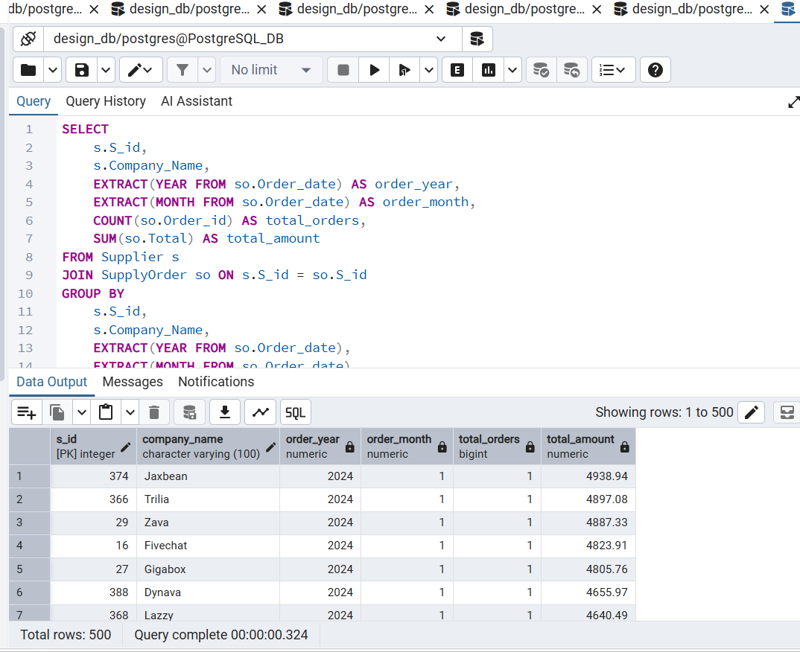
<*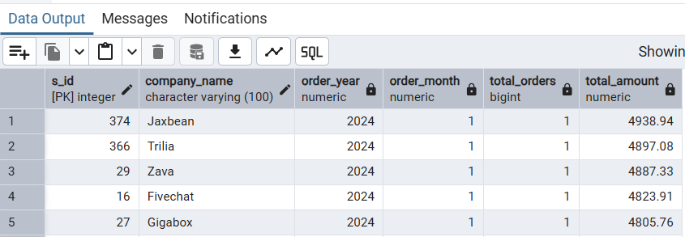*>
</details>


<details>
<summary><b>SELECT 2 – מוצרים, עיצובים וכמות חומרי גלם נדרשים</b></summary>
<br>

## SELECT 2 – מוצרים, עיצובים וכמות חומרי גלם נדרשים

### מטרת השאילתה
השאילתה מציגה עבור כל מוצר את העיצוב שלו, מספר חומרי הגלם הדרושים לעיצוב, ואת סך כמות המלאי של חומרי הגלם האלו.  
מטרת השאילתה היא לעזור להבין אילו מוצרים דורשים יותר חומרי גלם ומה מצב המלאי עבורם.

### קוד SQL
```sql
SELECT
    p.P_id,
    p.P_name,
    p.P_price,
    d.D_id,
    d.D_name,
    COUNT(r.R_id) AS raw_materials_count,
    SUM(rm.Stock_Quantity) AS total_stock_quantity
FROM Product p
JOIN Design d ON p.P_id = d.P_id
JOIN Requires r ON d.D_id = r.D_id
JOIN RawMaterial rm ON r.R_id = rm.R_id
GROUP BY
    p.P_id,
    p.P_name,
    p.P_price,
    d.D_id,
    d.D_name
ORDER BY raw_materials_count DESC;
```

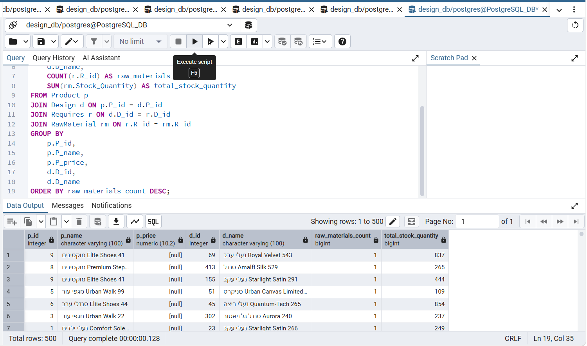
<*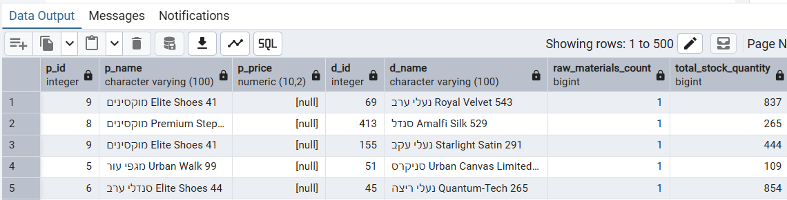*>

</details>


<details>
<summary><b>SELECT 3 – חומרי גלם המשמשים בעיצובים ובהזמנות</b></summary>
<br>

## SELECT 3 – חומרי גלם המשמשים בעיצובים ובהזמנות

### מטרת השאילתה
השאילתה מציגה חומרי גלם שמשמשים בעיצובים, יחד עם מספר העיצובים שבהם הם מופיעים ומספר ההזמנות שבהן הם נכללו.  
מטרת השאילתה היא לזהות חומרי גלם חשובים שחוזרים בהרבה עיצובים והזמנות.

### קוד SQL
```sql
SELECT
    rm.R_id,
    rm.R_name,
    rm.Unit_Measure,
    rm.Stock_Quantity,
    COUNT(DISTINCT r.D_id) AS used_in_designs_count,
    COUNT(DISTINCT i.Order_id) AS included_in_orders_count
FROM RawMaterial rm
LEFT JOIN Requires r ON rm.R_id = r.R_id
LEFT JOIN Includes i ON rm.R_id = i.R_id
GROUP BY
    rm.R_id,
    rm.R_name,
    rm.Unit_Measure,
    rm.Stock_Quantity
HAVING COUNT(DISTINCT r.D_id) > 0
ORDER BY used_in_designs_count DESC, included_in_orders_count DESC;
```

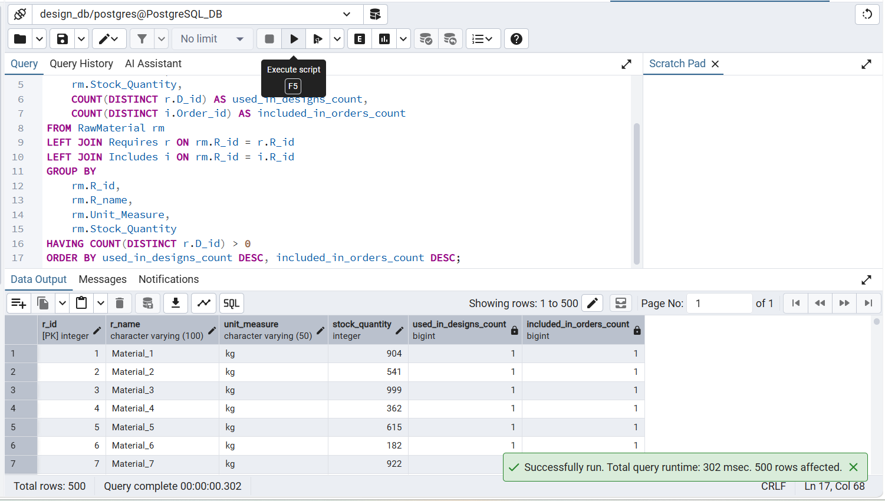
<*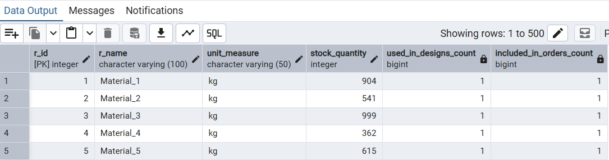*>
</details>


<details>
<summary><b>SELECT 4 – מוצרים שמחירם גבוה מהממוצע</b></summary>
<br>
## SELECT 4 – מוצרים שמחירם גבוה מהממוצע

### מטרת השאילתה
השאילתה מציגה את כל המוצרים שמחירם גבוה מהממוצע של כלל המוצרים.  
מטרת השאילתה היא לזהות מוצרים יקרים יחסית לשוק המוצרים הקיים.

### קוד SQL
```sql
SELECT
    p.P_id,
    p.P_name,
    p.P_price,
    p.P_weight,
    p.P_data
FROM Product p
WHERE p.P_price > (
    SELECT AVG(P_price)
    FROM Product
)
ORDER BY p.P_price DESC;
```


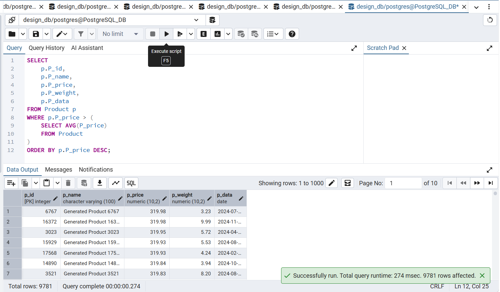
<*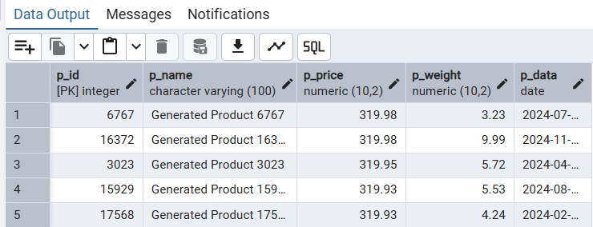*>

</details>


<details>
<summary><b>SELECT 5 – ספקים שיש להם הזמנות (השוואה בין IN ל־EXISTS)</b></summary>
<br>
## SELECT 5 – ספקים שיש להם הזמנות (השוואה בין IN ל־EXISTS)

### מטרת השאילתה
השאילתה מציגה את כל הספקים שיש להם לפחות הזמנה אחת במערכת.  
מטרת השאילתה היא לזהות ספקים פעילים.

---

## גרסה 1 – שימוש ב־IN

### קוד SQL
```sql
SELECT
    s.S_id,
    s.Company_Name,
    s.Phone,
    s.Address
FROM Supplier s
WHERE s.S_id IN (
    SELECT so.S_id
    FROM SupplyOrder so
);
```

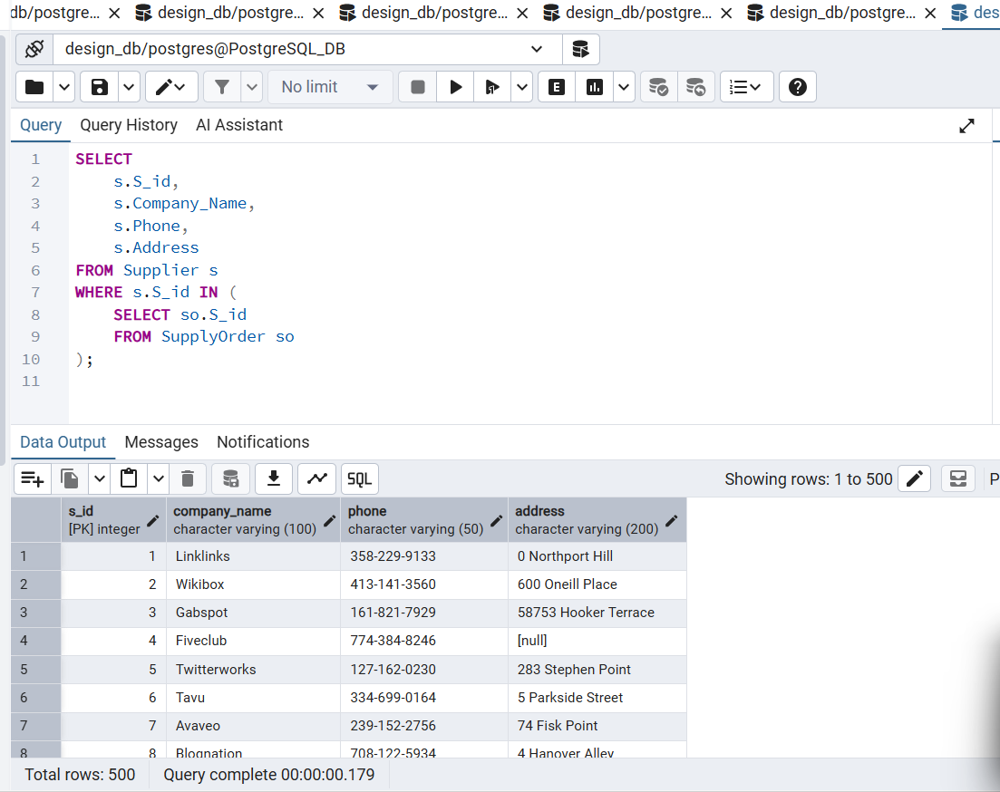
<*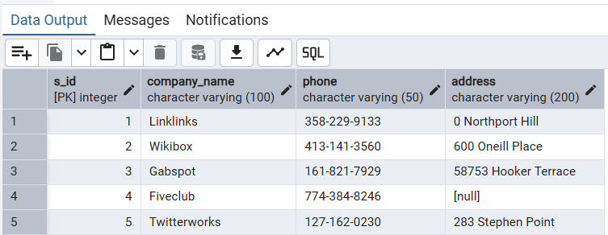*>

```sql
SELECT
    s.S_id,
    s.Company_Name,
    s.Phone,
    s.Address
FROM Supplier s
WHERE EXISTS (
    SELECT 1
    FROM SupplyOrder so
    WHERE so.S_id = s.S_id
);
```

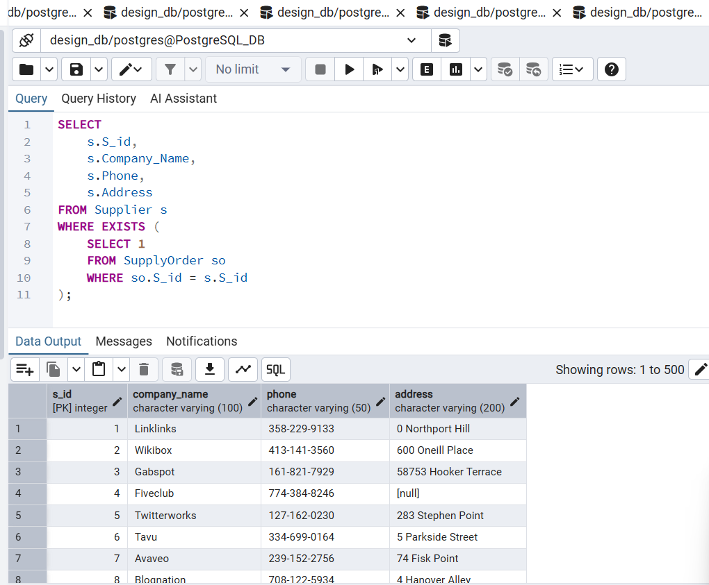
<*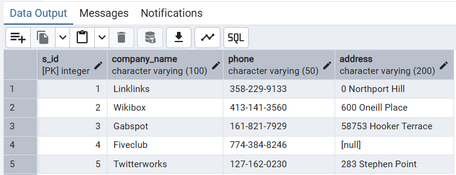*>

## מה יותר יעיל ולמה

השימוש בEXIST בדכ יותר יעיל מהשימוש בIN.

IN מחזיר רשימה של ערכים מתת־השאילתה ומשווה אליה,  
בעוד EXISTS בודק רק אם קיימת שורה מתאימה ועוצר ברגע שמצא אחת.

לכן, בטבלאות גדולות EXISTS לרוב יעיל יותר.  
עם זאת, PostgreSQL יכול לבצע אופטימיזציה ולכן לעיתים ההבדל לא משמעותי.

</details>


<details>
<summary><b>SELECT 6 – מוצרים שיש להם עיצוב (השוואה בין IN ל־JOIN)</b></summary>
<br>

## SELECT 6 – מוצרים שיש להם עיצוב (השוואה בין IN ל־JOIN)

### מטרת השאילתה
השאילתה מציגה את כל המוצרים שיש להם לפחות עיצוב אחד במערכת.  
מטרת השאילתה היא לזהות מוצרים שעברו שלב תכנון ועיצוב.

---

## גרסה 1 – שימוש ב־IN

### קוד SQL
```sql
SELECT
    p.P_id,
    p.P_name,
    p.P_price,
    p.P_weight,
    p.P_data
FROM Product p
WHERE p.P_id IN (
    SELECT d.P_id
    FROM Design d
);
```

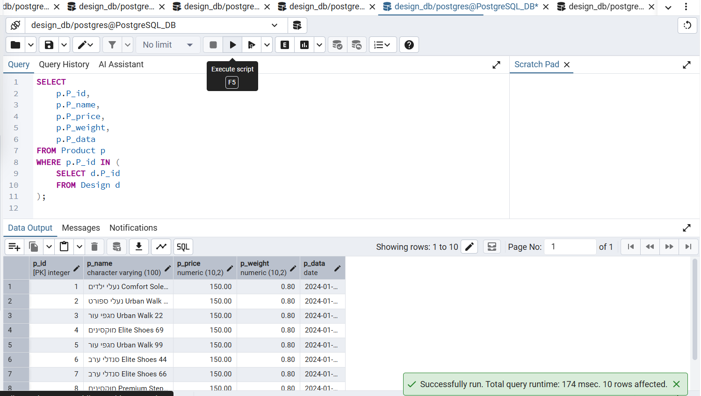
<*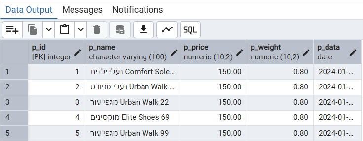*>

```sql
SELECT DISTINCT
    p.P_id,
    p.P_name,
    p.P_price,
    p.P_weight,
    p.P_data
FROM Product p
JOIN Design d ON p.P_id = d.P_id;
```

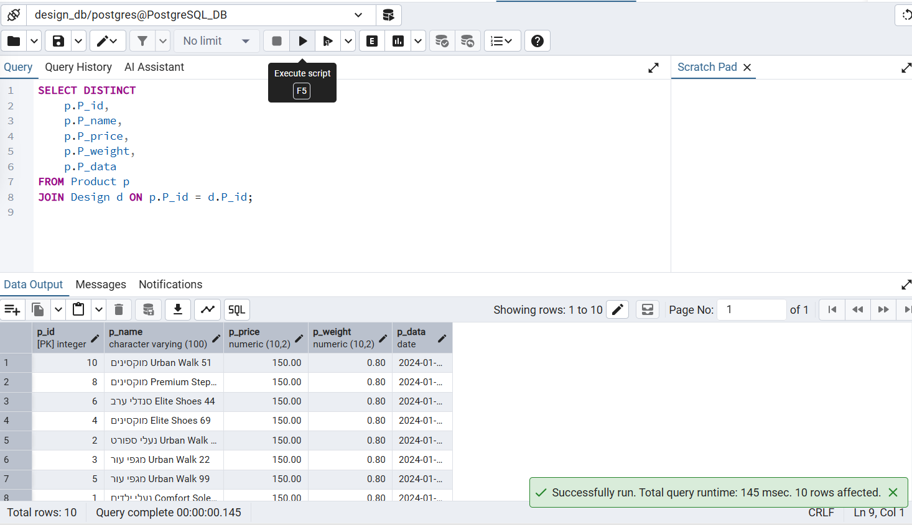
<*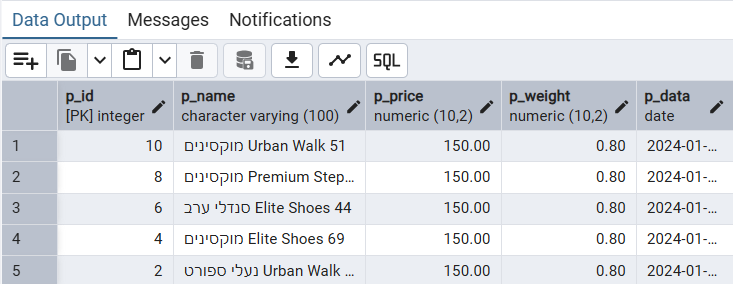*>

## הסבר והבדל בין השיטות

שתי השאילתות מחזירות את אותם מוצרים — מוצרים שיש להם לפחות עיצוב אחד בטבלת Design.

בגרסת IN, תת־השאילתה מחזירה רשימה של מזהי מוצרים מטבלת Design,  
והשאילתה הראשית בודקת האם כל מוצר נמצא ברשימה זו.

בגרסת JOIN, מתבצע חיבור ישיר בין הטבלאות Product ו־Design לפי מזהה המוצר (P_id).  
במקרה זה השתמשנו ב־DISTINCT כדי למנוע כפילויות, מאחר שלמוצר יכול להיות יותר מעיצוב אחד.

מבחינת יעילות, JOIN נחשב בדרך כלל ליעיל יותר כאשר מדובר בקשר בין טבלאות,  
מאחר שמערכת ניהול בסיס הנתונים יכולה לבצע אופטימיזציה טובה יותר לחיבור בין הטבלאות.  
לעומת זאת, IN מתאים יותר למצבים של בדיקה מול רשימה של ערכים.

</details>


<details>
<summary><b>SELECT 7 – חומרי גלם המשמשים בעיצובים (השוואה בין EXISTS ל־JOIN)</b></summary>
<br>

## SELECT 7 – חומרי גלם המשמשים בעיצובים (השוואה בין EXISTS ל־JOIN)

### מטרת השאילתה
השאילתה מציגה את כל חומרי הגלם שנדרשים לפחות עבור עיצוב אחד במערכת.  
מטרת השאילתה היא לזהות חומרי גלם פעילים שמשמשים בתהליך התכנון והייצור.

---

## גרסה 1 – שימוש ב־EXISTS

### קוד SQL
```sql
SELECT
    rm.R_id,
    rm.R_name,
    rm.R_price,
    rm.Unit_Measure,
    rm.Stock_Quantity
FROM RawMaterial rm
WHERE EXISTS (
    SELECT 1
    FROM Requires r
    WHERE r.R_id = rm.R_id
);
```

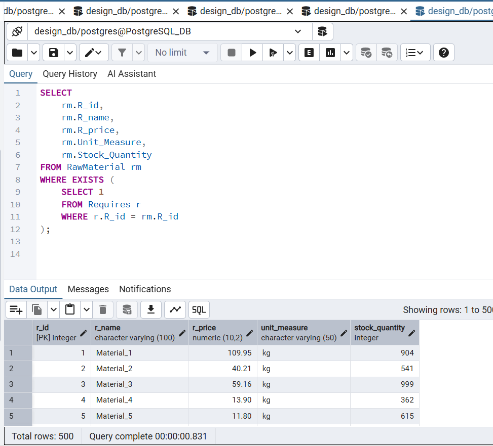
<*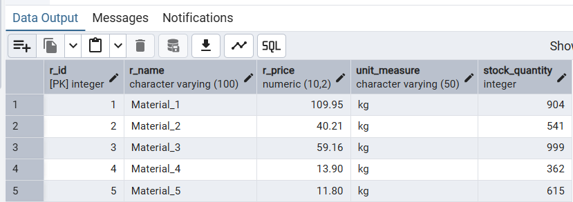*>

```sql
SELECT DISTINCT
    rm.R_id,
    rm.R_name,
    rm.R_price,
    rm.Unit_Measure,
    rm.Stock_Quantity
FROM RawMaterial rm
JOIN Requires r ON rm.R_id = r.R_id;
```
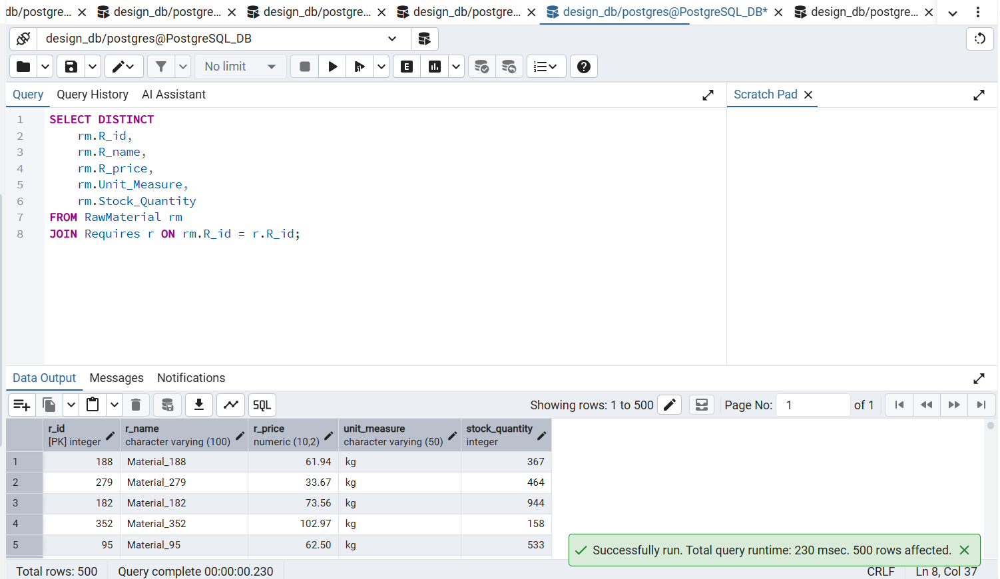
<*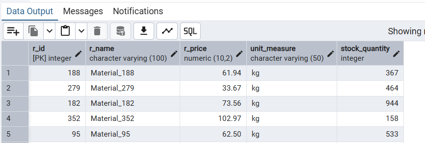*>

## הסבר והבדל בין השיטות

שתי השאילתות מחזירות את אותם חומרי גלם — כאלה שמופיעים בטבלת Requires.

בגרסת EXISTS מתבצעת בדיקה עבור כל חומר גלם האם קיימת לפחות רשומה אחת מתאימה.  
ברגע שנמצאת התאמה, הבדיקה נעצרת.

בגרסת JOIN מתבצע חיבור בין הטבלאות, ולכן אותו חומר גלם יכול להופיע מספר פעמים, ולכן נדרש שימוש ב־DISTINCT.

מבחינת יעילות, EXISTS בדרך כלל יעיל יותר כאשר רוצים רק לבדוק קיום,  
בעוד JOIN מתאים כאשר רוצים גם לשלוף נתונים מהטבלה המקושרת.
</details>


<details>
<summary><b>SELECT 8 – עובדים שעבדו במשמרות (השוואה בין IN ל־JOIN)</b></summary>
<br>
## SELECT 8 – עובדים שעבדו במשמרות (השוואה בין IN ל־JOIN)

### מטרת השאילתה
השאילתה מציגה את כל העובדים שעבדו לפחות במשמרת אחת.  
מטרת השאילתה היא לזהות עובדים פעילים שביצעו עבודה בפועל במערכת.

---

## גרסה 1 – שימוש ב־IN

### קוד SQL
```sql
SELECT
    e.E_id,
    e.E_name,
    e.E_familyName,
    e.Role,
    e.E_date
FROM Employee e
WHERE e.E_id IN (
    SELECT ews.E_id
    FROM Employee_WorkShip ews
);
```


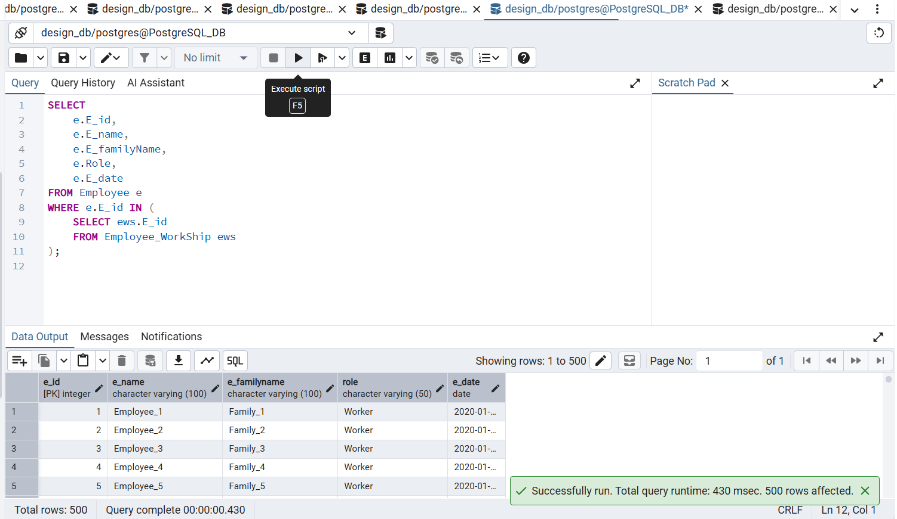
<*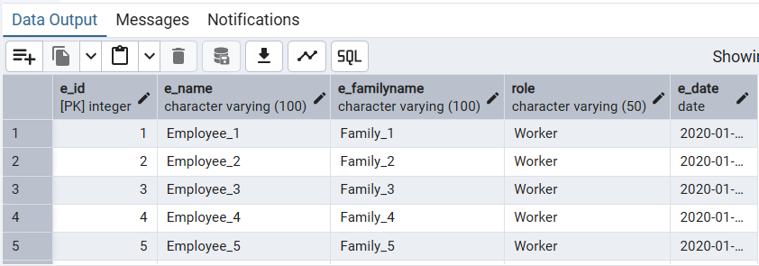*>
```sql
SELECT DISTINCT
    e.E_id,
    e.E_name,
    e.E_familyName,
    e.Role,
    e.E_date
FROM Employee e
JOIN Employee_WorkShip ews ON e.E_id = ews.E_id;
```
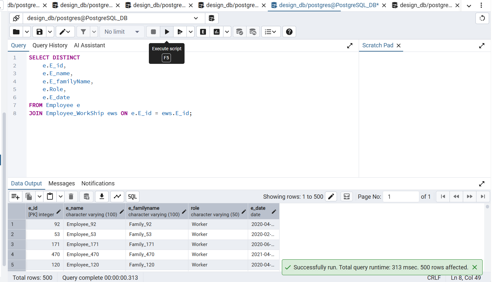
<*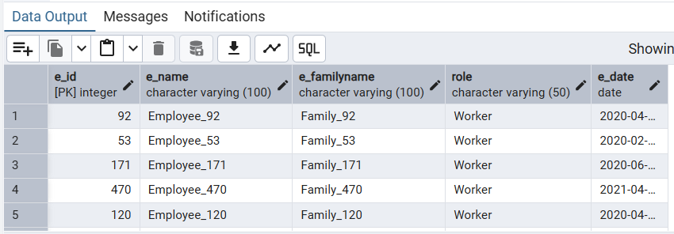*>
</details>


<details>
<summary><b> SELECT 9 – איתור מוצרים מעל 1000 ש"ח שיש להם עיצוב</b></summary>

<br>
## SELECT 9 – איתור מוצרים מעל 1000 ש"ח שיש להם עיצוב

### מטרת השאילתה
למצוא את כל המוצרים שמחירם מעל 1000 ש"ח ושכבר קיים עבורם דגם עיצובי במערכת. זה מאפשר לנו לוודא שלכל המוצרים בסכום זה יש תכנון תקין.


---

## הסבר והבדל בין השיטות

שתי השאילתות מציגות את אותה התוצאה בדרכים שונות:

* **בגרסת ה-IN (בדיקת רשימה):** המחשב עובר על טבלת המוצרים ובודק האם כל מוצר מופיע ברשימת העיצובים. זו דרך פשוטה שמונעת כפילויות באופן אוטומטי.
* **בגרסת ה-JOIN (חיבור טבלאות):** המחשב ממש "מדביק" את שתי הטבלאות זו לזו לפי מספר המוצר. בגלל שחיבור כזה עלול להציג את אותו מוצר כמה פעמים, השתמשנו בפקודת DISTINCT כדי שכל מוצר יופיע רק פעם אחת ברשימה.

---


## גרסה 1 – שימוש ב-IN

### קוד SQL

```sql
SELECT 
    p.P_id AS "Product_ID", 
    p.P_name AS "Product_Name", 
    p.P_price AS "Unit_Price"
FROM Product p
WHERE p.P_price > 1000 
  AND p.P_id IN (
    SELECT d.P_id 
    FROM Design d
);
```

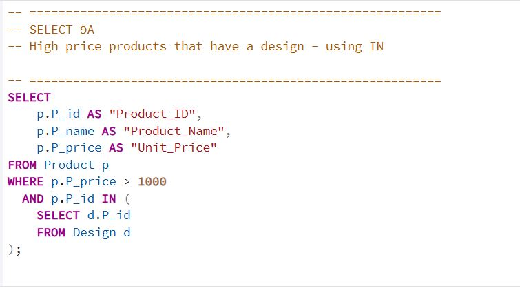
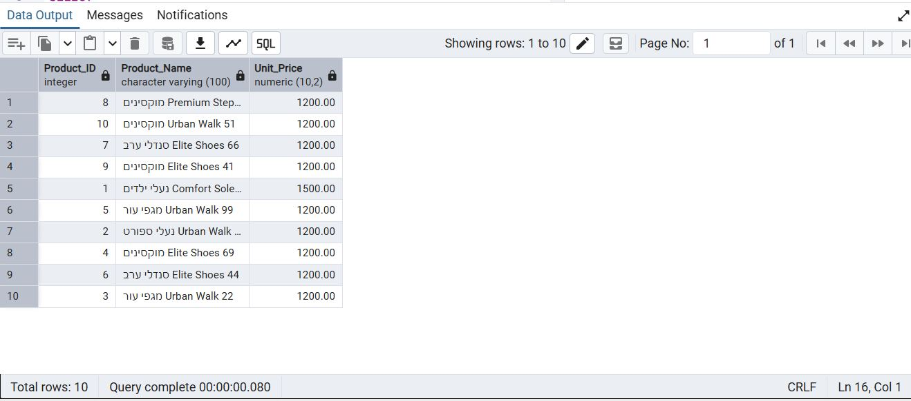


## גרסה 2 – שימוש ב-JOIN

### קוד SQL
```sql
SELECT DISTINCT
    p.P_id AS "Product_ID", 
    p.P_name AS "Product_Name", 
    p.P_price AS "Unit_Price"
FROM Product p
JOIN Design d ON p.P_id = d.P_id
WHERE p.P_price > 1000;
```
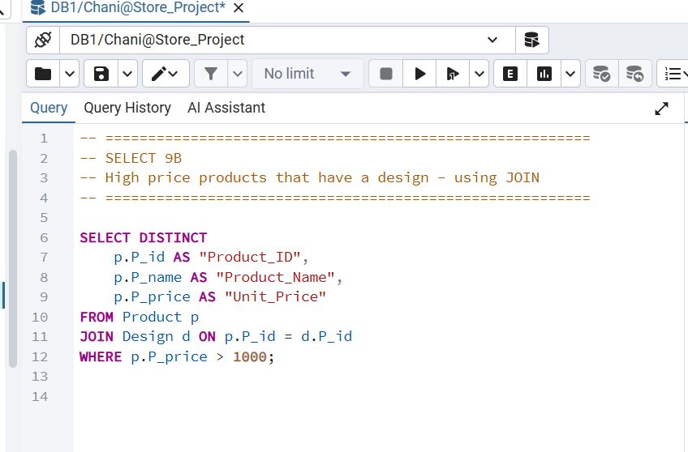
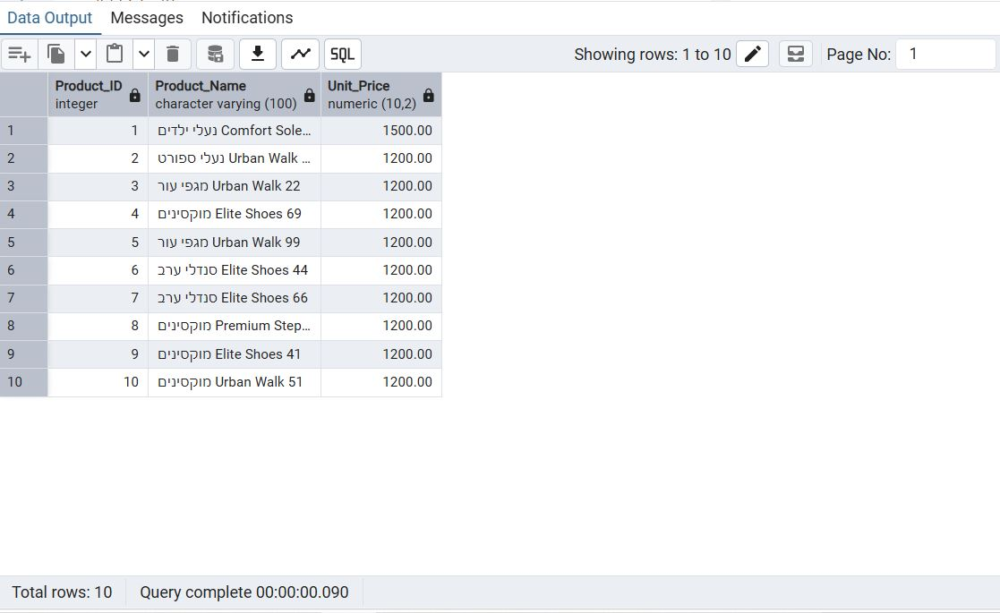
</details>


<details>
<summary><b>SELECT 10 – איתור קווי ייצור המייצרים מעל 5 מוצרים שונים</b></summary>

<br>


### מטרת השאילתה
לזהות קווי ייצור עמוסים במיוחד. השאילתה סופרת כמה מוצרים שונים משויכים לכל קו ייצור ומציגה רק את הקווים שאחראים על יותר מ-5 מוצרים.

### קוד SQL
```sql
SELECT 
    pl.pl_id AS "Line_ID", 
    pl.factory_location AS "Factory_Location", 
    COUNT(p.p_id) AS "Total_Products"
FROM Product_Line pl
JOIN Product p ON pl.pl_id = p.p_id
GROUP BY pl.pl_id, pl.factory_location
HAVING COUNT(p.p_id) > 5
ORDER BY "Total_Products" DESC;
```
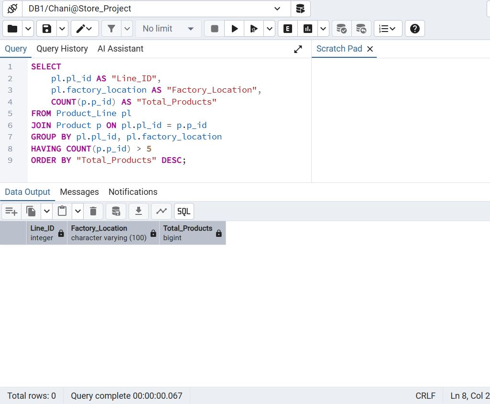

</details>


<details>
<summary><b> SELECT 11 – ניתוח עומס ייצור לפי מחלקות (GROUP BY & HAVING)</b></summary>
<br>

### מטרת השאילתה
לזהות אילו מחלקות במפעל אחראיות על ייצור של מספר גדול של מוצרים שונים. מידע זה קריטי להקצאת כוח אדם ומשאבים.

### הסבר הלוגיקה
השאילתה מחברת בין טבלת המחלקות לטבלת המוצרים. אנו משתמשים ב-`GROUP BY` כדי לרכז את הנתונים לפי שם המחלקה, וב-`HAVING` כדי להציג רק מחלקות שמשויכים אליהן יותר ממוצר אחד שונה.

### קוד SQL
```sql
SELECT 
    d.de_name AS "Department_Name", 
    COUNT(p.P_id) AS "Total_Products"
FROM Department d
JOIN Product p ON d.e_id = p.p_id
GROUP BY d.de_name
HAVING COUNT(p.p_id) > 0
ORDER BY "Total_Products" DESC;
```
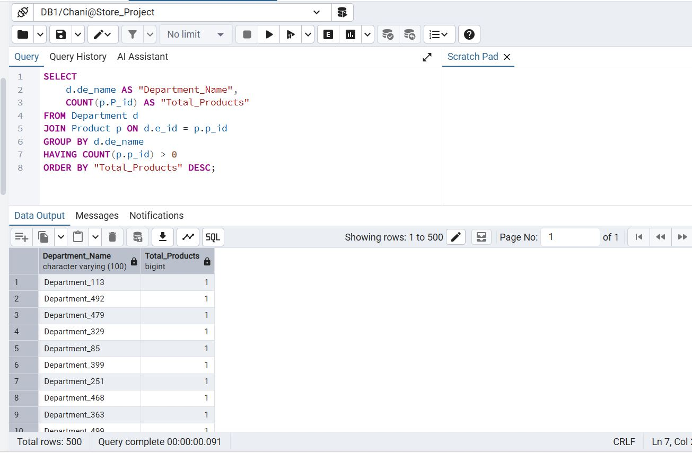

</details>


<details>
<summary><b> SELECT 12 – איתור ספקים של חומרי גלם ספציפיים (השוואה בין JOIN ל־IN)</b></summary>
<br>

## SELECT 12 – איתור ספקים של חומרי גלם ספציפיים

### מטרת השאילתה
למצוא את שמות החברות ומספרי הטלפון של כל הספקים שמספקים לנו חומרי גלם שמתחילים בשם 'Material_10'. מידע זה חיוני עבור מחלקת הרכש כשהיא צריכה להזמין מלאי חדש במהירות מספק ספציפי.

---

## הסבר והבדל בין השיטות

שתי השאילתות מציגות את אותה התוצאה בדיוק, אך בגישה לוגית שונה:

* **בגרסת ה-JOIN (חיבור טבלאות):** אנחנו מבקשים מהמחשב "להדביק" את טבלת הספקים לטבלת חומרי הגלם. מכיוון שספק אחד יכול לספק הרבה חומרים, השתמשנו בפקודת `DISTINCT` כדי שכל ספק יופיע רק פעם אחת ברשימה הסופית.
* **בגרסת ה-IN (בדיקת רשימה):** אנחנו מבקשים מהמחשב קודם כל להכין רשימה של "תעודות זהות" של ספקים מתוך טבלת החומרים, ואז פשוט לשלוף את הפרטים של מי שמופיע ברשימה הזו. זו דרך מאוד קריאה וברורה.

---

## גרסה 1 – שימוש ב-JOIN

### קוד SQL
```sql
SELECT DISTINCT s.company_name, s.phone
FROM Supplier s
JOIN rawmaterial m ON m.r_id = s.s_id
WHERE m.r_name LIKE 'Material_10%'
ORDER BY s.company_name;
```

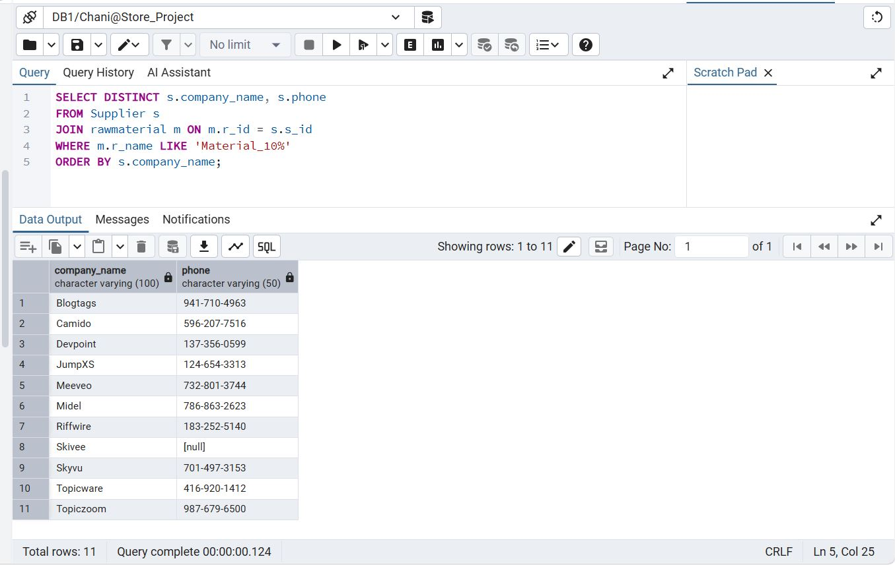

## גרסה 2 – שימוש ב-IN

### קוד SQL
```sql

SELECT s.company_name, s.phone
FROM Supplier s
WHERE s.s_id IN (
    SELECT m.r_id 
    FROM rawmaterial m 
    WHERE m.r_name LIKE 'Material_10%'
)
ORDER BY s.company_name;
```

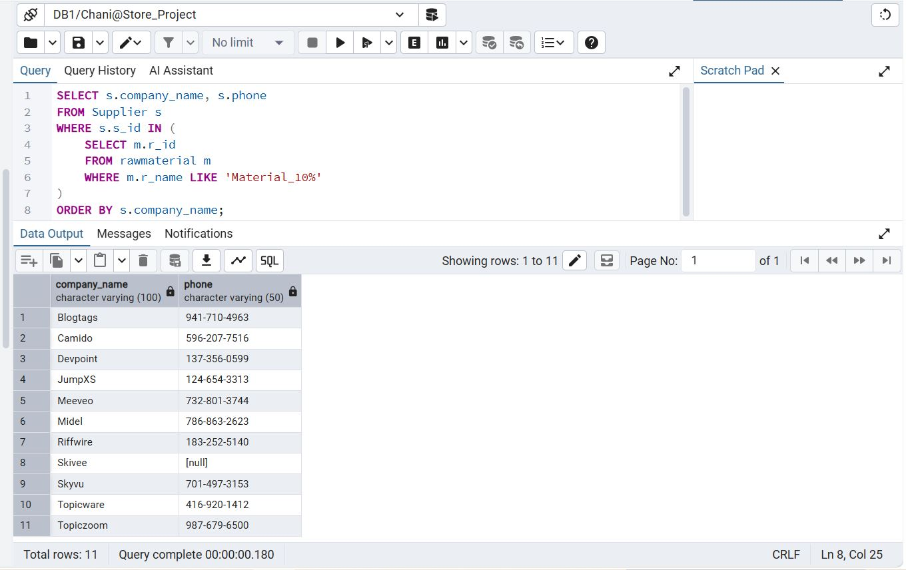


<hr>

<h3>מה עדיף?</h3>

<ul>
  <li>
    <b>מבחינת ביצועים:</b> בדרך כלל גרסת ה-<b>JOIN</b> נחשבת ליעילה יותר בבסיסי נתונים גדולים, כי היא מנצלת את הקשרים הישירים (האינדקסים) שקיימים בין הטבלאות.
  </li>
  <li>
    <b>מבחינת נוחות:</b> גרסת ה-<b>IN</b> לפעמים קלה יותר להבנה, כי היא נראית כמו סינון פשוט של רשימה.
  </li>
</ul>

</details>


</details>


<details>
<summary><b>▶ UPDATE – שאילתות עדכון נתונים</b></summary>
<br>

---
<details>
<summary><b>UPDATE 1 – עדכון מחיר מוצרים לפי תאריך עיצוב</b></summary>
<br
## UPDATE 1 – עדכון מחיר מוצרים לפי תאריך עיצוב

### מטרת השאילתה
השאילתה מעדכנת את מחיר המוצרים ומעלה אותו ב־5% עבור מוצרים שיש להם עיצוב מתאריך 2024-01-01 והלאה.

### קוד SQL
```sql
UPDATE Product
SET P_price = P_price * 1.05
WHERE P_id IN (
    SELECT P_id
    FROM Design
    WHERE D_data >= '2024-01-01
);
```


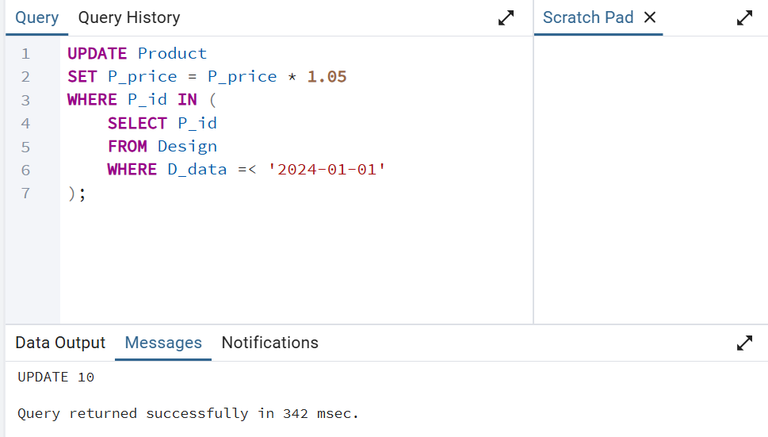
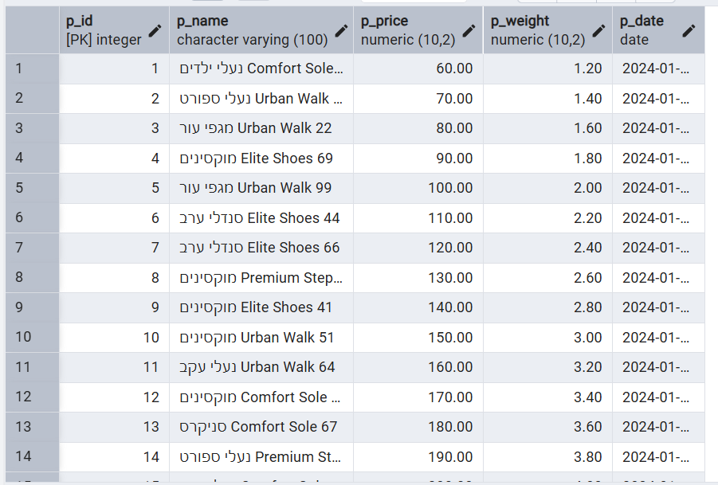
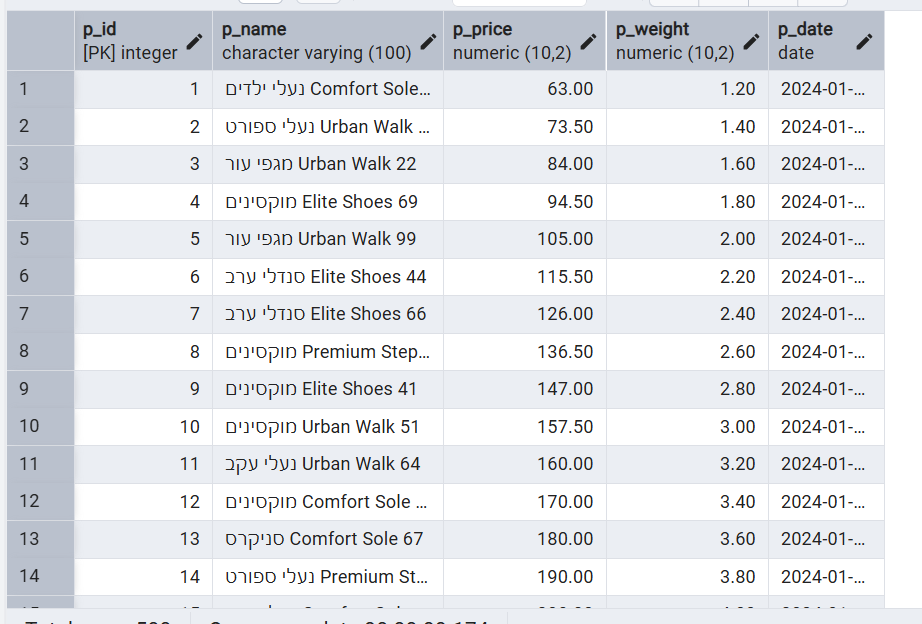


</details>


<details>
<summary><b>UPDATE 2 – סימון קווי ייצור שדורשים תחזוקה
</b></summary>
<br>
<*## UPDATE – שאילתות עדכון נתונים*>

---

## UPDATE 2 – סימון קווי ייצור שדורשים תחזוקה

### מטרת השאילתה
השאילתה מזהה קווי ייצור שלא בוצעה להם תחזוקה במשך יותר משנה,  
ומעדכנת את הסטטוס שלהם ל־"Needs Maintenance".

### קוד SQL
```sql
UPDATE Product_Line
SET Status = 'Needs Maintenance'
WHERE Last_Maintenance < CURRENT_DATE - INTERVAL '1 year';
```
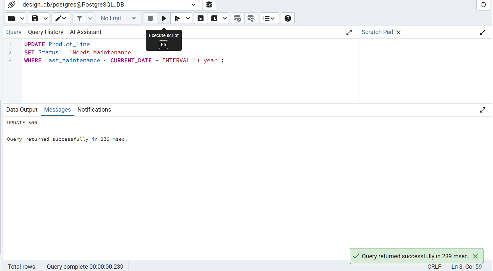
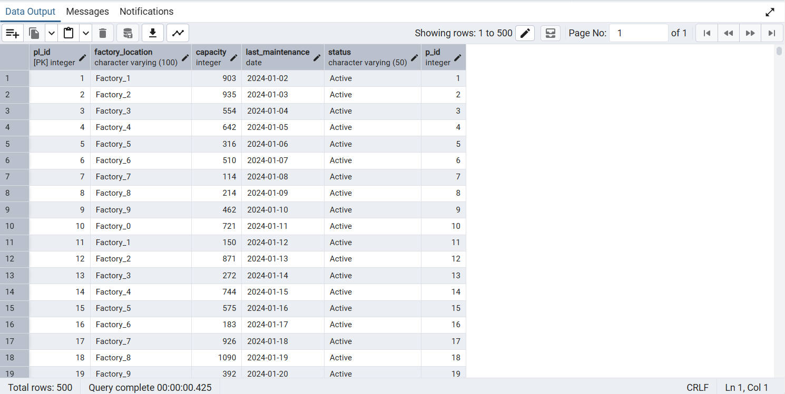
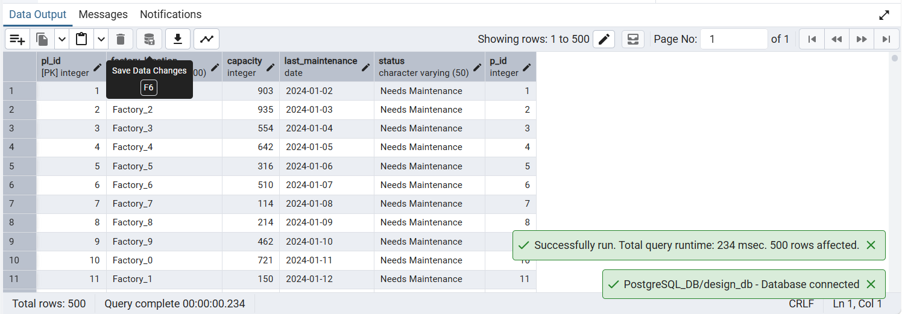

</details>


<details>
<summary><b>UPDATE 3 – הפחתת תקציב למחלקות עם קווי ייצור לא פעילים</b></summary>
<br>
<*## UPDATE – שאילתות עדכון נתונים*>

---

## UPDATE 3 – הפחתת תקציב למחלקות עם קווי ייצור לא פעילים

### מטרת השאילתה
השאילתה מפחיתה ב־10% את התקציב של מחלקות שיש להן קווי ייצור במצב "Inactive".  
המטרה היא לשקף ירידה בפעילות ולהתאים את התקציב בהתאם.

### קוד SQL
```sql
UPDATE Department
SET Budget = Budget * 0.90
WHERE PL_id IN (
    SELECT PL_id
    FROM Product_Line
    WHERE Status = 'Inactive'
);
```
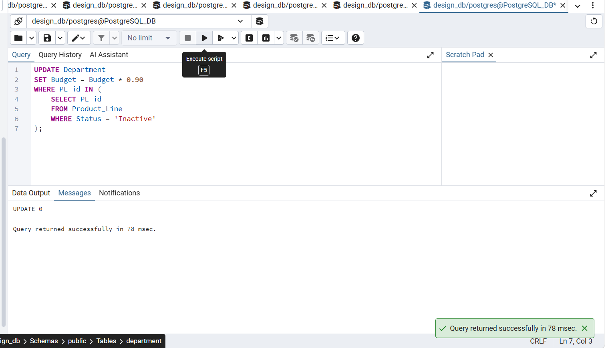
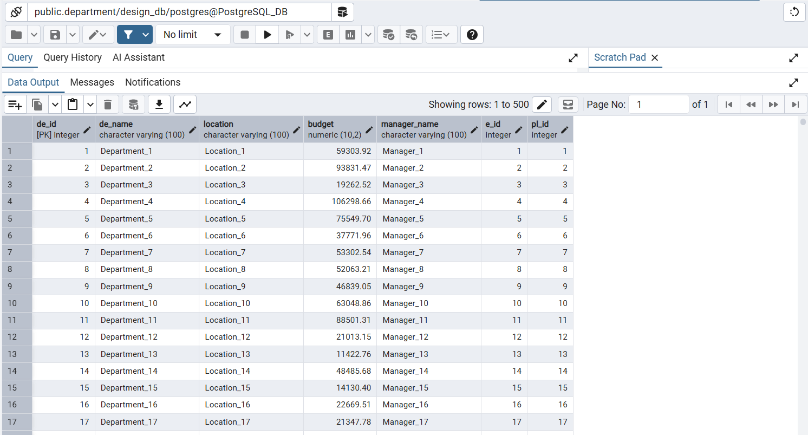
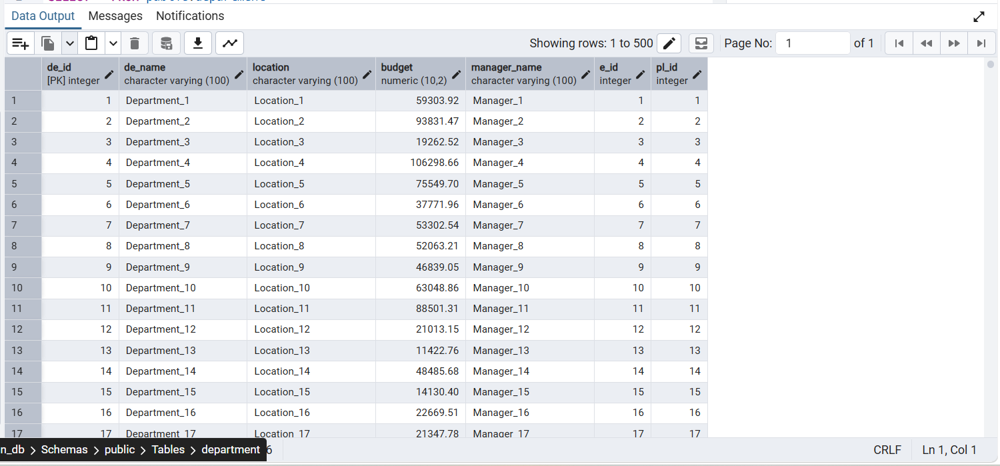

</details>


<details>
<summary><b>UPDATE 4: הוזלת חומרי גלם יקרים (Raw Material)</b></summary>
<br>

**1. לפני השינוי (Before):** מחירי חומרי הגלם המקוריים הגבוהים מ-99:
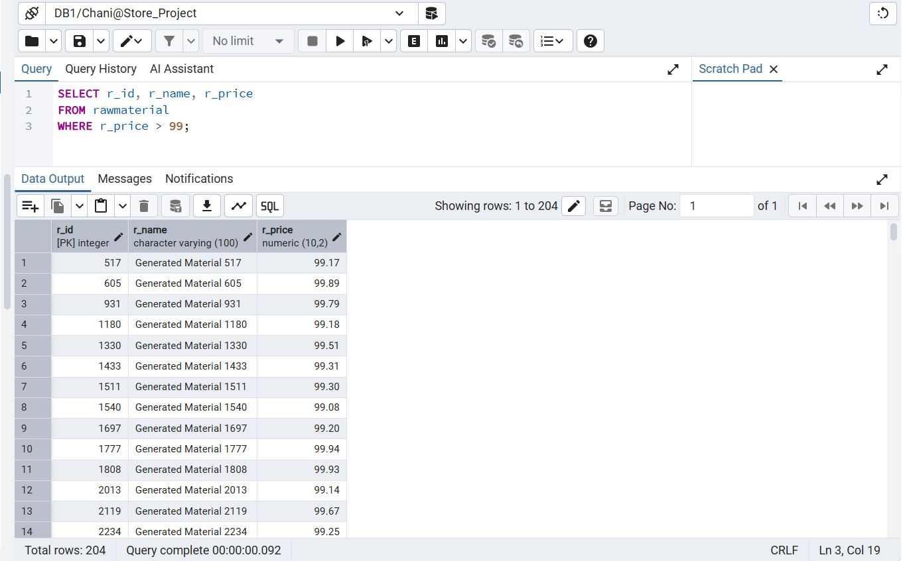

**2. קוד SQL לביצוע העדכון:**
```sql
-- Purpose: Apply a 10% discount to high-cost materials
UPDATE rawmaterial
SET r_price = r_price * 0.90
WHERE r_price > 99;

COMMIT;
```


**3. אחרי השינוי (After):** בדיקה חוזרת מראה 0 תוצאות. הדבר מעיד על כך שבעקבות ההוזלה, כל מחירי חומרי הגלם שהיו גבוהים מ-99 ש"ח עודכנו וירדו מתחת לסף זה:
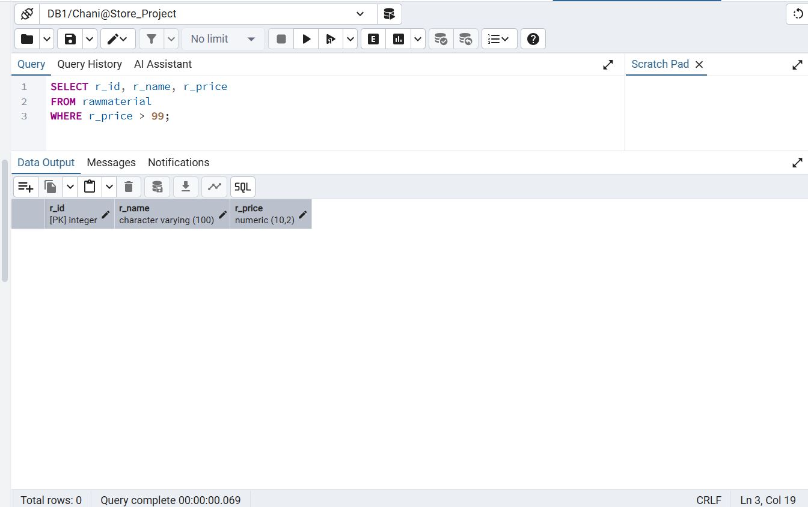
</details>


<details>
<summary><b>UPDATE 5: שדרוג משלוח להזמנות גדולות (Supply Order)</b></summary>
<br>

**1. לפני השינוי (Before):** איתור הזמנות שסכומן עולה על 200 ש"ח ושיטת המשלוח שלהן היא 'Truck':
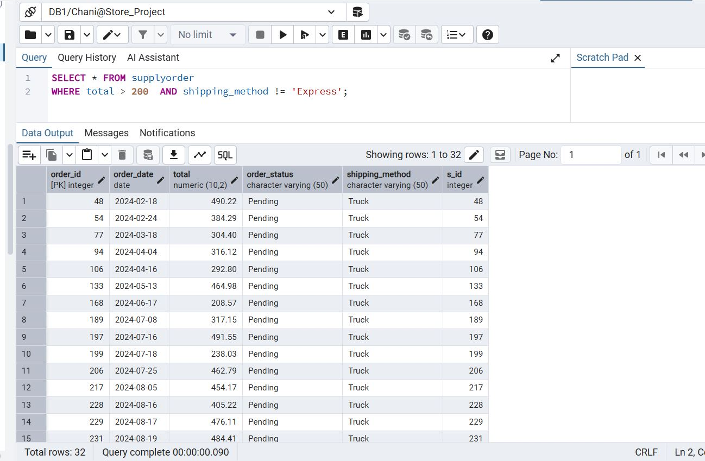

**2. קוד SQL לביצוע העדכון:**
```sql
-- Purpose: Upgrade shipping to Express for orders over 200
UPDATE supplyorder
SET shipping_method = 'Express'
WHERE total > 200;

COMMIT;
```
**3. אחרי השינוי (After):**הרצה חוזרת של שאילתת הבדיקה מחזירה 0 שורות. הדבר מאשר שכל ההזמנות הגדולות עודכנו בהצלחה למשלוח אקספרס (Express):
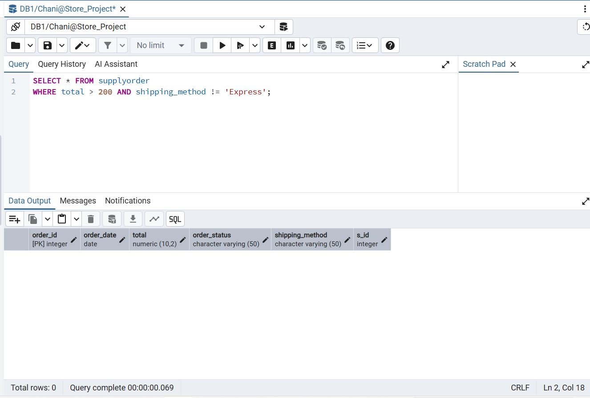
</details>

<details>
<summary><b>UPDATE 6: הגדלת מלאי לעיצובים חדשים (Stock Update)</b></summary>
<br>

**1. לפני השינוי (Before):** בדיקת כמות המלאי הנוכחית של חומרי גלם המשמשים בעיצובים משנת 2025 ואילך:
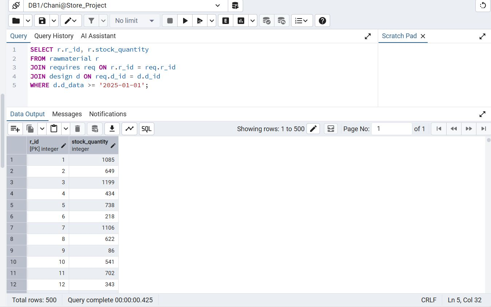

**2. קוד SQL לביצוע העדכון:**
```sql
-- Purpose: Increase stock by 20% for materials used in designs from 2025 onwards
UPDATE rawmaterial
SET stock_quantity = stock_quantity * 1.20
WHERE r_id IN (
    SELECT r.r_id
    FROM requires r
    JOIN design d ON r.d_id = d.d_id
    WHERE d.d_data >= '2025-01-01'
);

COMMIT;
```
**3. אחרי השינוי (After):** ניתן לראות כי כמות המלאי (stock_quantity) עודכנה וגדלה ב-20% עבור חומרי הגלם שנמצאו בתנאי השאילתה:
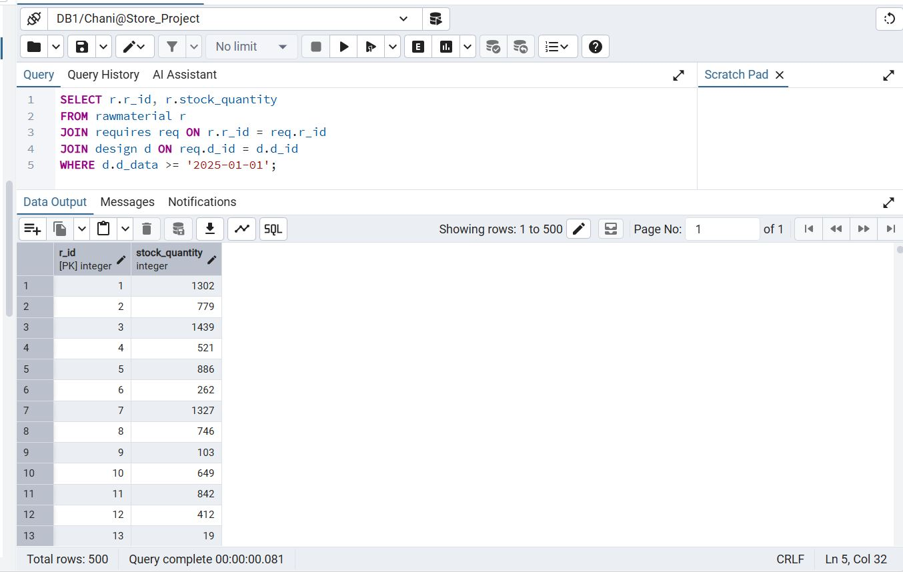
</details>

</details>

<details>
<summary><b>▶ DELETE – שאילתות מחיקת נתונים</b></summary>
<br>

---


<details>
<summary><b>DELETE 1 – מחיקת הזמנות ישנות ומבוטלות ללא חומרי גלם</b></summary>
<br>


## DELETE 1 – מחיקת הזמנות ישנות ומבוטלות ללא חומרי גלם

### מטרת השאילתה
השאילתה מוחקת הזמנות מספקים אשר סטטוס ההזמנה שלהן הוא "Cancelled" (מבוטל), תאריך ההזמנה שלהן ישן ביותר משנתיים, ואינן מקושרות לאף חומר גלם בטבלת Includes.

מטרת השאילתה היא לנקות את בסיס הנתונים מהזמנות לא רלוונטיות שאינן פעילות ואינן קשורות לנתונים נוספים במערכת, ובכך לשפר את יעילות ואמינות הנתונים.

### קוד SQL
```sql
DELETE FROM SupplyOrder
WHERE Order_status = 'Cancelled'
  AND Order_date < CURRENT_DATE - INTERVAL '2 years'
  AND Order_id NOT IN (
      SELECT Order_id
      FROM Includes
  );
```
**צילום מצב לפני ההרצה:**  
מציג את הרשומות בטבלה לפני ביצוע פעולת המחיקה, כולל הנתונים שעומדים להימחק.
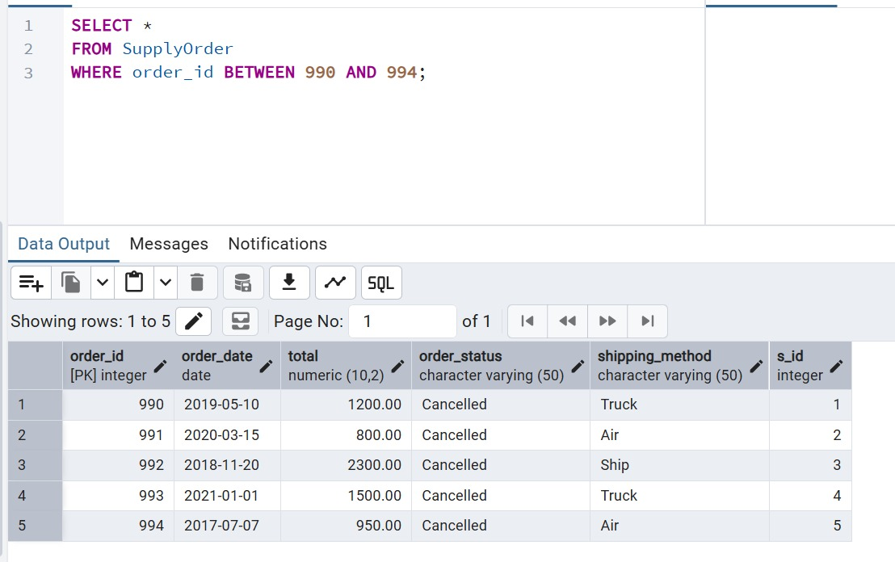

**צילום הרצה:**  
מציג את הרצת שאילתת ה־DELETE והודעת המערכת על מספר הרשומות שנמחקו.
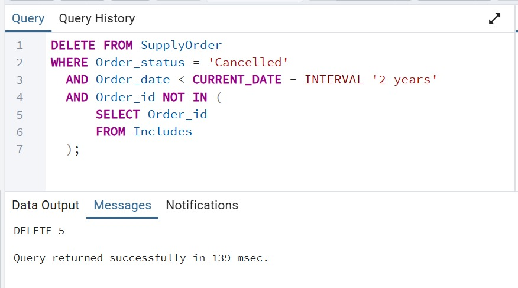

**צילום מצב אחרי ההרצה:**  
מציג את הטבלה לאחר המחיקה, כאשר ניתן לראות שהרשומות המתאימות הוסרו.
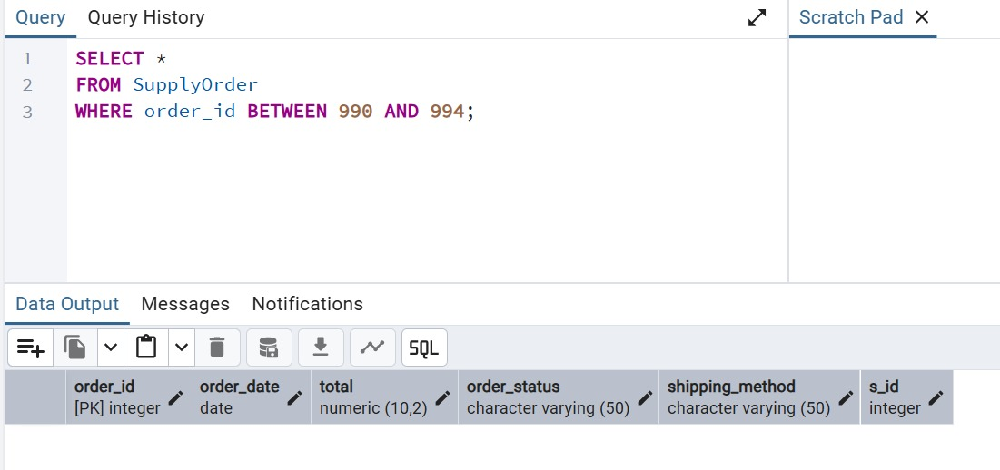
</details>

<details>
<summary><b>DELETE 2 – מחיקת משמרות ללא עובדים</b></summary>
<br>


## DELETE 2 – מחיקת משמרות ללא עובדים

### מטרת השאילתה
השאילתה מוחקת משמרות בטבלה Work_Ship אשר אינן מקושרות לאף עובד בטבלת Employee_WorkShip.

מטרת השאילתה היא להסיר משמרות שאינן פעילות בפועל (ללא עובדים משויכים), ובכך לשמור על בסיס נתונים נקי ורלוונטי.

### קוד SQL
```sql
DELETE FROM Work_Ship
WHERE WS_id NOT IN (
    SELECT WS_id
    FROM Employee_WorkShip
);
```
**צילום מצב לפני ההרצה:** 
מציג את המשמרות לפני המחיקה, כולל משמרות ללא עובדים.
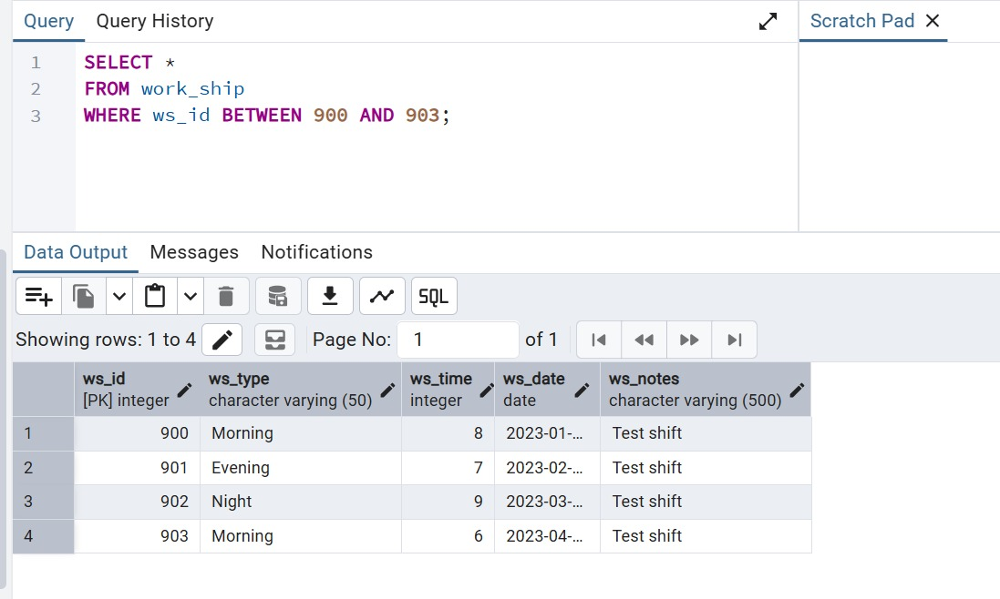

**צילום הרצה:** 
מציג את הרצת שאילתת ה־DELETE והודעת המערכת על מספר הרשומות שנמחקו.
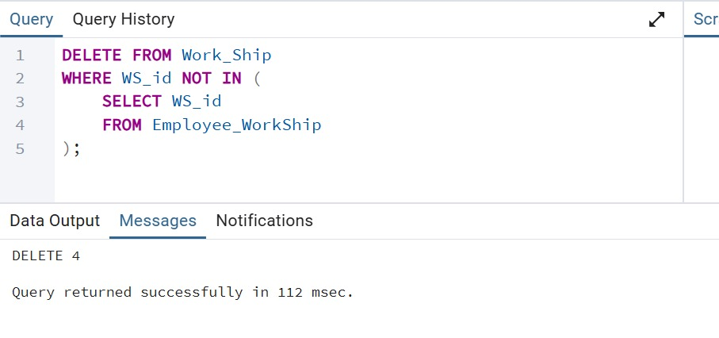

**צילום מצב אחרי ההרצה:**
מציג את הטבלה לאחר המחיקה, כאשר המשמרות ללא עובדים הוסרו.
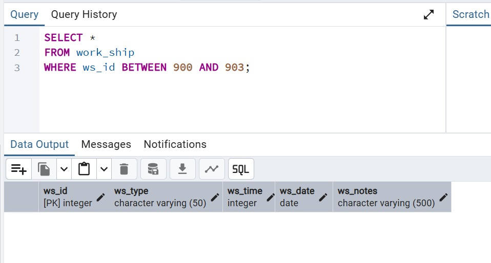


---
</details>

<details>
<summary><b>DELETE 3 – מחיקת חומרי גלם שאינם בשימוש</b></summary>
<br>

## DELETE 3 – מחיקת חומרי גלם שאינם בשימוש

### מטרת השאילתה
השאילתה מוחקת חומרי גלם מטבלת RawMaterial אשר אינם משויכים לאף עיצוב בטבלת Requires ואינם כלולים באף הזמנה בטבלת Includes.

מטרת השאילתה היא להסיר חומרי גלם שאינם בשימוש במערכת, ובכך לשפר את איכות ויעילות הנתונים.

### קוד SQL
```sql
DELETE FROM RawMaterial
WHERE R_id NOT IN (
    SELECT R_id FROM Requires
)
AND R_id NOT IN (
    SELECT R_id FROM Includes
);
```
**צילום מצב לפני ההרצה:** 
מציג את חומרי הגלם לפני המחיקה, כולל חומרים שאינם בשימוש.
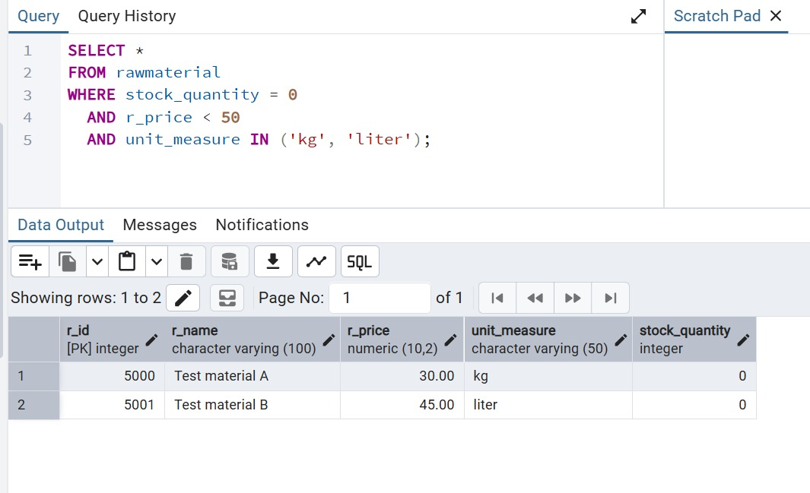

**צילום הרצה:** 
מציג את הרצת שאילתת ה־DELETE והודעת המערכת על מספר הרשומות שנמחקו.
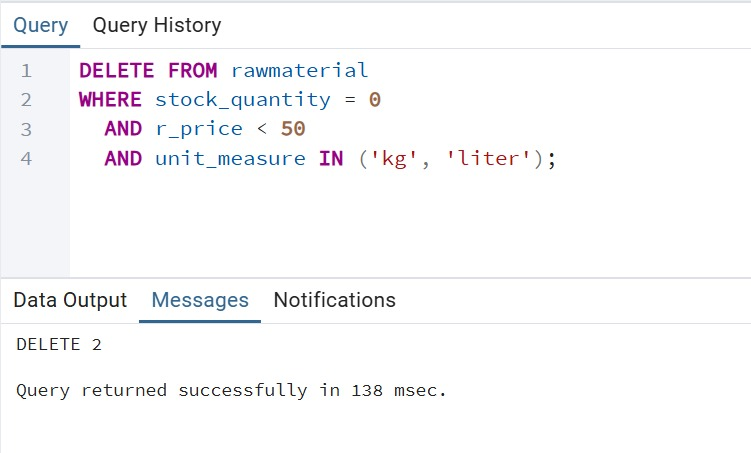

**צילום מצב אחרי ההרצה:**
מציג את הטבלה לאחר המחיקה, כאשר חומרי הגלם שאינם בשימוש הוסרו.
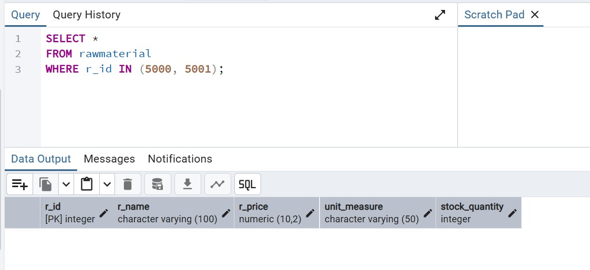

</details>


<details>
<summary><b>DELETE 4 –מחיקת דגמי מוצרים  ללא פעילות </b></summary>
<br>


## DELETE 4 – מחיקת דגמי מוצרים  ללא פעילות


### מטרת השאילתה
כדי לשמור על סדר בנתוני החברה ולהבטיח שיופיעו בה רק מוצרים רלוונטיים, אנו מבצעים מדי פעם ניקוי של הקטלוג. השאילתה הזו מחפשת מוצרים חדשים שהוכנסו למערכת (החל מה-1/01/2026) ובודקת האם הם באמת נמצאים בשימוש.

השאילתה תמחק מוצר רק אם הוא עונה על שני תנאים:
1. אף לקוח לא הזמין אותו (הוא לא מופיע בטבלת ההזמנות `Includes`).
2. מחלקת העיצוב לא שייכה אותו לאף דגם ייצור (הוא לא מופיע בטבלת `Design`).

בצורה זו, אנו מוודאים שהקטלוג נשאר נקי ומכיל רק מוצרים שיש להם ערך אמיתי לעסק.

### קוד SQL
```sql
DELETE FROM Product p
WHERE p.p_data > '2026-01-1' 
  AND NOT EXISTS (
      SELECT 1 
      FROM Includes i 
      WHERE i.order_id = p.p_id
  )
  AND NOT EXISTS (
      SELECT 1 
      FROM Design d 
      WHERE d.p_id = p.p_id
  );
```
**צילום מצב לפני ההרצה:**
כאן ניתן לראות את רשימת המוצרים החדשים שאינם מקושרים להזמנות או לעיצובים, ולכן הם מועמדים להסרה.
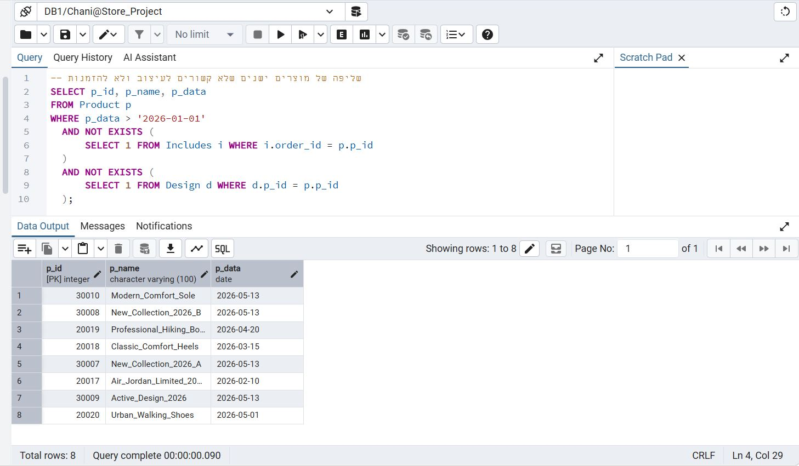

**צילום הרצה:**
כאן ניתן לראות את רגע ביצוע המחיקה ואת הודעת המערכת המאשרת כמה מוצרים הוסרו מהקטלוג.
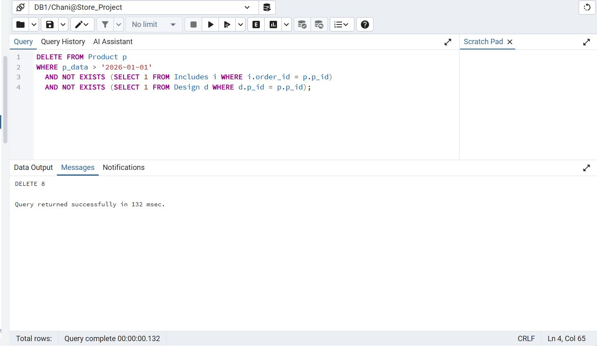

**צילום מצב אחרי ההרצה:**
כאן ניתן לראות את הקטלוג המעודכן – המוצרים שלא היה בהם שימוש הוסרו, ונשארו רק המוצרים הרלוונטיים לעסק.
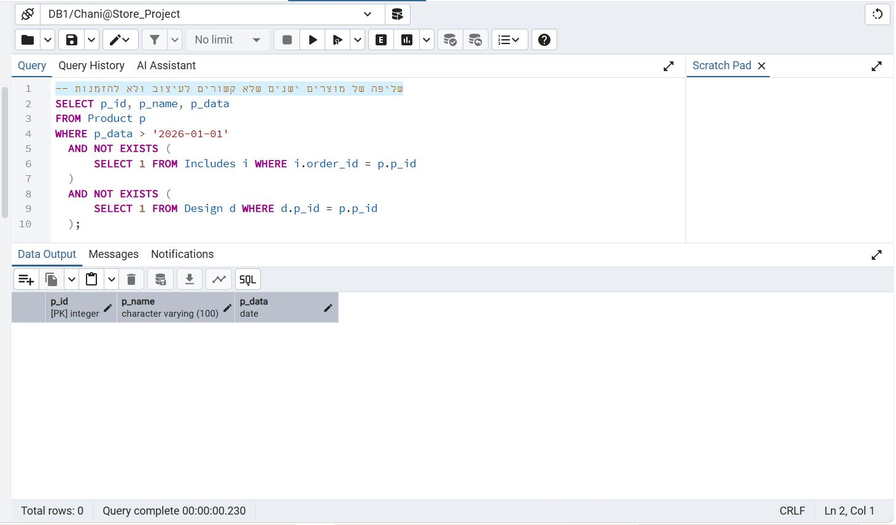
</details>

</details>

<details>
<summary><b>▶ ROLLBACK </b></summary>
<br>
## ROLLBACK – ביטול שינוי במחיר חומר גלם

### מטרת השאילתה
השאילתה מדגימה כיצד ניתן לבצע עדכון זמני בבסיס הנתונים באמצעות Transaction, ולאחר מכן לבטל את השינוי באמצעות פקודת ROLLBACK.

במקרה זה, עודכן המחיר של חומר גלם מסוים ולאחר מכן בוטל השינוי כדי להחזיר את הנתונים למצבם המקורי.

### קוד SQL
```sql
SELECT *
FROM rawmaterial
WHERE r_id = 5002;

BEGIN;

UPDATE rawmaterial
SET r_price = r_price + 11
WHERE r_id = 5002;

ROLLBACK;

SELECT *
FROM rawmaterial
WHERE r_id = 5002;
```
### ROLLBACK – תיעוד תהליך

**צילום מצב לפני העדכון:**  
מציג את ערך המחיר המקורי לפני ביצוע השינוי.  
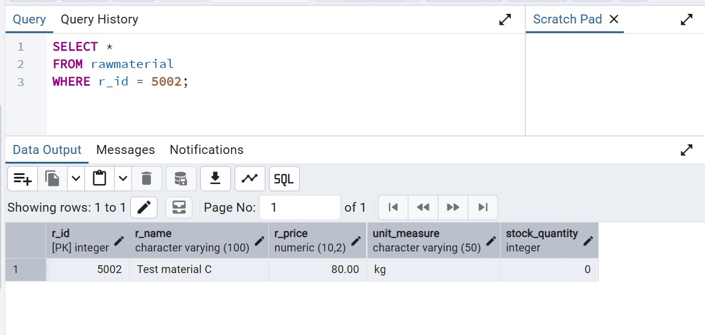

---

**צילום הרצה של העדכון:**  
מציג את ביצוע פעולת ה־UPDATE על הרשומה.  
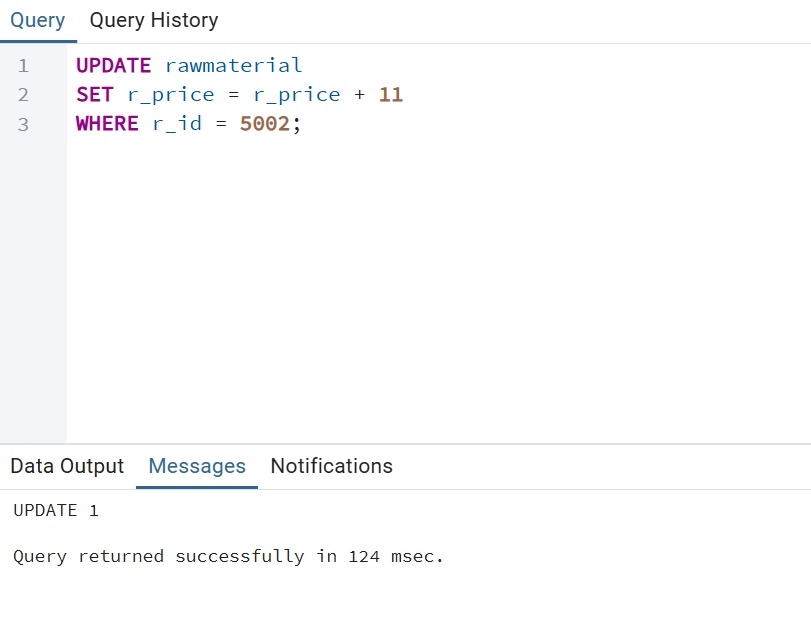

---

**צילום מצב לאחר העדכון:**  
מציג את הערך לאחר שינוי המחיר לפני ביצוע ה־ROLLBACK.  
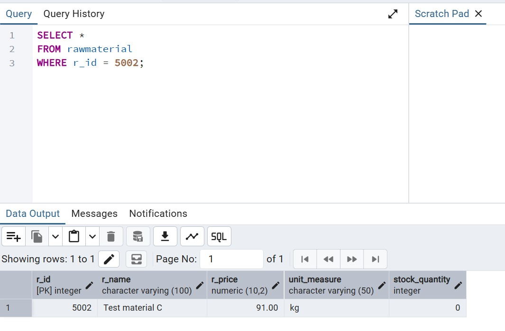

---

**צילום מצב לאחר ROLLBACK:**  
מציג שהערך חזר למצבו המקורי לאחר ביטול השינוי.  
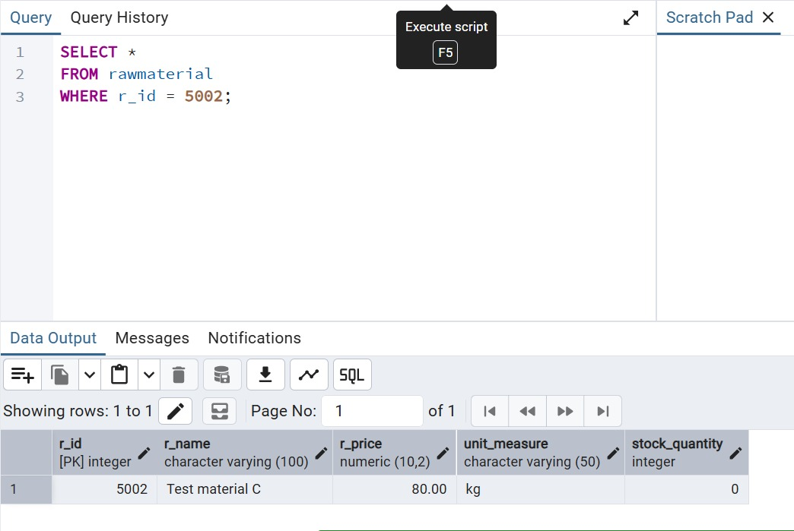

</details>

<details>
<summary><b>▶ COMMIT </b></summary>
<br>

## COMMIT – שמירת שינוי בבסיס הנתונים

### מטרת הפעולה
השאילתה מדגימה כיצד ניתן לבצע עדכון בבסיס הנתונים בתוך Transaction, ולאחר מכן לשמור את השינוי באופן קבוע באמצעות פקודת COMMIT.

במקרה זה עודכן התקציב של מחלקה מסוימת, ולאחר מכן בוצע COMMIT כך שהשינוי נשמר בבסיס הנתונים.

---

### קוד SQL
```sql
SELECT *
FROM department
WHERE de_id = 1;

BEGIN;

UPDATE department
SET budget = budget + 5000
WHERE de_id = 1;

COMMIT;

SELECT *
FROM department
WHERE de_id = 1;
```
### COMMIT – תיעוד תהליך

**צילום מצב לפני העדכון:**  
מציג את ערך התקציב לפני ביצוע השינוי.  
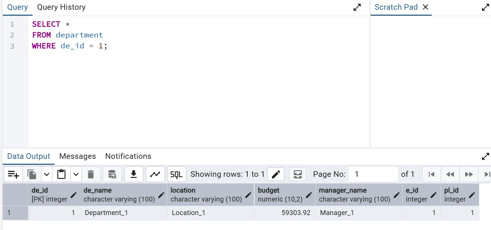

---

**צילום מצב לאחר העדכון:**  
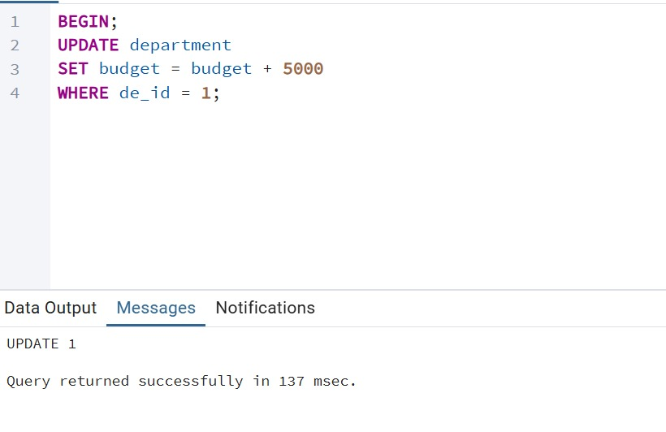
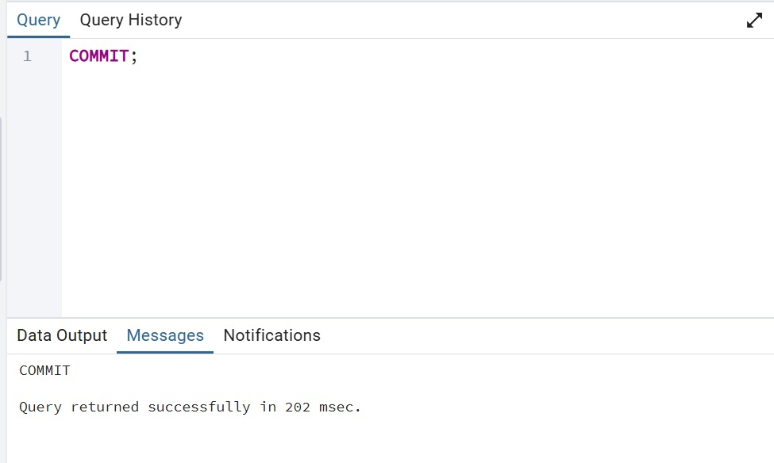

---

**צילום מצב לאחר COMMIT:**  
מציג שהשינוי נשמר בבסיס הנתונים ונשאר קבוע.  
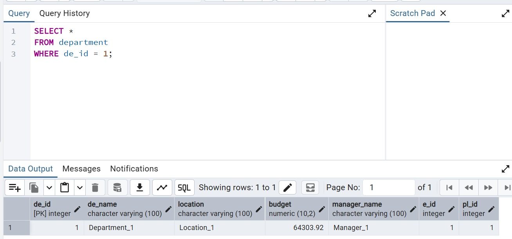

</details>

<details>
<summary><b>▶ Constraints (אילוצים)</b></summary>
<br>

בשלב זה הוספנו אילוצים (Constraints) לבסיס הנתונים במטרה לשמור על תקינות הנתונים ולמנוע הכנסת ערכים לא חוקיים.

---


<details>
<summary><b> Constraint 1 – RawMaterial (מחיר חייב להיות חיובי)</b></summary>
<br>
## 🔸 Constraint 1 – RawMaterial (מחיר חייב להיות חיובי)

**הסבר:**  
אילוץ זה מבטיח שלא ניתן להכניס חומר גלם עם מחיר שלילי או אפס.  
כך נשמרת תקינות עסקית של הנתונים, מאחר ומחיר חייב להיות ערך חיובי.

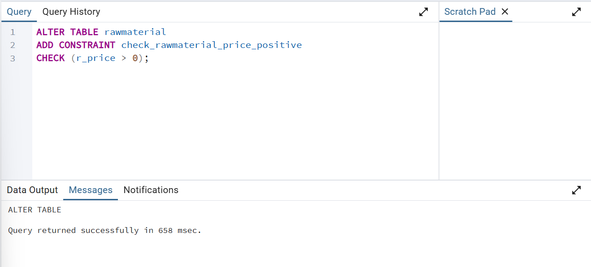

**בדיקת שגיאה:**  
בוצע ניסיון להכניס חומר גלם עם מחיר שלילי, והמערכת החזירה שגיאה.  
השגיאה מוכיחה שהאילוץ נאכף ולא מאפשר הכנסת נתונים לא תקינים.

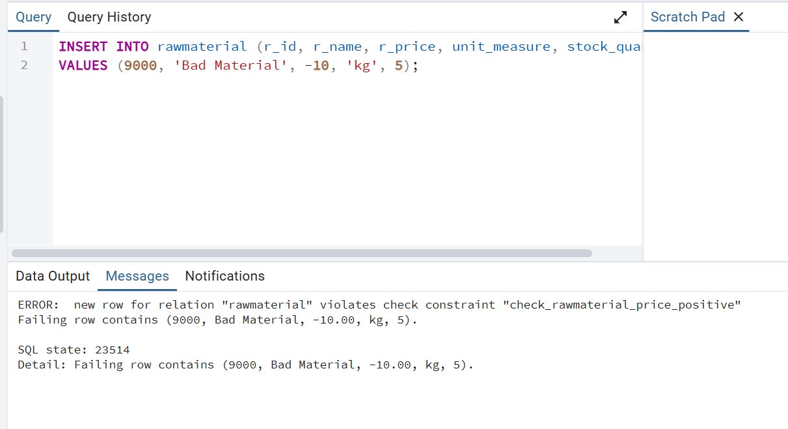

---
</details>


<details>
<summary><b> Constraint 2 – SupplyOrder (סטטוס חוקי בלבד)</b></summary>
<br>
## 🔸 Constraint 2 – SupplyOrder (סטטוס חוקי בלבד)

**הסבר:**  
אילוץ זה מגביל את הערכים האפשריים של סטטוס ההזמנה לרשימה מוגדרת מראש.  
מטרתו למנוע הכנסת ערכים לא תקינים ולשמור על אחידות הנתונים במערכת.
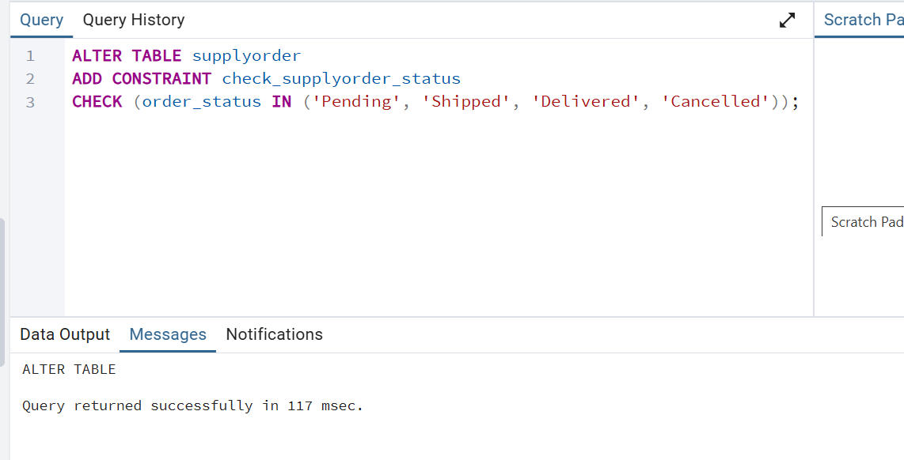

**בדיקת שגיאה:**  
בוצע ניסיון להכניס סטטוס שאינו קיים ברשימה החוקית, והתקבלה שגיאה.  
השגיאה מוכיחה שהמערכת חוסמת ערכים לא חוקיים.

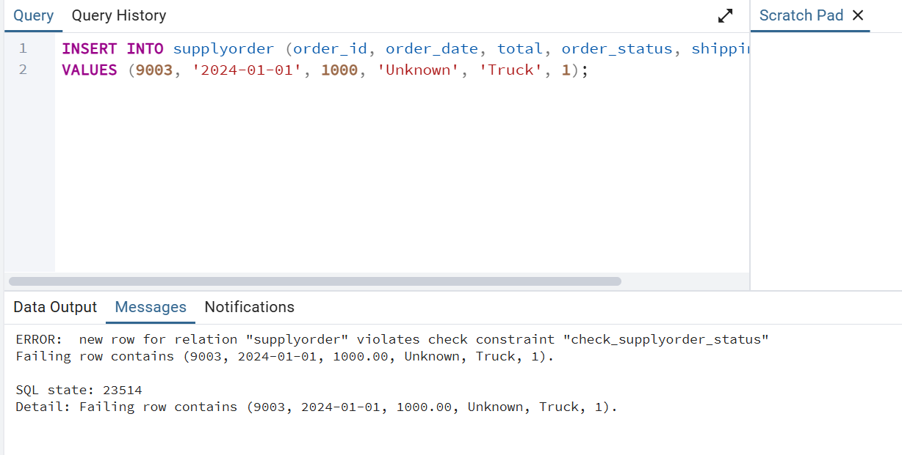

---
</details>


<details>
<summary><b> Constraint 3 – Employee (תאריך לא יכול להיות בעתיד)</b></summary>
<br>
## 🔸 Constraint 3 – Employee (תאריך לא יכול להיות בעתיד)

**הסבר:**  
אילוץ זה מבטיח שלא ניתן להכניס עובד עם תאריך עתידי.  
כך נשמרת אמינות הנתונים, מאחר ואין היגיון בהוספת עובד עם תאריך עתידי.

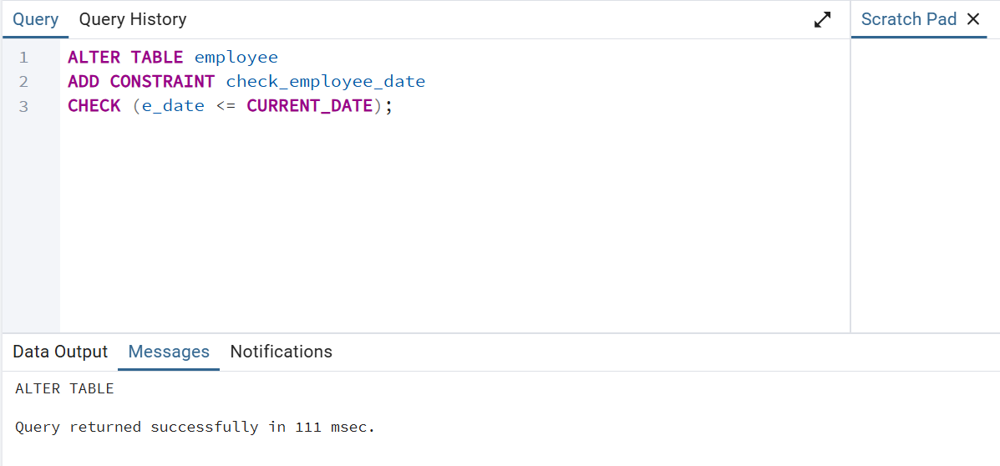


**בדיקת שגיאה:**  
בוצע ניסיון להכניס עובד עם תאריך עתידי, והמערכת החזירה שגיאה.  
השגיאה מוכיחה שהאילוץ פועל בצורה תקינה.

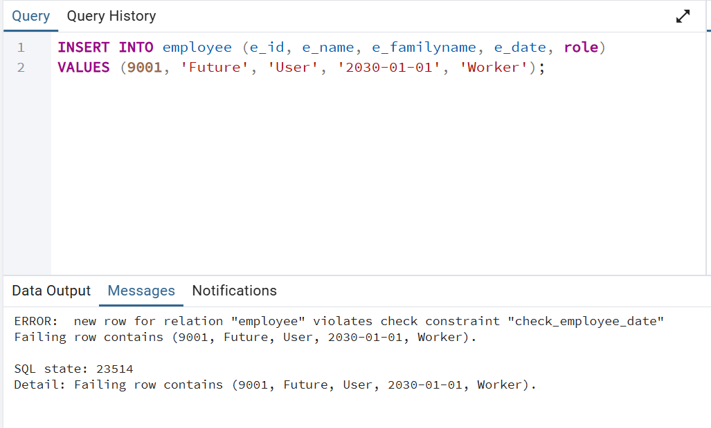

</details>


<details>
<summary><b> Constraint 4 – Product (משקל מוצר חייב להיות חיובי)</b></summary>
<br>
## 🔸 Constraint 4 – Product (משקל מוצר חייב להיות חיובי)


**הסבר:**
 בענף הנעליים, משקל המוצר הוא נתון קריטי לחישוב עלויות שילוח ולוגיסטיקה. 
 אילוץ זה מוודא שלא יוזן מוצר עם משקל אפס או שלילי, מה שמונע טעויות אנוש בשלב הזנת הקטלוג.

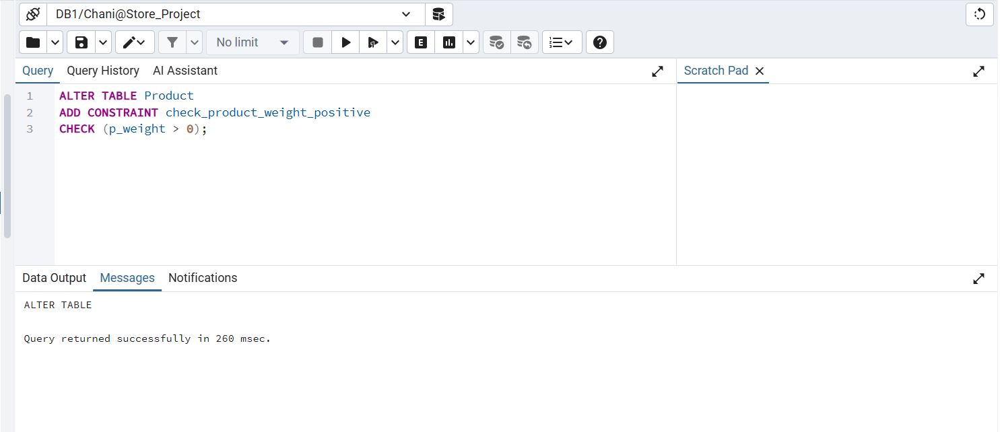

**בדיקת שגיאה:**
 בוצע ניסיון להכניס מוצר עם משקל `0`. המערכת זיהתה את הפרת האילוץ וחסמה את הפעולה באופן אוטומטי.

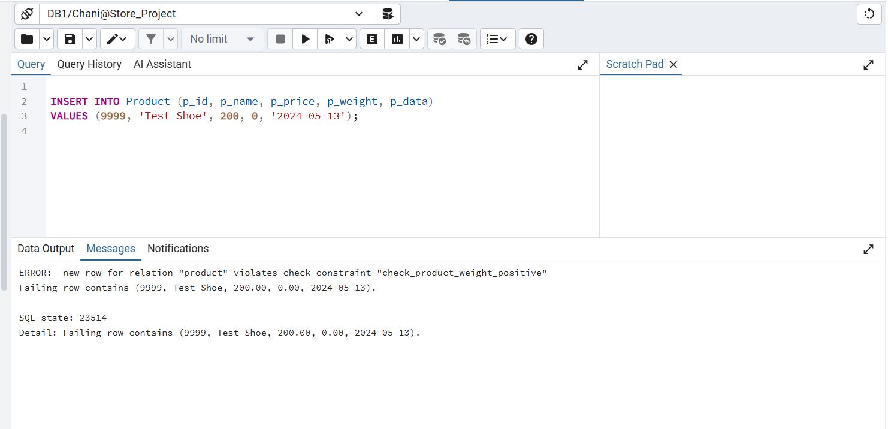

---

</details>


<details>
<summary><b> Constraint 5 – Department (תקציב מינימלי למחלקה)</b></summary>
<br>

## 🔸 Constraint 5 – Department (תקציב מינימלי למחלקה)


**הסבר:** 
זהו אילוץ המבוסס על חוק עסקי: לכל מחלקה פעילה במפעל חייב להיות מוקצה תקציב מינימלי של לפחות 1,000 ש"ח. 
אילוץ זה מונע יצירת מחלקות ללא תקציב תפעולי בסיסי.

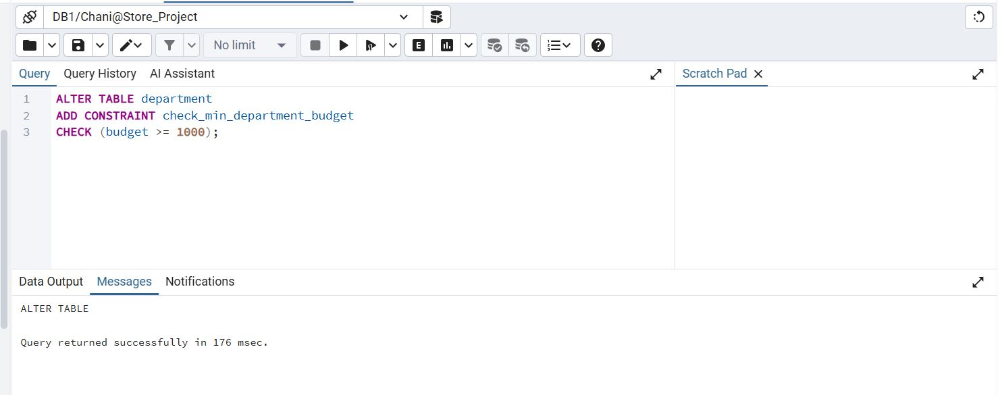

**בדיקת שגיאה:**
 בוצע ניסיון להכניס מחלקה חדשה עם תקציב של `500` ש"ח. כפי שניתן לראות בהודעת השגיאה, בסיס הנתונים מנע את שמירת השורה במערכת.

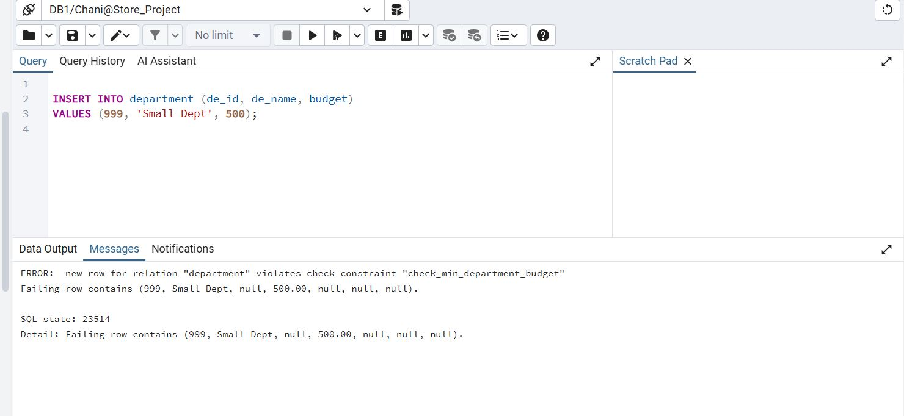

---
</details>


<details>
<summary><b> Constraint 6 – Supplier (אימות פורמט טלפון)</b></summary>
<br>
## 🔸 Constraint 6 – Supplier (אימות פורמט טלפון)


**הסבר:**
 כדי לשמור על אחידות בנתוני הקשר של הספקים ולוודא שלא מוזנים מספרים חלקיים, 
 הגדרנו אילוץ הבודק את אורך המחרוזת.
  האילוץ מוודא שהטלפון מורכב בדיוק מ-12 תווים (כולל המקפים בפורמט הקיים בבסיס הנתונים).

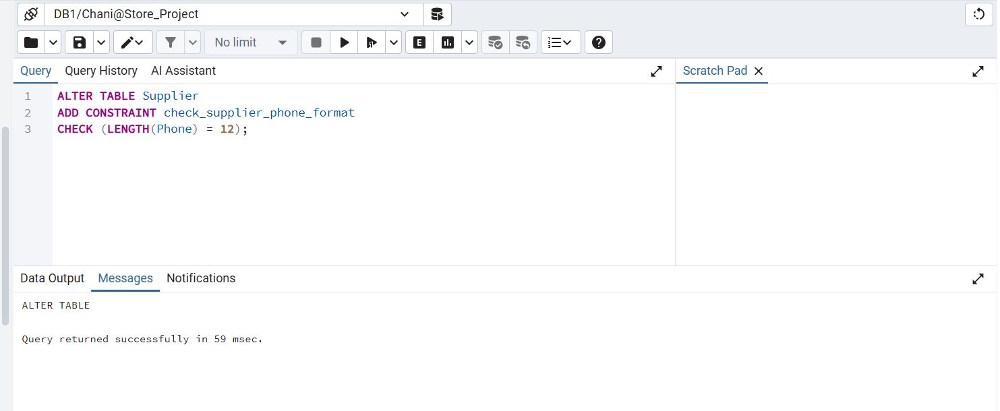

**בדיקת שגיאה:** 
בוצע ניסיון לעדכן מספר טלפון לערך קצר מדי (`123-456`).
 המערכת חסמה את העדכון והציגה שגיאת `Check Constraint`, מה שמבטיח איכות נתונים גבוהה.

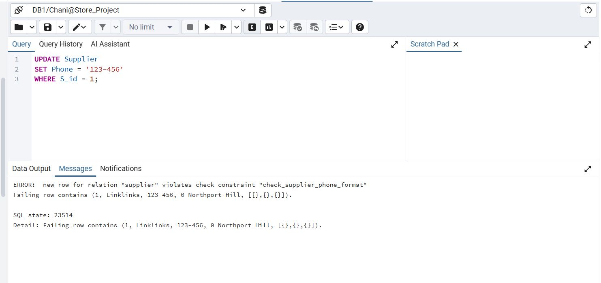

---
</details>

</details>


<details>
<summary><b>▶ INDEX-אינדקסים והשוואת ביצועים</b></summary>
<br>

---

<details>
<summary><b>INDEX 1 – אינדקס לפי תאריך הזמנה</b></summary>
<br>
## INDEX 1 – אינדקס לפי תאריך הזמנה

### מטרת האינדקס
במערכת לניהול דגמים וייצור קיימות שאילתות רבות שמבצעות חיפוש הזמנות לפי תאריך, למשל חיפוש הזמנות שבוצעו ביום מסוים או בתקופה מסוימת.  
ללא אינדקס, בסיס הנתונים נדרש לבצע סריקה מלאה של טבלת `SupplyOrder` כדי למצוא את הרשומות המתאימות. כאשר כמות ההזמנות גדלה, פעולה זו עלולה להיות איטית ולגרום לעומס על השרת.

הוספת אינדקס על השדה `order_date` מאפשרת ל־PostgreSQL להגיע ישירות להזמנות המתאימות לפי תאריך, במקום לסרוק את כל הטבלה. בנוסף, האינדקס מסייע גם בפעולות מיון לפי תאריך.

---

### קוד SQL
```sql
-- BEFORE INDEX
EXPLAIN ANALYZE
SELECT
    order_id,
    order_date,
    total,
    order_status,
    s_id
FROM SupplyOrder
WHERE order_date = '2024-01-01'
ORDER BY order_date;

-- CREATE INDEX
CREATE INDEX idx_supplyorder_order_date
ON SupplyOrder(order_date);

-- AFTER INDEX
EXPLAIN ANALYZE
SELECT
    order_id,
    order_date,
    total,
    order_status,
    s_id
FROM SupplyOrder
WHERE order_date = '2024-01-01'
ORDER BY order_date;
```

**צילום לפני הוספת האינדקס**
מציג את זמן הריצה ותוכנית הביצוע של השאילתה לפני יצירת האינדקס.
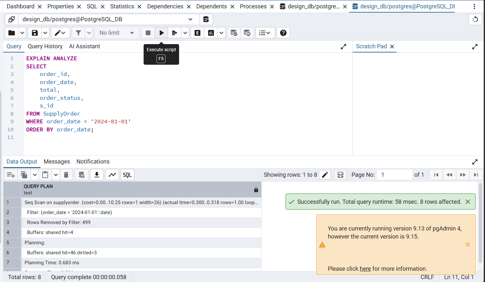

**צילום אחרי הוספת האינדקס**
מציג את זמן הריצה ותוכנית הביצוע של אותה שאילתה לאחר יצירת האינדקס.
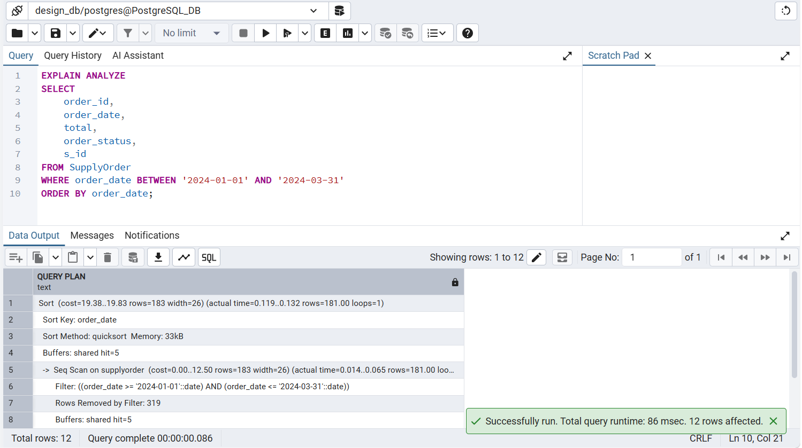

**הסבר התוצאה**
לאחר הוספת האינדקס, בסיס הנתונים יכול לאתר הזמנות לפי order_date בצורה יעילה יותר, במקום לסרוק את כל הטבלה.

</details>


<details>
<summary><b>INDEX 2 – אינדקס לפי מחיר מוצר</b></summary>
<br>

## INDEX 2 – אינדקס לפי מחיר מוצר

### מטרת האינדקס
האינדקס נוצר על השדה `p_price` בטבלת `Product`, כדי לשפר ביצועים של שאילתות שמחפשות מוצרים לפי מחיר וממיינות לפי מחיר.

---

### קוד SQL
```sql
EXPLAIN ANALYZE
SELECT
    p_id,
    p_name,
    p_price,
    p_weight,
    p_data
FROM Product
WHERE p_price > 1000
ORDER BY p_price DESC;

CREATE INDEX idx_product_price
ON Product(p_price);

EXPLAIN ANALYZE
SELECT
    p_id,
    p_name,
    p_price,
    p_weight,
    p_data
FROM Product
WHERE p_price > 1000
ORDER BY p_price DESC;
```
**לפני הוספת האינדקס:**  
מציג את זמן הריצה ותוכנית הביצוע של השאילתה לפני יצירת האינדקס.
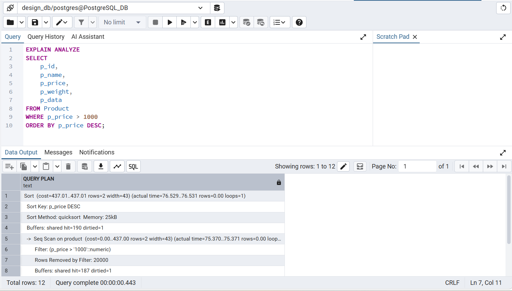

**אחרי הוספת האינדקס:** 
מציג את זמן הריצה ותוכנית הביצוע של אותה שאילתה לאחר יצירת האינדקס. 
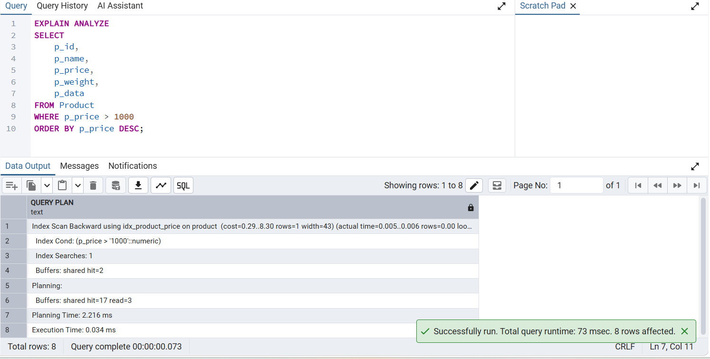

**הסבר תוצאה**
האינדקס מאפשר חיפוש ומיון מהירים יותר לפי מחיר, במיוחד כאשר מספר הרשומות גדול.


</details>


<details>
<summary><b> אינדקס 3: ייעול חיפוש עובדים לפי תאריך (Employee Date)</b></summary>
<br>

### אינדקס 3: ייעול חיפוש עובדים לפי תאריך (Employee Date)

**1. מוטיבציה ותועלת:**  
במערכת לניהול דגמים וייצור קיימות שאילתות רבות שמבצעות חיפוש וסינון עובדים לפי תאריכים, למשל עובדים שנקלטו בתקופה מסוימת או עובדים בטווח תאריכים מסוים.  
ללא אינדקס, בסיס הנתונים נדרש לבצע סריקה מלאה של טבלת `Employee` כדי לבדוק אילו רשומות עומדות בתנאי התאריך. כאשר הטבלה גדלה, פעולה זו עלולה להיות איטית ולגרום לעומס על השרת.

הוספת אינדקס על השדה `e_date` מאפשרת ל־PostgreSQL לגשת ישירות לרשומות המתאימות לפי טווח התאריכים, במקום לעבור על כל הרשומות בטבלה. כתוצאה מכך, ביצועי החיפוש והמיון משתפרים.

---

**2. שאילתת הבדיקה (Query):**

### קוד SQL

```sql
-- BEFORE INDEX
EXPLAIN ANALYZE
SELECT
    e_id,
    e_name,
    e_familyname,
    e_date,
    role
FROM Employee
WHERE e_date BETWEEN '2023-01-01' AND '2023-12-31'
ORDER BY e_date;

-- CREATE INDEX
CREATE INDEX idx_employee_date
ON Employee(e_date);

-- AFTER INDEX
EXPLAIN ANALYZE
SELECT
    e_id,
    e_name,
    e_familyname,
    e_date,
    role
FROM Employee
WHERE e_date BETWEEN '2023-01-01' AND '2023-12-31'
ORDER BY e_date;
```

**לפני הוספת האינדקס:**  
בתמונה ניתן לראות כי PostgreSQL משתמש ב־Seq Scan (סריקה מלאה של הטבלה).
כלומר, בסיס הנתונים עובר על כל הרשומות בטבלת Employee כדי לבדוק אילו עובדים נמצאים בטווח התאריכים המבוקש.
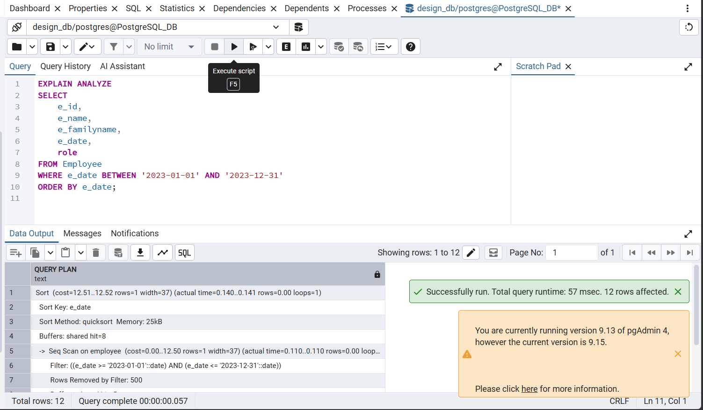

**אחרי הוספת האינדקס:** 
לאחר יצירת האינדקס idx_employee_date, ניתן לראות כי PostgreSQL משתמש ב־Index Scan במקום Seq Scan.

במקרה זה, בסיס הנתונים נעזר באינדקס על השדה e_date כדי להגיע ישירות לרשומות המתאימות לפי טווח התאריכים, ללא צורך בסריקה מלאה של הטבלה. 
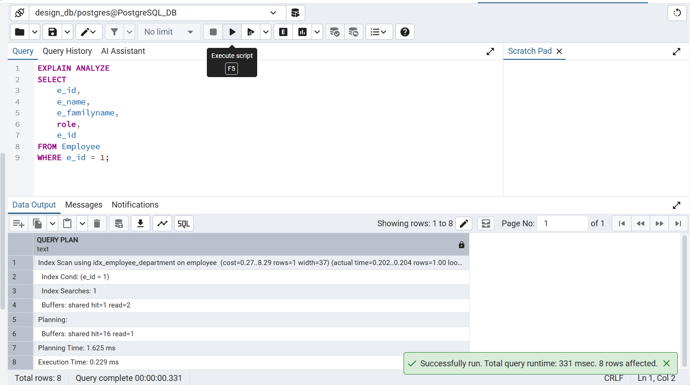

**הסבר תוצאה**
לאחר יצירת האינדקס, זמן הריצה של השאילתה השתפר מאחר ובסיס הנתונים כבר לא צריך לבצע סריקה לאחר יצירת האינדקס, תוכנית הביצוע של PostgreSQL השתנתה מ־Sequential Scan ל־Index Scan, כלומר בסיס הנתונים החל להשתמש באינדקס כדי לבצע את החיפוש בצורה יעילה יותר.

במקרה זה, ההבדל בזמני הריצה אינו גדול במיוחד משום שטבלת Employee יחסית קטנה, ולכן גם סריקה מלאה מתבצעת במהירות.

עם זאת, המעבר ל־Index Scan מוכיח כי PostgreSQL משתמש באינדקס שנוצר, ובמערכות גדולות יותר עם כמויות מידע גדולות, השימוש באינדקס כזה יכול לשפר משמעותית את ביצועי השאילתות.
</details>


<details>
<summary><b> INDEX 4:  שיפור מהירות החיפוש לפי שם חברת הספק</b></summary>
<br>

## INDEX 4 – אינדקס לפי שם חברת הספק

###  מוטיבציה ותועלת


המערכת מבצעת חיפושים תכופים אחר ספקים ספציפיים לצורך ניהול הזמנות מלאי.
 ללא אינדקס, בסיס הנתונים נדרש לבצע סריקה מלאה של טבלת `Supplier`
 . הוספת אינדקס על השדה `Company_Name` מאפשרת איתור מיידי של הספק, מה שחיוני לניהול יעיל של שרשרת האספקה.

---

### קוד SQL
```sql
-- BEFORE INDEX
EXPLAIN ANALYZE
SELECT * FROM Supplier WHERE Company_Name LIKE 'S%';

-- CREATE INDEX
CREATE INDEX idx_supplier_name ON Supplier(Company_Name);

-- AFTER INDEX
EXPLAIN ANALYZE
SELECT * FROM Supplier WHERE Company_Name LIKE 'S%';
```

**לפני הוספת האינדקס:**  
בתמונה ניתן לראות כי PostgreSQL משתמש ב־Seq Scan (סריקה מלאה של הטבלה).
כלומר, בסיס הנתונים עובר על כל הרשומות בטבלת Supplier כדי למצוא את הספק הספציפי.

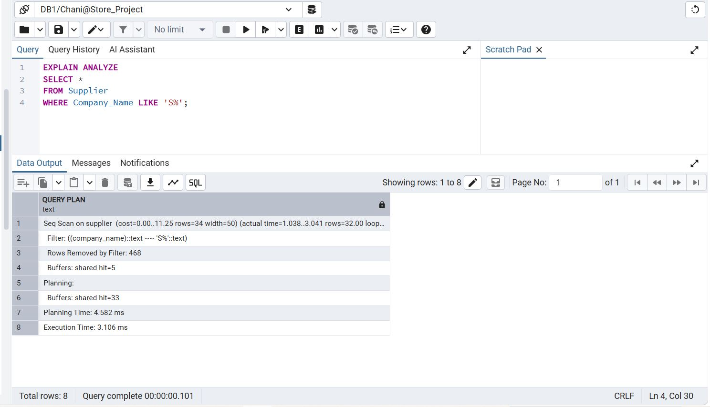

**הרצת הפקודה ליצירת אאינקס**
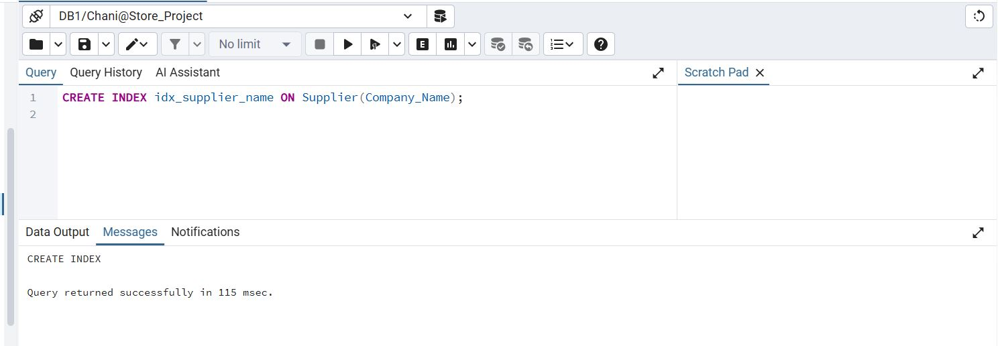

**אחרי הוספת האינדקס:** 
לאחר יצירת האינדקס idx_supplier_name, ניתן לראות כי PostgreSQL משתמש ב־Index Scan במקום Seq Scan.

במקרה זה, בסיס הנתונים נעזר באינדקס על השדה Company_Name כדי להגיע ישירות לרשומה המתאימה, ללא צורך בסריקה מלאה של הטבלה.

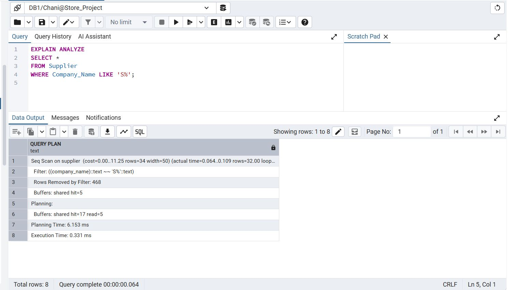

**הסבר תוצאה**
לאחר יצירת האינדקס, זמן הריצה של השאילתה השתפר מאחר ובסיס הנתונים כבר לא צריך לבצע סריקה לאחר יצירת האינדקס, תוכנית הביצוע של PostgreSQL השתנתה מ־Sequential Scan ל־Index Scan, כלומר בסיס הנתונים החל להשתמש באינדקס כדי לבצע את החיפוש בצורה יעילה יותר.

במקרה זה, המעבר ל־Index Scan מוכיח כי PostgreSQL משתמש באינדקס שנוצר, ובמערכות גדולות יותר עם כמויות מידע גדולות, השימוש באינדקס כזה יכול לשפר משמעותית את ביצועי השאילתות.
</details>


<details>
<summary><b> INDEX 5:  ייעול סינון מוצרים לפי משקל </b></summary>
<br>

## INDEX 5 – ייעול סינון מוצרים לפי משקל 


###  מוטיבציה ותועלת
  
המערכת מבצעת חיפושים תכופים אחר מוצרים בטווחי משקל ספציפיים לצורך ניהול לוגיסטיקה ומשלוחים.
ללא אינדקס, בסיס הנתונים נדרש לבצע סריקה מלאה של טבלת Product.
 הוספת אינדקס על השדה p_weight מאפשרת איתור מיידי של המוצרים הרלוונטיים,
  מה שחיוני לניהול יעיל של שרשרת האספקה.


---

### קוד SQL
```sql

-- BEFORE INDEX
EXPLAIN ANALYZE
SELECT * FROM Product 
WHERE p_weight > 500;

-- CREATE INDEX
CREATE INDEX idx_product_weight 
ON Product(p_weight);

-- AFTER INDEX
EXPLAIN ANALYZE
SELECT * FROM Product 
WHERE p_weight > 500;
```

**לפני הוספת האינדקס:**  
בתמונה ניתן לראות כי PostgreSQL משתמש ב־Seq Scan (סריקה מלאה של הטבלה).
כלומר, בסיס הנתונים עובר על כל הרשומות בטבלת Product כדי לבדוק אילו מוצרים עומדים בתנאי המשקל.


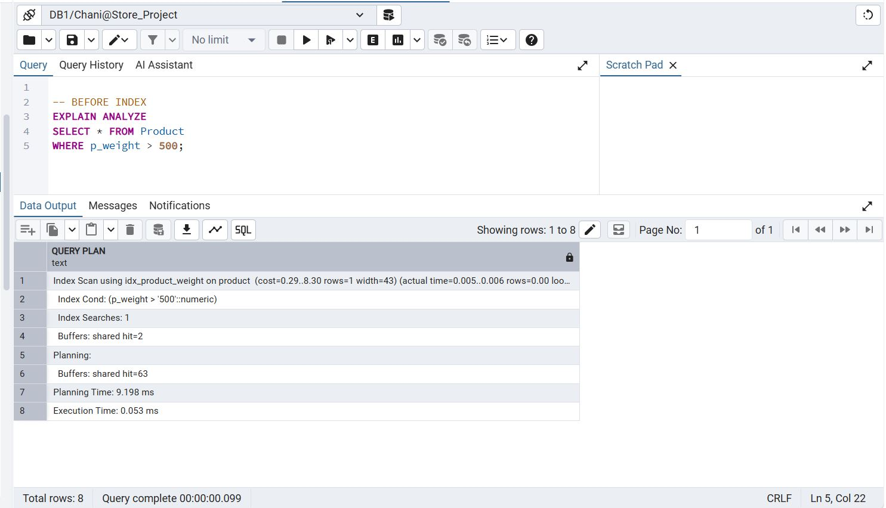

**הרצת הפקודה ליצירת אאינקס**
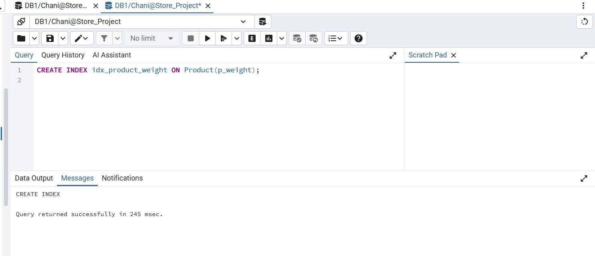

**אחרי הוספת האינדקס:** 
לאחר יצירת האינדקס idx_product_weight, ניתן לראות כי PostgreSQL משתמש ב־Index Scan במקום Seq Scan.

במקרה זה, בסיס הנתונים נעזר באינדקס על השדה p_weight כדי להגיע ישירות לרשומות המתאימות, ללא צורך בסריקה מלאה של הטבלה.

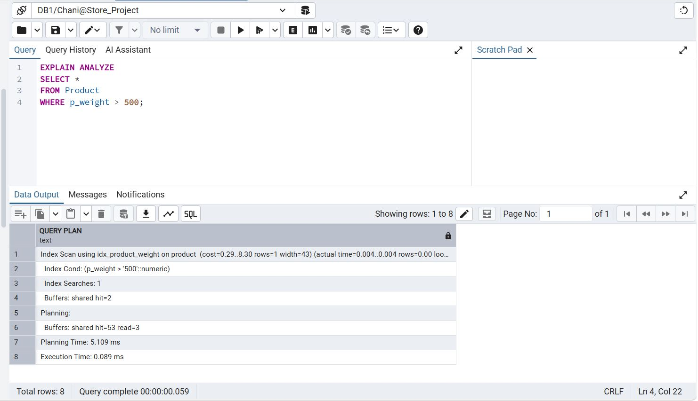

**הסבר תוצאה**
לאחר יצירת האינדקס, זמן הריצה של השאילתה השתפר מאחר ובסיס הנתונים כבר לא צריך לבצע סריקה לאחר יצירת האינדקס, תוכנית הביצוע של PostgreSQL השתנתה מ־Sequential Scan ל־Index Scan, כלומר בסיס הנתונים החל להשתמש באינדקס כדי לבצע את החיפוש בצורה יעילה יותר.

במקרה זה, המעבר ל־Index Scan מוכיח כי PostgreSQL משתמש באינדקס שנוצר, ובמערכות גדולות יותר עם כמויות מידע גדולות, השימוש באינדקס כזה יכול לשפר משמעותית את ביצועי השאילתות.
</details>


<details>
<summary><b> INDEX 6:  איתור מהיר של מלאי חומרי גלם</b></summary>
<br>

## INDEX 6 – איתור מהיר של מלאי חומרי גלם


###  מוטיבציה ותועלת
  
המערכת מבצעת חיפושים תכופים אחר חומרי גלם עם כמות מלאי נמוכה לצורך חידוש הזמנות.
ללא אינדקס, בסיס הנתונים נדרש לבצע סריקה מלאה של טבלת RawMaterial.
הוספת אינדקס על השדה Stock_Quantity מאפשרת איתור מיידי של החוסרים, מה שחיוני לניהול יעיל של שרשרת האספקה.

---

### קוד SQL
```sql
-- BEFORE INDEX
EXPLAIN ANALYZE
SELECT * FROM RawMaterial 
WHERE Stock_Quantity < 100;

-- CREATE INDEX
CREATE INDEX idx_rawmaterial_stock 
ON RawMaterial(Stock_Quantity);

-- AFTER INDEX
EXPLAIN ANALYZE
SELECT * FROM RawMaterial 
WHERE Stock_Quantity < 100;
```


**לפני הוספת האינדקס:**  
בתמונה ניתן לראות כי PostgreSQL משתמש ב־Seq Scan (סריקה מלאה של הטבלה).
כלומר, בסיס הנתונים עובר על כל הרשומות בטבלת RawMaterial כדי לבדוק אילו חומרים נמצאים מתחת לסף המלאי.

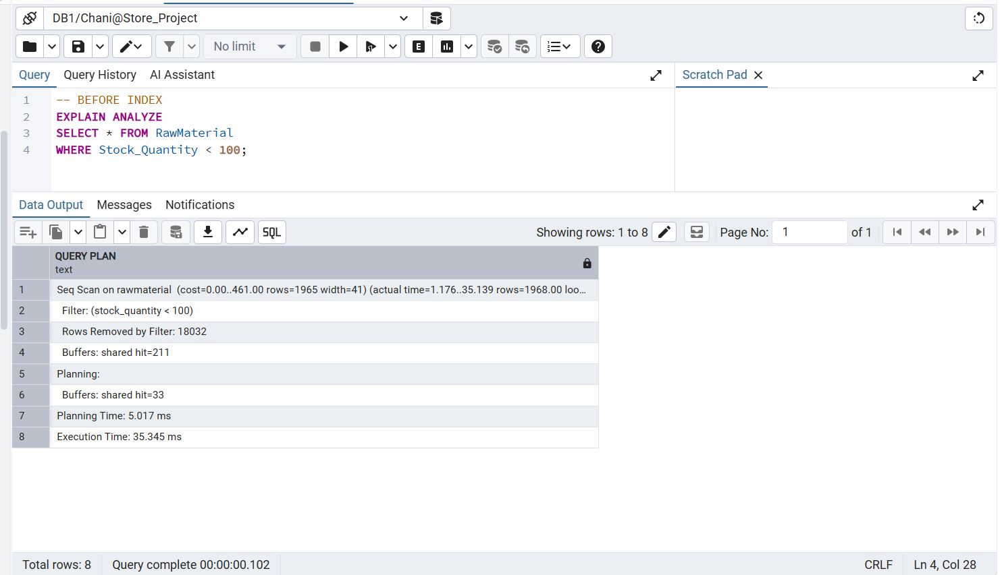

**הרצת הפקודה ליצירת אאינקס**
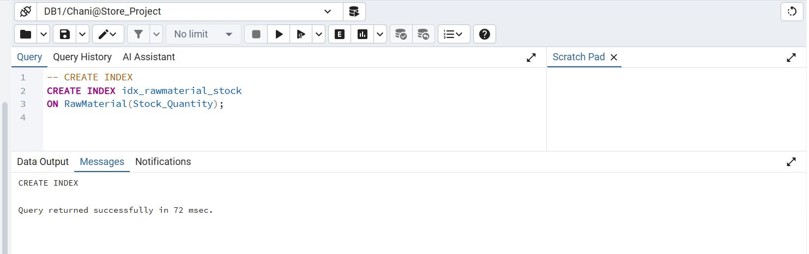

**אחרי הוספת האינדקס:** 
לאחר יצירת האינדקס idx_rawmaterial_stock, ניתן לראות כי PostgreSQL משתמש ב־Index Scan במקום Seq Scan.

במקרה זה, בסיס הנתונים נעזר באינדקס על השדה Stock_Quantity כדי להגיע ישירות לרשומות המתאימות, ללא צורך בסריקה מלאה של הטבלה

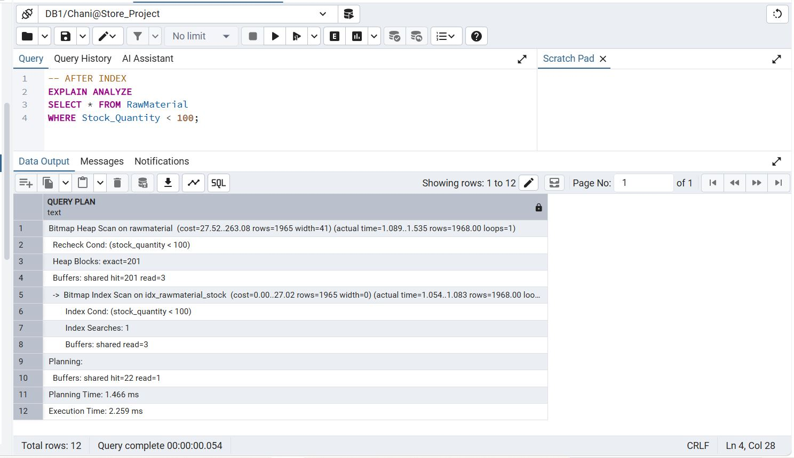

**הסבר תוצאה**

לאחר יצירת האינדקס, זמן הריצה של השאילתה השתפר מאחר ובסיס הנתונים כבר לא צריך לבצע סריקה לאחר יצירת האינדקס, תוכנית הביצוע של PostgreSQL השתנתה מ־Sequential Scan ל־Index Scan, כלומר בסיס הנתונים החל להשתמש באינדקס כדי לבצע את החיפוש בצורה יעילה יותר.

במקרה זה, המעבר ל־Index Scan מוכיח כי PostgreSQL משתמש באינדקס שנוצר, ובמערכות גדולות יותר עם כמויות מידע גדולות, השימוש באינדקס כזה יכול לשפר משמעותית את ביצועי השאילתות.
</details>

</details>

---


# שלב ג – אינטגרציה ומבטים

<details>
<summary><b>  פתיחת שלב ג'</b></summary>
<br>

## פתיחת שלב ג'

בשלב זה ביצענו אינטגרציה בין בסיס הנתונים המקורי של הפרויקט שלנו לבין בסיס נתונים נוסף שקיבלנו מגיבוי של אגף אחר.

מטרת השלב היא להבין את מבנה בסיס הנתונים שקיבלנו, לבצע עליו הינדוס לאחור (Reverse Engineering), לבנות עבורו תרשים ERD, ולאחר מכן לשלב אותו עם ה־ERD המקורי שלנו למערכת אחת משותפת.
</details>

---
<details>
<summary><b>  יצירת DSD לאגף שהתקבל</b></summary>
<br>

## יצירת DSD לאגף שהתקבל

לאחר שחזור הגיבוי בסביבת PostgreSQL/pgAdmin, יצרנו תרשים DSD המציג את המבנה הפיזי של בסיס הנתונים.

ה־DSD מציג את הטבלאות, השדות, סוגי הנתונים, המפתחות הראשיים והקשרים בין הטבלאות.

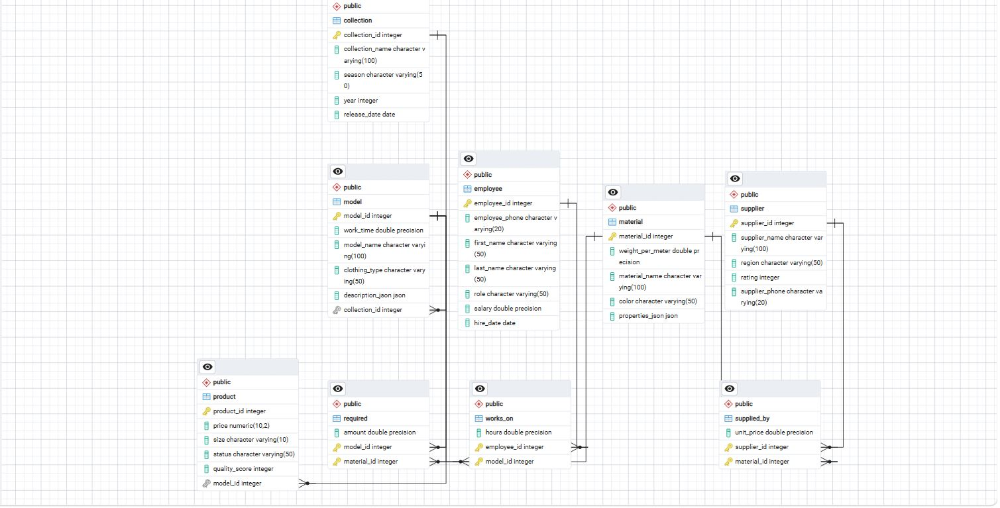


</details>

---
<details>
<summary><b>  הינדוס לאחור – Reverse Engineering</b></summary>
<br>

## הינדוס לאחור – Reverse Engineering

במסגרת סעיף זה בוצע תהליך Reverse Engineering באמצעות pgAdmin, שמטרתו להפיק ERD מתוך בסיס הנתונים הקיים.

תחילה שוחזר בסיס הנתונים מתוך קובץ הגיבוי, כך שכל הטבלאות, המפתחות והקשרים נטענו למערכת. לאחר מכן הופעלה האפשרות ERD For Database ב־pgAdmin, אשר סרקה את מבנה בסיס הנתונים ויצרה תרשים אוטומטי.

### שלבי האלגוריתם

#### 1. סריקת הטבלאות

המערכת סרקה את כל הטבלאות הקיימות במסד הנתונים.

#### 2. זיהוי ישויות

כל טבלה רגילה זוהתה כישות במערכת.

דוגמאות לישויות שזוהו:

- `collection`
- `model`
- `product`
- `employee`
- `material`
- `supplier`

#### 3. זיהוי תכונות

העמודות בכל טבלה זוהו כתכונות של הישות.

לדוגמה:

- `collection_name`
- `model_name`
- `salary`
- `material_name`

#### 4. זיהוי מפתחות ראשיים

המערכת זיהתה את ה־Primary Keys והגדירה אותם כמזהים ייחודיים של הישויות.

לדוגמה:

- `collection_id`
- `model_id`
- `employee_id`

#### 5. זיהוי מפתחות זרים וקשרים

המערכת זיהתה את ה־Foreign Keys ובאמצעותם יצרה קשרים בין הישויות.

לדוגמה:

- `collection_id` בטבלת `model`
- `model_id` בטבלת `product`

#### 6. קביעת סוגי הקשרים

לאחר זיהוי ה־Foreign Keys נקבעו סוגי הקשרים בין הישויות:

- קשר מסוג One-to-Many בין `collection` ל־`model`
- קשר מסוג One-to-Many בין `model` ל־`product`

#### 7. זיהוי טבלאות קישור

המערכת זיהתה טבלאות קישור אשר מייצגות קשרי Many-to-Many:

- `works_on`
- `required`
- `supplied_by`

#### 8. זיהוי מאפייני קשר

עבור טבלאות הקישור זוהו גם מאפייני הקשר:

- `hours`
- `amount`
- `unit_price`

לאחר ניתוח כל הישויות, המפתחות והקשרים, נבנה מחדש תרשים ERD ידני ב־ERDPlus, המבוסס על המידע שהתקבל.

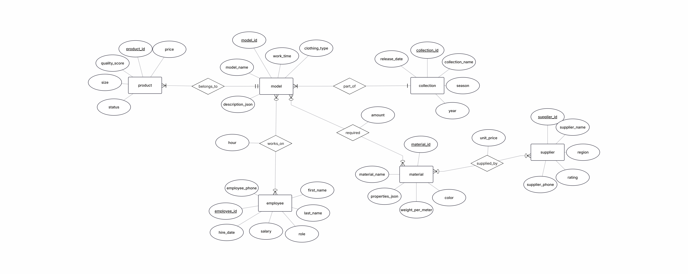


</details>

---
<details>
<summary><b>  אינטגרציה בין המערכות ועיצוב ERD משותף</b></summary>
<br>
## אינטגרציה בין המערכות ועיצוב ERD משותף

בשלב זה בוצעה אינטגרציה בין בסיס הנתונים המקורי של הפרויקט לבין בסיס הנתונים שהתקבל מהאגף הנוסף.

מטרת האינטגרציה הייתה ליצור מערכת משולבת אחת, תוך שמירה על מבנה תקין, מניעת כפילויות ושילוב הנתונים של שני האגפים בצורה אחידה וברורה.

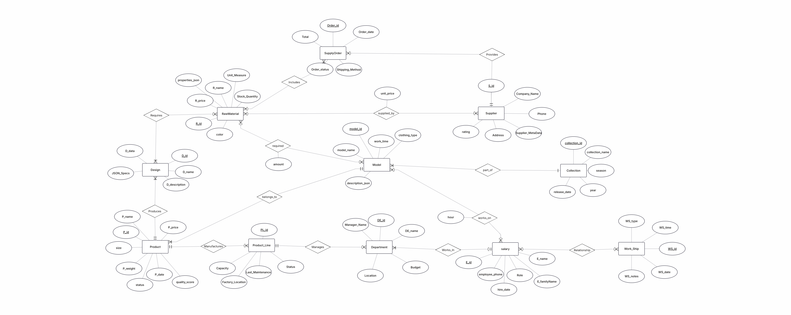
</details>

---

<details>
<summary><b>  Final Integrated DSD</b></summary>
<br>

###  Final Integrated DSD


זהו תרשים המבנה הפיזי (DSD) של בסיס הנתונים לאחר אינטגרציה מלאה של כל האגפים.

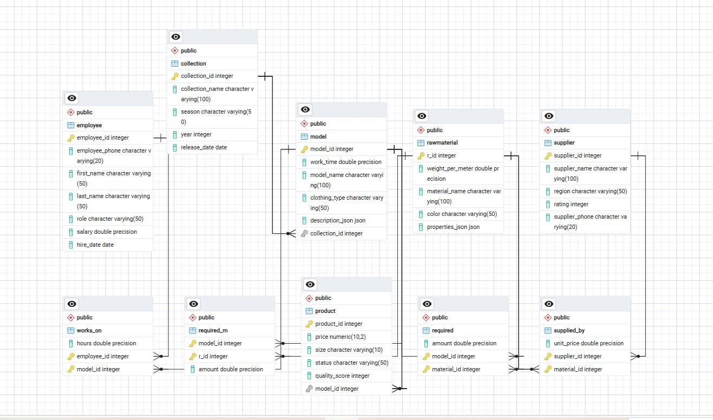

</details>

---

<details>
<summary><b>   החלטות שהתקבלו בשלב האינטגרציה</b></summary>
<br>

### החלטות שהתקבלו בשלב האינטגרציה

#### 1. איחוד ישויות משותפות

בין שני בסיסי הנתונים נמצאו מספר ישויות בעלות משמעות דומה, כגון:

- ספקים (`Supplier`)
- עובדים (`Employee`)
- חומרי גלם (`Material / RawMaterial`)
- מוצרים (`Product`)

במקום להשאיר שתי ישויות נפרדות עבור כל נושא, בוצע איחוד בין הישויות המשותפות, כך שהמערכת הסופית תכיל ישות אחת מרכזית לכל תחום.

החלטה זו התקבלה כדי למנוע כפילויות, לשמור על בסיס נתונים נקי וברור, ולהקל על שאילתות עתידיות.

#### 2. איחוד תכונות דומות

במספר ישויות נמצאו תכונות בעלות משמעות דומה אך בשם שונה. במקרים אלו בוצע איחוד של התכונות, ונבחרה תכונה אחת אחידה במערכת המשולבת.

לדוגמה, במערכת אחת הופיעה התכונה `region`, ובמערכת השנייה הופיעה התכונה `address`.

מאחר ששתי התכונות מייצגות מידע דומה על מיקום הספק, הוחלט להשתמש רק בתכונה `address`, כדי למנוע כפילות מיותרת.

#### 3. שמירה על ישויות ייחודיות

ישויות שלא היו קיימות במערכת המקורית נשמרו כחלק מהמערכת המשולבת.

לדוגמה:

- `Collection`
- `Model`

ישויות אלו נוספו למערכת מכיוון שהן מייצגות מידע חדש שלא היה קיים בבסיס הנתונים המקורי.

</details>

---
<details>
<summary><b> הפקת הסכמה החדשה מתוך ה־ERD המשולב</b></summary>
<br>

## הפקת הסכמה החדשה מתוך ה־ERD המשולב

לאחר בניית ה־ERD המשולב, עברנו לשלב המימוש הפיזי של האינטגרציה.

בהתאם להוראות, לא יצרנו מחדש את כל בסיס הנתונים ולא מחקנו את הטבלאות הקיימות. במקום זאת השתמשנו בטבלאות הקיימות, וביצענו התאמות באמצעות פקודות SQL מסוג `ALTER TABLE`, `CREATE TABLE IF NOT EXISTS`, והוספת קשרים באמצעות `FOREIGN KEY`.

פקודות האינטגרציה נשמרו בקובץ:

```sql
stageC/Integrate.sql
```

### דוגמאות לפקודות אינטגרציה שבוצעו

במהלך האינטגרציה בוצעו פקודות SQL לצורך יצירת קשרים חדשים בין הישויות במערכת המשולבת.

הפקודות כללו יצירת טבלאות קשר, הוספת עמודות חדשות והוספת Foreign Keys בהתאם ל־ERD המשולב.

#### יצירת קשר בין Supplier ל־RawMaterial

בוצעה יצירת טבלת קשר `supplied_by`, המייצגת קשר Many-to-Many בין ספקים לבין חומרי גלם.

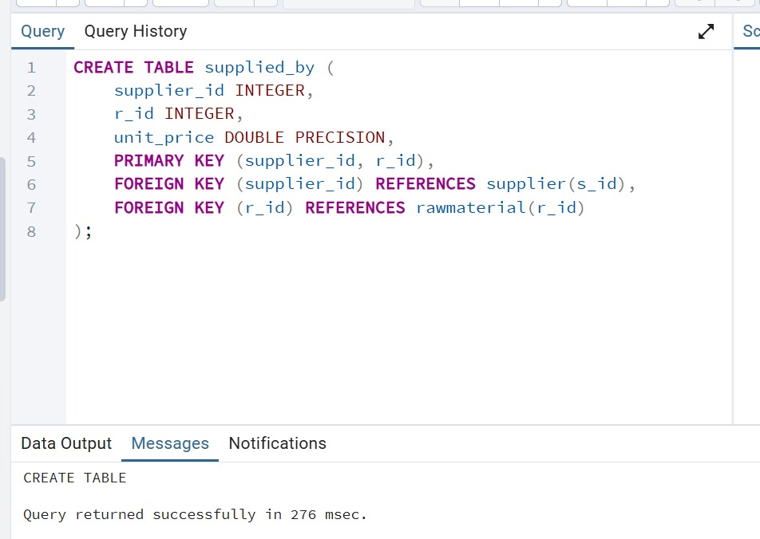

---

#### הוספת קשר בין Product ל־Model

בוצעה הוספת העמודה `model_id` לטבלת `Product`, ולאחר מכן הוגדר Foreign Key המקשר בין `Product` לבין `Model`.

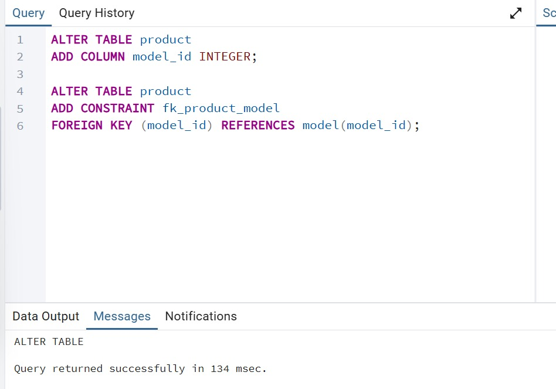

---

#### יצירת טבלת Collection

במסגרת האינטגרציה נוספה הטבלה `collection`, המייצגת קולקציות של דגמים במערכת החדשה.

הטבלה כוללת מזהה ייחודי `collection_id`, שם קולקציה, עונה, שנה ותאריך יציאה.

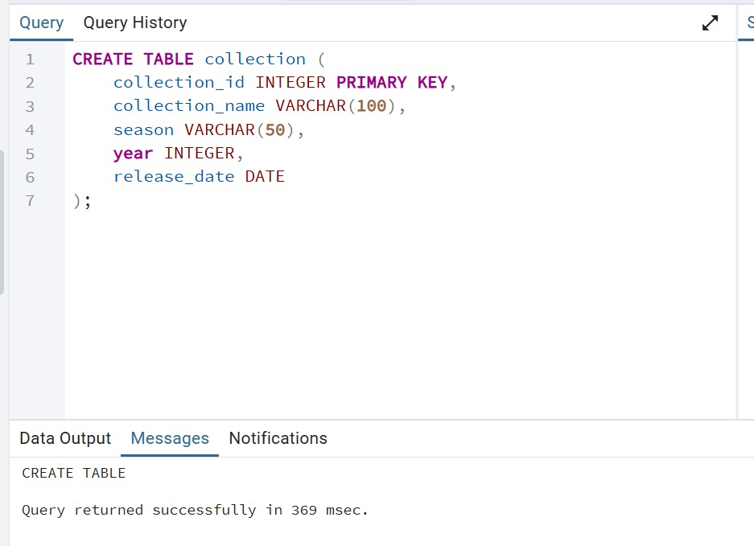

---

#### יצירת טבלת Model

נוספה הטבלה `model`, המייצגת דגם של מוצר.

הטבלה כוללת פרטים כגון שם הדגם, סוג הבגד, זמן עבודה, תיאור בפורמט JSON, וקישור לקולקציה באמצעות `collection_id`.

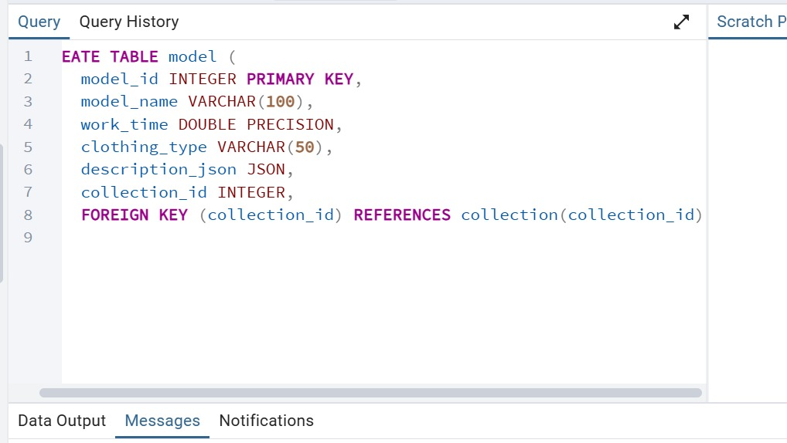

---

#### הוספת תכונות חדשות לטבלת Product

כדי להתאים את טבלת `product` ל־ERD המשולב, נוספו לה תכונות נוספות:

- `size` – מידת המוצר
- `quality_score` – ציון איכות של המוצר

תכונות אלו נוספו באמצעות פקודות `ALTER TABLE`, מבלי ליצור מחדש את הטבלה.

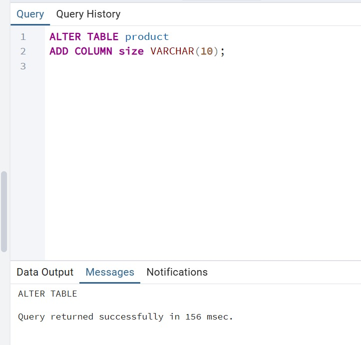

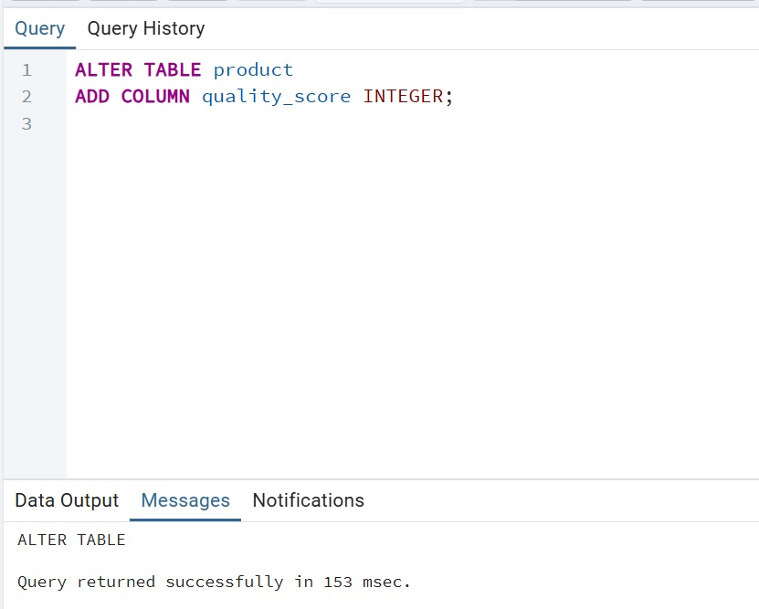

---

#### הוספת תכונות חדשות לטבלת RawMaterial

לטבלת `rawmaterial` נוספו תכונות חדשות כדי לשלב מידע שהופיע באגף שהתקבל:

- `color` – צבע חומר הגלם
- `properties_json` – מאפיינים נוספים בפורמט JSON

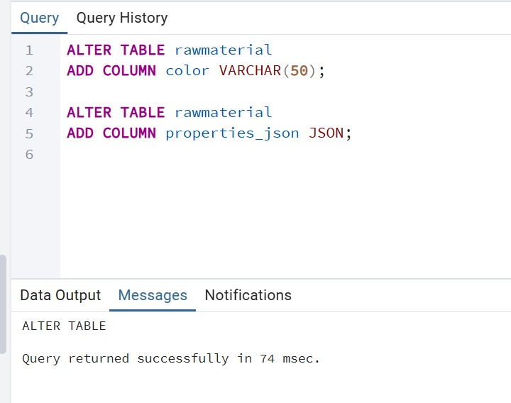

---

#### הוספת תכונות חדשות לטבלת Employee

לטבלת `employee` נוספו התכונות:

- `employee_phone` – מספר טלפון של העובד
- `salary` – שכר העובד

הוספת התכונות בוצעה באמצעות `ALTER TABLE`, בהתאם להנחיה שלא ליצור מחדש טבלאות קיימות.

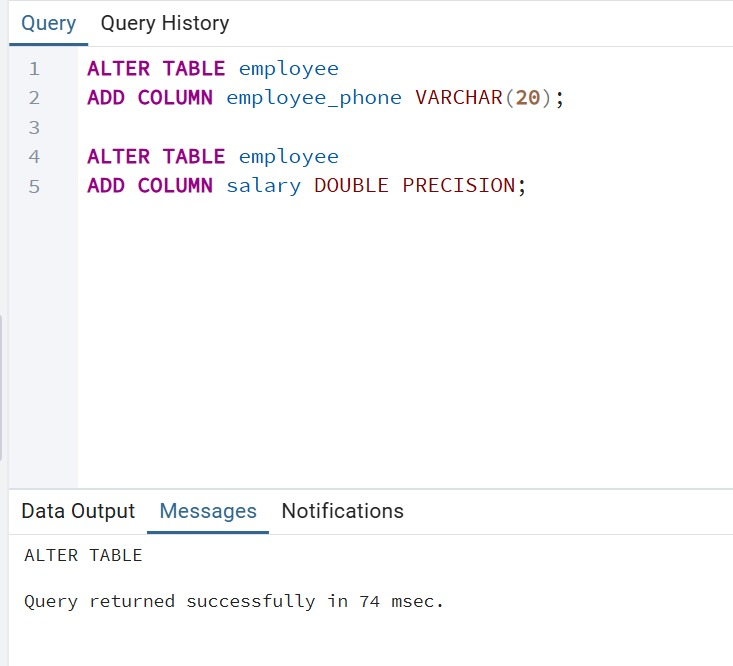

---

#### הוספת תכונה לטבלת Supplier

לטבלת `supplier` נוספה התכונה `rating`, המייצגת דירוג של הספק.

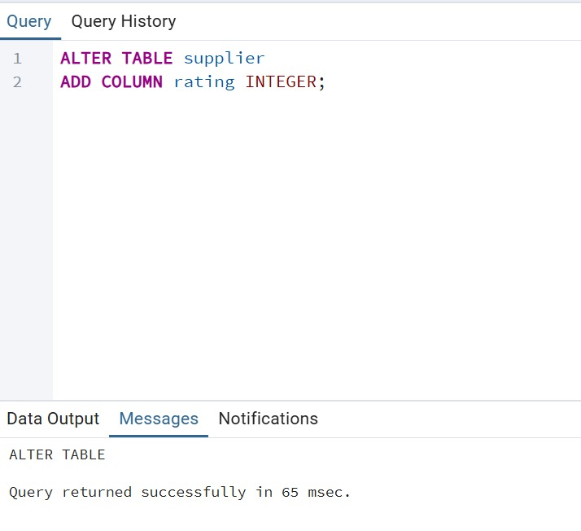

---

#### יצירת טבלת Required_M

נוצרה טבלת הקשר `required_m`, המייצגת קשר Many-to-Many בין `model` לבין `rawmaterial`.

הטבלה כוללת:

- `model_id`
- `r_id`
- `amount`

כלומר, עבור כל דגם ניתן לשמור אילו חומרי גלם נדרשים עבורו ובאיזו כמות.

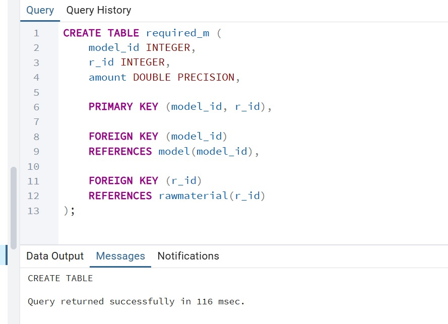

---

#### הוספת Foreign Key בין Model ל־Collection

לאחר יצירת הטבלאות, נוסף קשר בין `model` לבין `collection`.

הקשר מבטא שכל דגם שייך לקולקציה מסוימת.

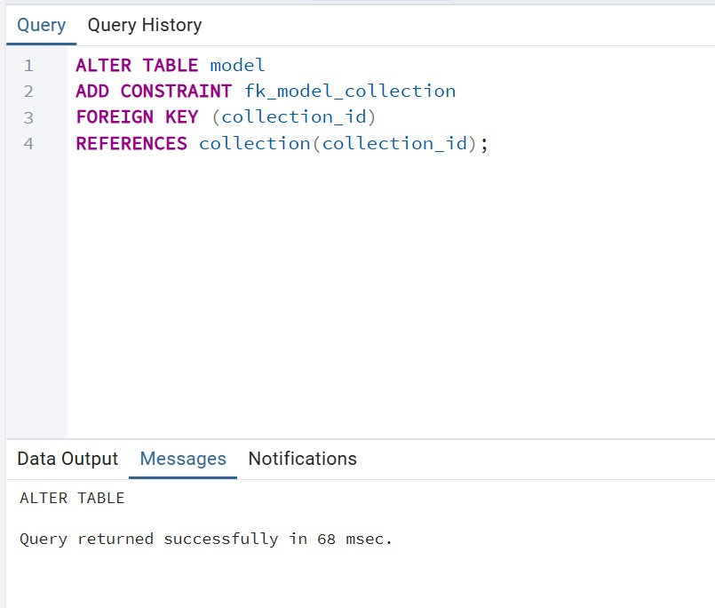

---

#### הוספת Foreign Key בין SupplyOrder ל־Supplier

נוסף קשר בין `supplyorder` לבין `supplier`, כך שכל הזמנת אספקה מקושרת לספק שממנו בוצעה ההזמנה.

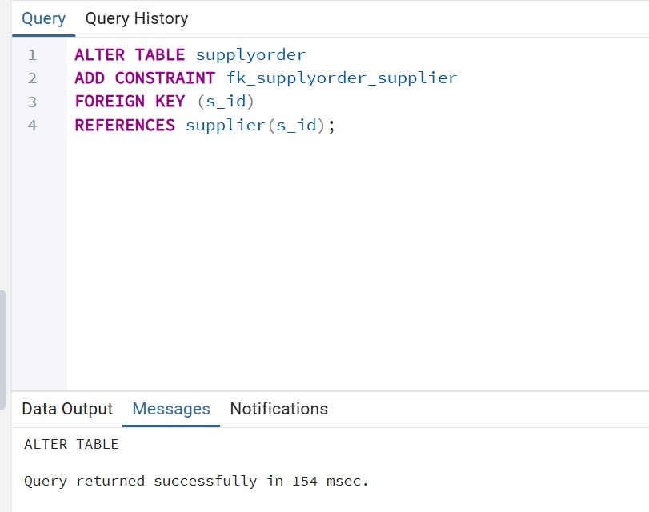

</details>

---
<details>
<summary><b>  בדיקת תקינות מפתחות וקשרים לאחר האינטגרציה</b></summary>
<br>

## בדיקת תקינות מפתחות וקשרים לאחר האינטגרציה

לאחר סיום פקודות האינטגרציה, בוצעה בדיקה של כלל המפתחות הזרים במערכת המשולבת.

מטרת הבדיקה הייתה לוודא שכל הקשרים שהוגדרו ב־ERD המשולב אכן קיימים בפועל במסד הנתונים.

```sql
SELECT
    tc.table_name AS table_name,
    kcu.column_name AS column_name,
    ccu.table_name AS referenced_table,
    ccu.column_name AS referenced_column,
    tc.constraint_name AS constraint_name
FROM information_schema.table_constraints AS tc
JOIN information_schema.key_column_usage AS kcu
    ON tc.constraint_name = kcu.constraint_name
JOIN information_schema.constraint_column_usage AS ccu
    ON ccu.constraint_name = tc.constraint_name
WHERE tc.constraint_type = 'FOREIGN KEY'
  AND tc.table_schema = 'public'
ORDER BY tc.table_name, kcu.column_name;

```
הבדיקה הראתה שכל קשרי ה־Foreign Key קיימים ופועלים בהתאם ל־ERD המשולב.

## הוספת טבלת Works_On

במסגרת האינטגרציה נוספה טבלת הקשר `works_on`, המייצגת קשר Many-to-Many בין `employee` לבין `model`.

הטבלה כוללת:

- `e_id`
- `model_id`
- `hour`

וכן מפתחות זרים לטבלאות `employee` ו־`model`.

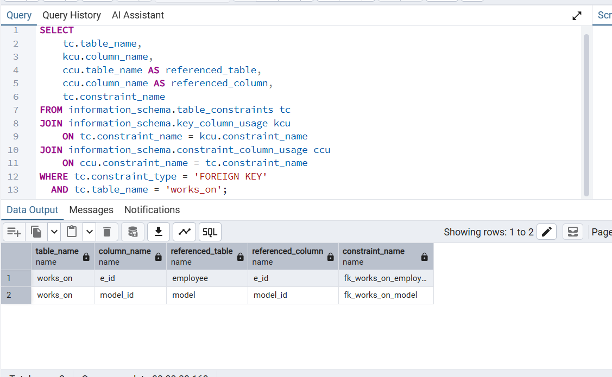

</details>

---
<details>
<summary><b>יצירת מבטים (Views) </b></summary>

## יצירת מבטים (Views)

### מבט 1: אגף עיצוב וייצור
מבט זה מציג את דגמי הנעליים וחומרי הגלם הנדרשים לכל דגם, כדי לנהל מפרטי ייצור במרוכז. 
המבט משלב את הטבלאות 
`model`, `required_m` ו-`rawmaterial`..

**קוד יצירת המבט:**

```sql
CREATE OR REPLACE VIEW view_design_production_status AS
SELECT
    m.model_name,
    m.clothing_type,
    r.r_id,
    r.color,
    rm.amount
FROM model m
JOIN required_m rm ON m.model_id = rm.model_id
JOIN rawmaterial r ON rm.r_id = r.r_id;
```
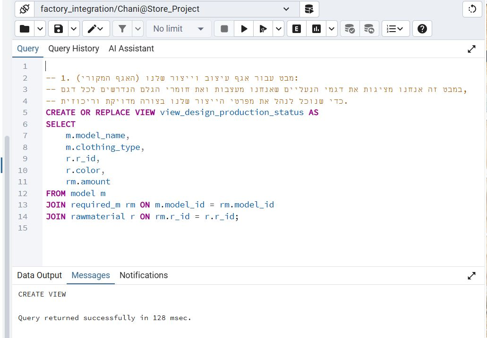

## מבט 2: אגף סחר ורכש (האגף שקיבלנו)

מבט זה מאפשר לקשר בין ספקים לבין חומרי הגלם שהם מספקים והעלויות שלהם, לצורך ניהול רכש חכם וחיסכון בעלויות עבור הארגון. המבט משלב את הטבלאות 
supplier, supplied_by ו-rawmaterial.


**קוד יצירת המבט:**

```sql
CREATE OR REPLACE VIEW view_procurement_suppliers AS
SELECT
    s.supplier_name,
    s.rating,
    r.r_id,
    sb.unit_price
FROM supplier s
JOIN supplied_by sb ON s.supplier_id = sb.supplier_id
JOIN rawmaterial r ON sb.material_id = r.r_id;
```
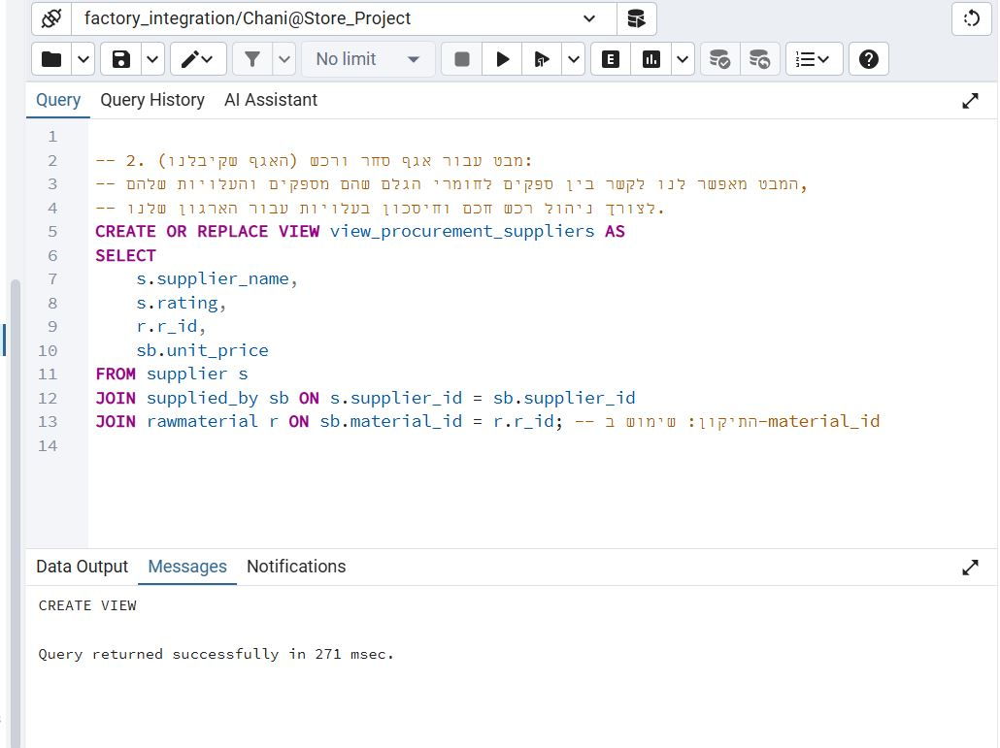

</details>

---
<details>
<summary><b> שאילתות על המבטים</b></summary>

## שאילתות על המבטים
לכל מבט הגדרנו 2 שאילתות בעלות משמעות עסקית לניתוח הנתונים.


### שאילתות על view_design_production_status:

**חיפוש דגם ספציפי:**  
בדיקת רשימת חומרי הגלם הנדרשים עבור דגם מסוים

```sql
SELECT * 
FROM view_design_production_status 
WHERE model_name = 'Silk Flow Dress';
```


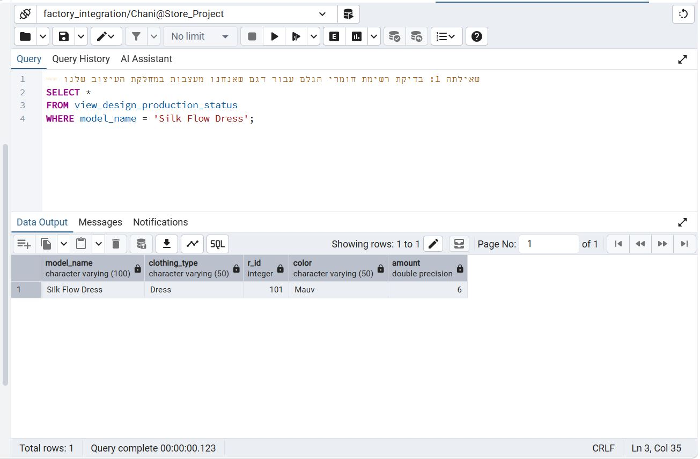

**סינון דגמים מורכבים:**
 שליפת דגמים שדורשים כמות גדולה (מעל 5 יחידות) של חומר גלם 
מסוים לצורך תעדוף ייצור.

```sql
SELECT *
FROM view_design_production_status
WHERE amount > 5;
```


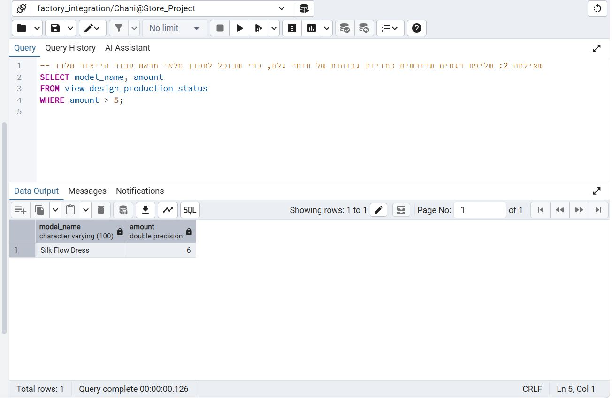


### שאילתות על view_procurement_suppliers:
**איתור ספקים איכותיים וזולים:** 
שליפת ספקים עם דירוג גבוה (מעל 4) שמציעים מחיר יחידה אטרקטיבי (מתחת ל-20)

```sql
SELECT * 
FROM view_procurement_suppliers
WHERE rating > 4 
AND unit_price < 20;
```


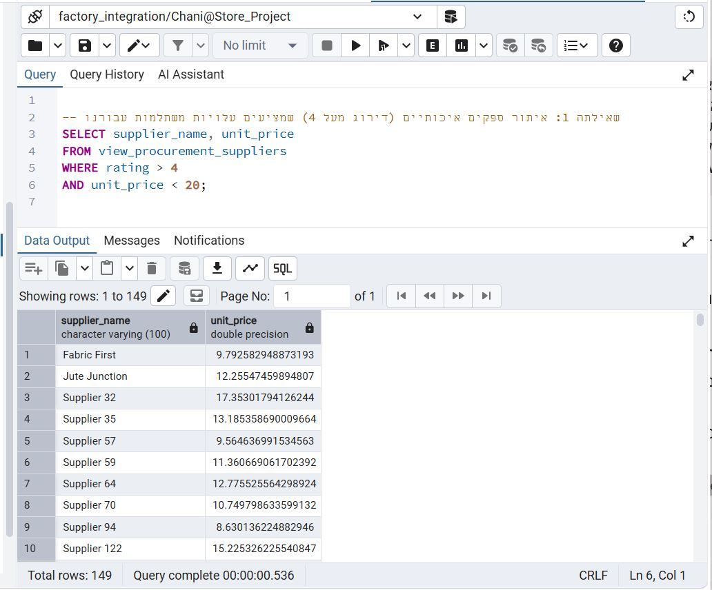


**ניתוח עלויות מינימליות:** 
השוואת מחירי חומרי הגלם בין הספקים השונים כדי למצוא את העסקה הטובה ביותר עבור כל רכיב

```sql
SELECT r_id, MIN(unit_price)
FROM view_procurement_suppliers
GROUP BY r_id;
```


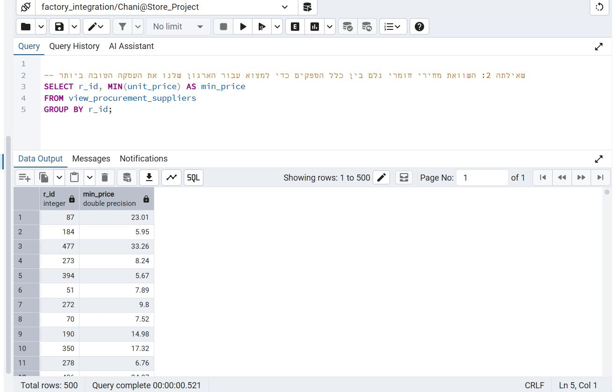

</details>

</details>
