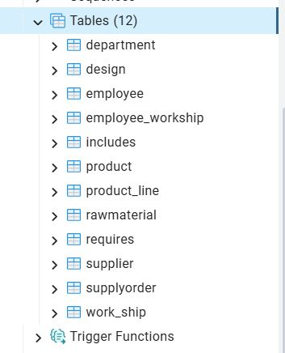

# targil0
# מיני פרויקט בבסיסי נתונים - אגף עיצוב וייצור

**מגישות:** שרי אדלר, מיכל גרינבלט וחני כהן  

**קורס:** מיני פרויקט בבסיסי נתונים  
**נושא האגף:** עיצוב וייצור (דגמים, חומרי גלם, מוצרים, ספקים ועובדים)
---

<b> מבוא וניתוח המערכת</b>

### 1. ניתוח מערכת TOP-DOWN
בשלב זה תוכננו מסכי המערכת הראשוניים בעזרת Google AI Studio. המטרה היא להמחיש את זרימת המידע בין הישויות השונות (מוצרים, חומרי גלם ועיצובים) בממשק המשתמש.

#### סקיצות ממשק (Wireframes):

**לוח בקרה (Dashboard):**
מציג סטטיסטיקות על תהליכי הייצור ומלאי חומרי הגלם.

**ניהול מוצרים:**
טבלת מעקב אחר מוצרים קיימים והקשר שלהם לדגמי העיצוב.

**טופס הזנת עיצוב חדש:**
ממשק להזנת מפרטים טכניים כולל תמיכה בפורמט JSON.

### מבוא ותיאור המערכת
פרויקט זה מתמקד ב**אגף עיצוב וייצור** כחלק ממערכת כוללת לניהול רשת חנויות. 
האגף אחראי על ניהול מחזור החיים של המוצר מרמת הרעיון והעיצוב ועד לייצורו בפועל, תוך תיאום עם ספקים לניהול חומרי הגלם ושיבוץ עובדים למשמרות הייצור.

**תחומי אחריות באגף:**
* **אגף מחקר ופיתוח (R&D):** ניהול דגמים (Designs) ומפרטי JSON טכניים.
* **לוגיסטיקה ורכש פנים-אגפי:** מעקב אחר חומרי גלם (Raw Materials) והזמנות רכש מול ספקים.
* **ייצור:** ניהול קווי ייצור (Production Lines) והפיכת דגמים למוצרים (Products) סופיים המוכנים למכירה בחנות.
* **ניהול כוח אדם:** שיוך עובדים (Employees) למחלקות ושיבוצם במשמרות (Work Shifts)..

<b>  ERD תכנון לוגי - דיאגרמת </b>

 
## 2. תכנון לוגי - דיאגרמת ERD
המערכת מורכבת מ-**9 ישויות מרכזיות**. לכל ישות הוגדרו לפחות 5 תכונות (Attributes) כדי להבטיח פירוט נתונים מרבי ודיוק בתהליכי העבודה.

### דיאגרמת ERD:

<b>📊 נירמול ותלויות פונקציונליות (BCNF)</b>

 
## 3. נירמול ותלויות פונקציונליות (Normalization & Functional Dependencies)

כל הטבלאות במערכת תוכננו כך שיעמדו ברמת נירמול **BCNF** (Boyce-Codd Normal Form). להלן פירוט התלויות והנירמול עבור כל סכמה:

### ישויות מרכזיות

* **Product (מוצר):**
    * **תלויות פונקציונליות:** $P\_id \rightarrow P\_name, P\_price, P\_weight, P\_date, D\_id, PL\_id$
    * **רמת נירמול:** BCNF.
    * **הסבר:** המפתח הראשי $P\_id$ הוא המכריע הפונקציונלי היחיד בטבלה. כל שאר השדות תלויים בו באופן מלא ואין תלויות טרנזיטיביות.

* **Employee (עובד):**
    * **תלויות פונקציונליות:** $E\_id \rightarrow E\_name, E\_familyName, E\_date, Role, DE\_id$
    * **רמת נירמול:** BCNF.
    * **הסבר:** כל פרטי העובד והמחלקה אליה הוא שייך נקבעים אך ורק לפי המזהה הייחודי $E\_id$.

* **Department (מחלקה):**
    * **תלויות פונקציונליות:** $DE\_id \rightarrow DE\_name, Location, Budget, Manager\_Name$
    * **רמת נירמול:** BCNF.
    * **הסבר:** אין שדות שאינם מפתחות שקובעים שדות אחרים (למשל, המיקום לא קובע את שם המחלקה).

* **SupplyOrder (הזמנת רכש):**
    * **תלויות פונקציונליות:** $Order\_id \rightarrow Order\_date, Total, Order\_status, Shipping\_Method, S\_id$
    * **רמת נירמול:** BCNF.
    * **הסבר:** למרות ש-$Total$ הוא אטריביוט נגזר, בבסיס הנתונים הפיזי הוא תלוי ב-$Order\_id$ בלבד.

* **Supplier (ספק):**
    * **תלויות פונקציונליות:** $S\_id \rightarrow Company\_Name, Phone, Address, Supplier\_MetaData$
    * **רמת נירמול:** BCNF.

* **Design, RawMaterial, Product_Line, Work_Ship:**
    * כל הטבלאות הללו נמצאות ב-BCNF מכיוון שלכל אחת מפתח ראשי יחיד ($D\_id, R\_id, PL\_id, WS\_id$ בהתאמה) המהווה את המכריע היחיד לכל שאר תכונות הישות.

---

### טבלאות קשר (Many-to-Many)

בטבלאות אלו המפתח מורכב משני שדות (Composite Primary Key).

* **Includes, Requires, Employee_WorkShip:**
    * **רמת נירמול:** BCNF.
    * **הסבר:** בטבלאות אלו אין תכונות נוספות מעבר למפתחות הזרים המרכיבים את המפתח הראשי. לכן, אין תלויות פונקציונליות שאינן טריוויאליות, והן עומדות בהגדרה המחמירה של BCNF.

---

### סיכום רמת הנירמול
המערכת כולה נמצאת ברמת נירמול **BCNF** מהסיבות הבאות:
1.  כל הטבלאות בנרמול ראשון (ערכים אטומיים, כולל שדות JSON המטופלים כאובייקט שלם).
2.  אין תלויות חלקיות (כל השדות תלויים במפתח הראשי במלואו).
3.  אין תלויות טרנזיטיביות (שדה שאינו מפתח לא קובע שדה אחר שאינו מפתח).
4.  לכל תלות פונקציונלית $X \rightarrow Y$, $X$ הוא מפתח-על (Superkey).

<b>💻 4. מימוש פיזי בבסיס הנתונים (DSD)</b>

 

### מימוש פיזי בבסיס הנתונים (DSD)
 * בשלב זה הפכנו את המודל הלוגי (ERD) לבסיס נתונים פיזי מתפקד בתוך שרת PostgreSQL.

### תיאור המימוש:
באמצעות ממשק ה-pgAdmin, הרצנו סקריפטים של SQL ליצירת הסכימה (Schema). התמונה להלן מציגה את עץ האובייקטים של המערכת, המהווה את ה-DSD (Data Structure Diagram) של הפרויקט:

 * הוכחת מימוש: ניתן לראות כי כל 9 הישויות שהוגדרו בתכנון נוצרו בהצלחה תחת הסכימה הציבורית (public).

 * אילוצים וקשרים: המימוש כולל הגדרת מפתחות ראשיים (PK) ומפתחות זרים (FK) המבטיחים את שלמות הנתונים (Referential Integrity). 

 

### 📥 4. מילוי נתונים - אסטרטגיה וביצוע טכני

<b> בפירוט תהליך המילוי האוטומטי (Python & pgAdmin)</b>

 

כדי להגיע לנפח נתונים משמעותי של מעל **500 רשומות** ולשמור על דיוק מקצועי, בחרנו להשתמש באוטומציה של סקריפטים ב-Python. התהליך בוצע בסדר כרונולוגי מחייב כדי לשמור על שלמות הנתונים ומניעת שגיאות של מפתחות זרים (Foreign Keys).

---

#### 🛠 שלב 1: יצירת תשתית המוצרים (`insert_products.sql`)
התחלנו עם כתיבת והרצת הקוד בקובץ בשם **`fill_products.py`**. 
* **הפעולה:** הקוד יצר קובץ SQL מוכן להרצה בשם `insert_products.sql` המכיל 500 שורות לטבלת **Product**.
* **הלוגיקה:** היינו חייבות להתחיל במוצרים, כי במבנה הנתונים שלנו לא ניתן ליצור עיצוב (Design) אם הוא לא משויך למוצר קיים במערכת.

---

#### 🎨 שלב 2: יצירת עיצובים מורכבים (`insert_designs.sql`)
לאחר שהמוצרים היו מוכנים בבסיס הנתונים, השתמשנו בסקריפט נוסף לייצור נתוני הטבלאות המקשרות. הקוד כלל לוגיקה שנועדה לדמות נתונים אמיתיים:
* **קישור למוצר:** כל עיצוב קיבל `p_id` רנדומלי (בין 1 ל-500) כדי להתחבר למוצרים שיצרנו בשלב קודם.
* **נתוני JSON:** לכל דגם הוספנו שדה `json_specs` (מפרט טכני) הכולל את חומר הגלם, שם המעצבת האחראית (מיכל או חני) והעונה הרלוונטית.
* **ערכי NULL:** הגדרנו בתוך הלולאה ש-15% מהתיאורים יהיו **NULL**, כדי לעמוד בדרישת המרצה לטיפול בנתונים חסרים במערכת.

---

#### 🚀 שלב 3: ייבוא והרצה ב-pgAdmin
לאחר שקבצי ה-SQL היו מוכנים, העתקנו את התוכן שלהם לתוך ה-Query Tool ב-**pgAdmin** והרצנו אותם לפי הסדר. בסיום ההרצה, ביצענו שאילתת אימות כדי לוודא שכל הנתונים נקלטו.

---

#### 🔍 שלב 4: בדיקה ויזואלית של הנתונים והסכימה
בשלב האחרון, השתמשנו באופציית ה-**View/Edit Data** ב-pgAdmin ובחנו את עץ האובייקטים (Browser) כדי לוודא שכל 12 הטבלאות (כולל `supplier`, `rawmaterial` ו-`employee`) הוקמו כראוי ושהקשרים ביניהן תקינים.

### 📥 4. מילוי נתונים (Data Population) - אסטרטגיה וביצוע

< פירוט תהליך המילוי האוטומטי (Python & pgAdmin)</b>

 

כדי לעמוד בדרישה של מעל **500 רשומות** בטבלאות המרכזיות ולשמור על דיוק מקצועי, בחרנו להשתמש באוטומציה של סקריפטים ב-Python. התהליך בוצע בסדר כרונולוגי מחייב כדי לשמור על שלמות הנתונים ומניעת שגיאות של מפתחות זרים (Foreign Keys).

---

#### 🛠 שלב א': יצירת תשתית המוצרים (`fill_products.py`)
התחלנו עם כתיבת והרצת הקוד בקובץ בשם **`fill_products.py`**. 
* **הפעולה:** הקוד יצר קובץ SQL מוכן להרצה בשם `insert_products.sql` המכיל 500 שורות לטבלת ה-**Product**.
* **הלוגיקה:** היינו חייבות להתחיל במוצרים, כי במבנה הנתונים שלנו לא ניתן ליצור עיצוב (Design) אם הוא לא משויך למוצר קיים במערכת.

---

#### 🎨 שלב ב': יצירת עיצובים מורכבים (`insert_designs.sql`)
לאחר שהמוצרים היו מוכנים בבסיס הנתונים, השתמשנו בסקריפט נוסף לייצור נתוני הטבלאות המקשרות. הקוד כלל לוגיקה שנועדה לדמות נתונים אמיתיים:
* **נתוני JSON:** לכל דגם הוספנו שדה `json_specs` (מפרט טכני) הכולל את חומר הגלם, שם המעצבת האחראית (מיכל או חני) והעונה הרלוונטית.
* **ערכי NULL:** הגדרנו בתוך הלולאה ש-15% מהתיאורים יקבלו ערך **NULL** באופן רנדומלי, כדי לעמוד בדרישת המטלה לטיפול בנתונים חסרים.

---

#### 🚀 שלב ג': ייבוא והרצה ב-pgAdmin
לאחר שקבצי ה-SQL היו מוכנים, העתקנו את התוכן שלהם לתוך ה-Query Tool ב-**pgAdmin** והרצנו אותם לפי הסדר. בסיום ההרצה, ביצענו שאילתת **COUNT** כדי לוודא שכל 500 הרשומות נקלטו בהצלחה בטבלאות המטרה.

---

#### 🔍 שלב ד': בדיקה ויזואלית של הנתונים והסכימה
בשלב האחרון, השתמשנו באופציית ה-**View/Edit Data** ב-pgAdmin ובחנו את עץ האובייקטים כדי לוודא שכל 12 הטבלאות הוקמו כראוי ושהקשרים ביניהן מתפקדים בצורה תקינה.

