# targil0
# מיני פרויקט בבסיסי נתונים - אגף עיצוב וייצור

**מגישות:** שרי אדלר, מיכל גרינבלט וחני כהן  

**קורס:** מיני פרויקט בבסיסי נתונים  
**נושא האגף:** עיצוב וייצור (דגמים, חומרי גלם, מוצרים, ספקים ועובדים)
---

<b> מבוא וניתוח המערכת</b>

### 1. ניתוח מערכת TOP-DOWN
בשלב זה תוכננו מסכי המערכת הראשוניים בעזרת Google AI Studio. המטרה היא להמחיש את זרימת המידע בין הישויות השונות (מוצרים, חומרי גלם ועיצובים) בממשק המשתמש.

#### סקיצות ממשק (Wireframes):

**לוח בקרה (Dashboard):**
מציג סטטיסטיקות על תהליכי הייצור ומלאי חומרי הגלם.

**ניהול מוצרים:**
טבלת מעקב אחר מוצרים קיימים והקשר שלהם לדגמי העיצוב.

**טופס הזנת עיצוב חדש:**
ממשק להזנת מפרטים טכניים כולל תמיכה בפורמט JSON.

### מבוא ותיאור המערכת
פרויקט זה מתמקד ב**אגף עיצוב וייצור** כחלק ממערכת כוללת לניהול רשת חנויות. 
האגף אחראי על ניהול מחזור החיים של המוצר מרמת הרעיון והעיצוב ועד לייצורו בפועל, תוך תיאום עם ספקים לניהול חומרי הגלם ושיבוץ עובדים למשמרות הייצור.

**תחומי אחריות באגף:**
* **אגף מחקר ופיתוח (R&D):** ניהול דגמים (Designs) ומפרטי JSON טכניים.
* **לוגיסטיקה ורכש פנים-אגפי:** מעקב אחר חומרי גלם (Raw Materials) והזמנות רכש מול ספקים.
* **ייצור:** ניהול קווי ייצור (Production Lines) והפיכת דגמים למוצרים (Products) סופיים המוכנים למכירה בחנות.
* **ניהול כוח אדם:** שיוך עובדים (Employees) למחלקות ושיבוצם במשמרות (Work Shifts)..

<b>  ERD תכנון לוגי - דיאגרמת </b>

 
## 2. תכנון לוגי - דיאגרמת ERD
המערכת מורכבת מ-**9 ישויות מרכזיות**. לכל ישות הוגדרו לפחות 5 תכונות (Attributes) כדי להבטיח פירוט נתונים מרבי ודיוק בתהליכי העבודה.

### דיאגרמת ERD:
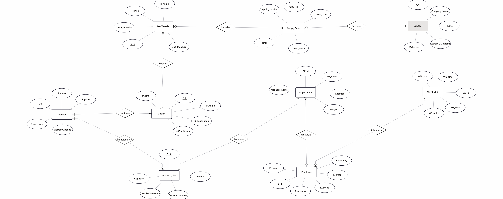

<b>📊 נירמול ותלויות פונקציונליות (BCNF)</b>

 
## 3. נירמול ותלויות פונקציונליות (Normalization & Functional Dependencies)

כל הטבלאות במערכת תוכננו כך שיעמדו ברמת נירמול **BCNF** (Boyce-Codd Normal Form). להלן פירוט התלויות והנירמול עבור כל סכמה:

### ישויות מרכזיות

* **Product (מוצר):**
    * **תלויות פונקציונליות:** $P\_id \rightarrow P\_name, P\_price, P\_weight, P\_date, D\_id, PL\_id$
    * **רמת נירמול:** BCNF.
    * **הסבר:** המפתח הראשי $P\_id$ הוא המכריע הפונקציונלי היחיד בטבלה. כל שאר השדות תלויים בו באופן מלא ואין תלויות טרנזיטיביות.

* **Employee (עובד):**
    * **תלויות פונקציונליות:** $E\_id \rightarrow E\_name, E\_familyName, E\_date, Role, DE\_id$
    * **רמת נירמול:** BCNF.
    * **הסבר:** כל פרטי העובד והמחלקה אליה הוא שייך נקבעים אך ורק לפי המזהה הייחודי $E\_id$.

* **Department (מחלקה):**
    * **תלויות פונקציונליות:** $DE\_id \rightarrow DE\_name, Location, Budget, Manager\_Name$
    * **רמת נירמול:** BCNF.
    * **הסבר:** אין שדות שאינם מפתחות שקובעים שדות אחרים (למשל, המיקום לא קובע את שם המחלקה).

* **SupplyOrder (הזמנת רכש):**
    * **תלויות פונקציונליות:** $Order\_id \rightarrow Order\_date, Total, Order\_status, Shipping\_Method, S\_id$
    * **רמת נירמול:** BCNF.
    * **הסבר:** למרות ש-$Total$ הוא אטריביוט נגזר, בבסיס הנתונים הפיזי הוא תלוי ב-$Order\_id$ בלבד.

* **Supplier (ספק):**
    * **תלויות פונקציונליות:** $S\_id \rightarrow Company\_Name, Phone, Address, Supplier\_MetaData$
    * **רמת נירמול:** BCNF.

* **Design, RawMaterial, Product_Line, Work_Ship:**
    * כל הטבלאות הללו נמצאות ב-BCNF מכיוון שלכל אחת מפתח ראשי יחיד ($D\_id, R\_id, PL\_id, WS\_id$ בהתאמה) המהווה את המכריע היחיד לכל שאר תכונות הישות.

---

### טבלאות קשר (Many-to-Many)

בטבלאות אלו המפתח מורכב משני שדות (Composite Primary Key).

* **Includes, Requires, Employee_WorkShip:**
    * **רמת נירמול:** BCNF.
    * **הסבר:** בטבלאות אלו אין תכונות נוספות מעבר למפתחות הזרים המרכיבים את המפתח הראשי. לכן, אין תלויות פונקציונליות שאינן טריוויאליות, והן עומדות בהגדרה המחמירה של BCNF.

---

### סיכום רמת הנירמול
המערכת כולה נמצאת ברמת נירמול **BCNF** מהסיבות הבאות:
1.  כל הטבלאות בנרמול ראשון (ערכים אטומיים, כולל שדות JSON המטופלים כאובייקט שלם).
2.  אין תלויות חלקיות (כל השדות תלויים במפתח הראשי במלואו).
3.  אין תלויות טרנזיטיביות (שדה שאינו מפתח לא קובע שדה אחר שאינו מפתח).
4.  לכל תלות פונקציונלית $X \rightarrow Y$, $X$ הוא מפתח-על (Superkey).

<b>📥 4. מימוש פיזי, מילוי נתונים וגיבוי המערכת </b>

 

<b>שיטת Python</b>

 

---

***💻 א. מימוש פיזי בבסיס הנתונים***
בשלב זה הפכנו את המודל הלוגי (ERD) לבסיס נתונים פיזי מתפקד בתוך סביבת המערכת ב-pgAdmin.

**תיאור המימוש:**
באמצעות ממשק ה-pgAdmin, הרצנו סקריפטים של SQL ליצירת הסכימה המלאה הכוללת את כל הטבלאות והקשרים. התמונה להלן מציגה את מבנה הטבלאות כפי שנוצרו:

* **אימות מימוש**: ניתן לראות כי כל הישויות שהוגדרו בתכנון נוצרו בהצלחה תחת הסכימה הציבורית (public).
* **אילוצים וקשרים**: המימוש כולל הגדרת מפתחות ראשיים (PK) ומפתחות זרים (FK) המבטיחים את שלמות הנתונים.

---

***🐍 ב. מילוי נתונים (Data Population) - אסטרטגיה וביצוע***

כדי לעמוד בדרישה של מעל **500 רשומות** בטבלאות המרכזיות ולשמור על דיוק מקצועי, בחרנו להשתמש באוטומציה של סקריפטים ב-Python. התהליך בוצע בסדר כרונולוגי מחייב כדי למנוע שגיאות של מפתחות זרים.

---

#### 🛠 שלב 1: יצירת תשתית המוצרים (`fill_products.py`)
בשלב הראשון כתבנו קוד Python שמייצר נתונים רנדומליים אך הגיוניים עבור המוצרים שלנו. הקוד יוצר קובץ SQL מוכן להרצה.

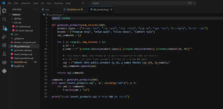

---

#### 🎨 שלב 2: יצירת פקודות ה-Insert
כאן ניתן לראות את קובץ ה-SQL שנוצר (`insert_products.sql`) עם פקודות ה-INSERT המוכנות. כללנו לוגיקה שיוצרת גם ערכי **NULL** באופן רנדומלי כדי לעמוד בדרישות הפרויקט לטיפול בנתונים חסרים.

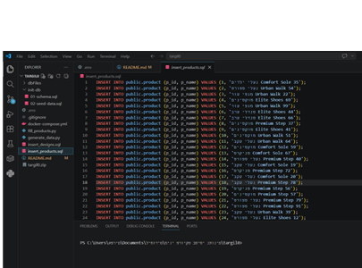

---

#### 🚀 שלב 3: ייבוא ואימות ב-pgAdmin
העתקנו את פקודות ה-Insert לתוך ה-Query Tool ב-**pgAdmin** והרצנו אותן כדי למלא את הטבלאות בפועל.

בסיום התהליך, ביצענו שאילתת **COUNT** על טבלת העיצובים (design) כדי לוודא שכל 500 הרשומות נקלטו בהצלחה בבסיס הנתונים.

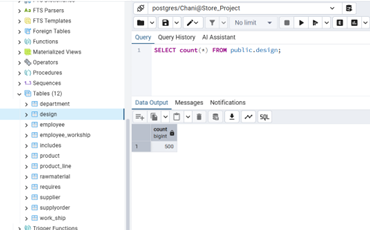

<b>שיטת Mockaroo (SQL Export) - טבלת Supplier</b>

 

בשיטה זו השתמשנו באתר [Mockaroo](https://www.mockaroo.com/) כדי למלא 500 רשומות לטבלת הספקים. זה עזר לנו לייצר נתונים שנראים אמיתיים בצורה מהירה ומדויקת.

**כך נראה התהליך שעשינו:**

**1. הגדרת הנתונים באתר:**
בצילום המסך אפשר לראות איך התאמנו את סוגי השדות (שם חברה, כתובת, טלפון) למבנה הטבלה שלנו. כדי לעמוד בדרישה של המטלה לערכים חסרים, הגדרנו אחוזי **Blank** (ערכי NULL) בשדות הטלפון והכתובת.

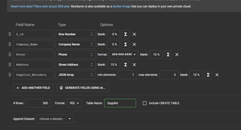

---

**2. בדיקת הנתונים לפני ההורדה:**
כאן אפשר לראות בתצוגה המקדימה שהאתר אכן ייצר נתונים בפורמט הנכון, כולל שמות חברות באנגלית ונתוני ה-JSON, מה שמוודא שהקובץ יהיה תקין לפני הייבוא.

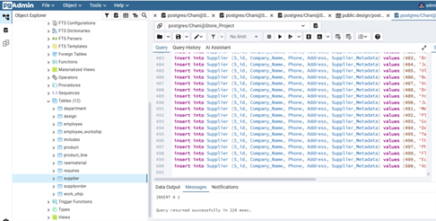

---

**3. שמירה וניהול ב-VS Code:**
הורדנו את הנתונים כקובץ SQL ושמרנו אותו בתיקיית הפרויקט שלנו. בתמונה רואים איך הקוד נראה בתוך ה-**VS Code** – שמירת הקובץ כאן מאפשרת לכל הבנות בצוות למשוך את הקובץ מה-GitHub ולהשתמש בו בבסיס הנתונים המקומי שלהן.

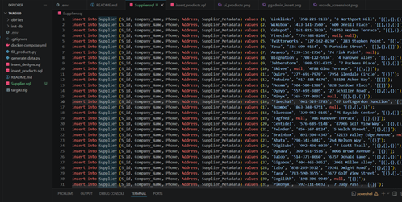

---

**4. הרצה ב-pgAdmin:**
העתקנו את פקודות ה-Insert מהקובץ והרצנו אותן ב-Query Tool. התמונה מראה את רגע ההרצה בתוך התוכנה והזנת הנתונים למחסן הנתונים הפיזי.

---

**5. התוצאה הסופית:**
בבדיקה בבסיס הנתונים אפשר לראות שהטבלה התמלאה ב-500 שורות. ניתן לראות בבירור את ערכי ה-**NULL** (השדות הריקים) שנוצרו רנדומלית, בדיוק לפי דרישות הפרויקט.

<b>שיטת Mockaroo (SQL Export) - טבלאות Product ו־Design</b>

כדי למלא 500 רשומות בטבלאות המרכזיות, השתמשנו באתר Mockaroo ליצירת נתונים אקראיים בצורה מהירה ואמינה.

בשלב הראשון הגדרנו את השדות בהתאם למבנה הטבלאות, ולאחר מכן ייצאנו את הנתונים בפורמט SQL.

את קובצי ה־SQL הרצנו ב־pgAdmin, וכך הוזנו הנתונים לטבלאות Product ו־Design.

לאחר ההרצה ביצענו בדיקת COUNT על מנת לוודא שכל הנתונים הוכנסו בהצלחה.

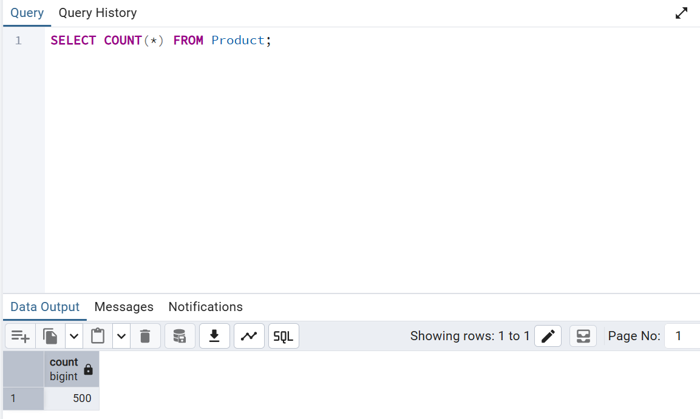

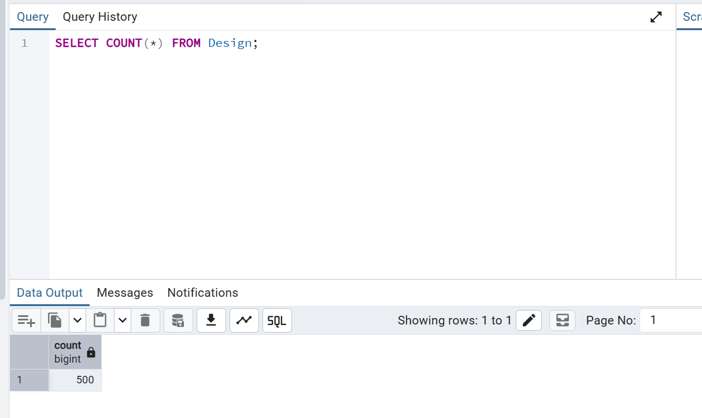

---

<b>שיטת SQL (Generate Series) - טבלת RawMaterial</b>

בטבלה זו השתמשנו בפקודת SQL מובנית של PostgreSQL בשם generate_series כדי ליצור כמות גדולה של נתונים בצורה אוטומטית.

בתחילה הוכנסו מספר רשומות ידניות לצורך בדיקה, ולאחר מכן בוצעה הכנסת נתונים אוטומטית באמצעות generate_series יחד עם פונקציות random ליצירת מחירים וכמויות.

השיטה אפשרה יצירה מהירה ויעילה של מעל 500 רשומות ללא שימוש בכלים חיצוניים.

לאחר ההרצה ביצענו בדיקת COUNT כדי לוודא שהנתונים הוכנסו בהצלחה.

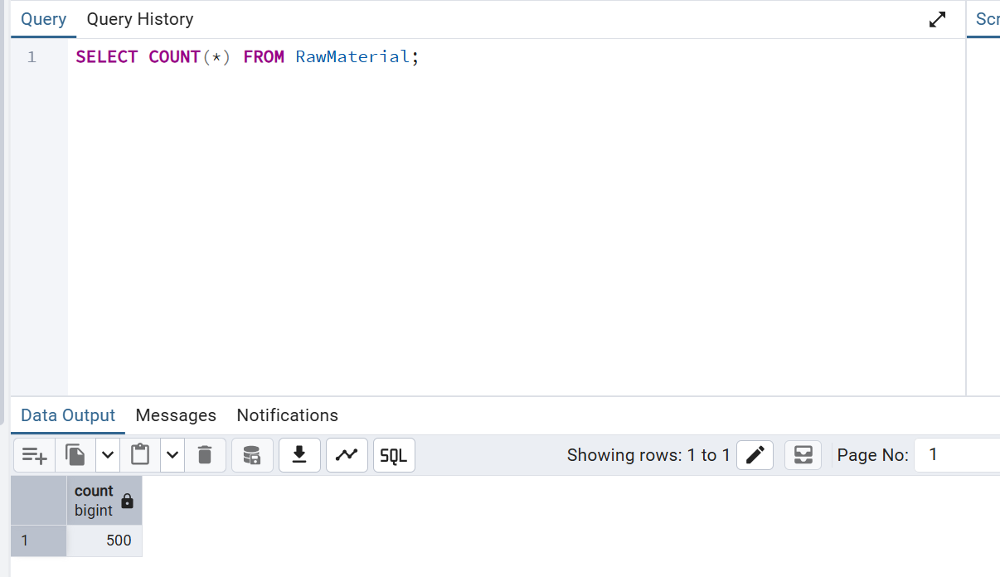

---

<b>טיפול בשגיאות (Data Integrity)</b>

במהלך העבודה נתקלנו במספר שגיאות אשר המחישו את חשיבות שלמות הנתונים במערכת.

בין השגיאות:

- Duplicate Key – הכנסת רשומה עם מזהה שכבר קיים
- JSON לא תקין
- NULL בשדה שמוגדר כ־NOT NULL
- Foreign Key Constraint – ניסיון למחוק רשומה שמקושרת לטבלה אחרת

שגיאות אלו סייעו לנו להבין את מגבלות המערכת ואת הקשרים בין הטבלאות.

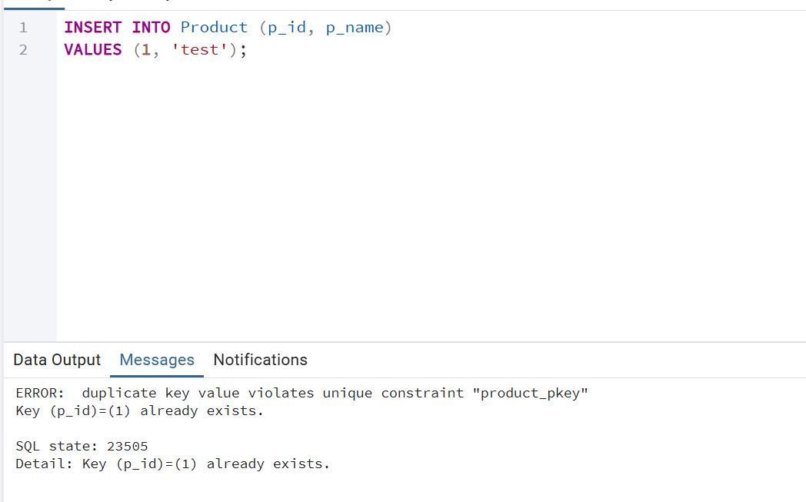

---

<b>גיבוי בסיס הנתונים (Backup)</b>

לאחר סיום מילוי הנתונים, ביצענו גיבוי מלא של בסיס הנתונים באמצעות pgAdmin.

הגיבוי נשמר בפורמט Custom כקובץ .backup, ומאפשר שחזור מלא של מבנה הנתונים והתוכן.

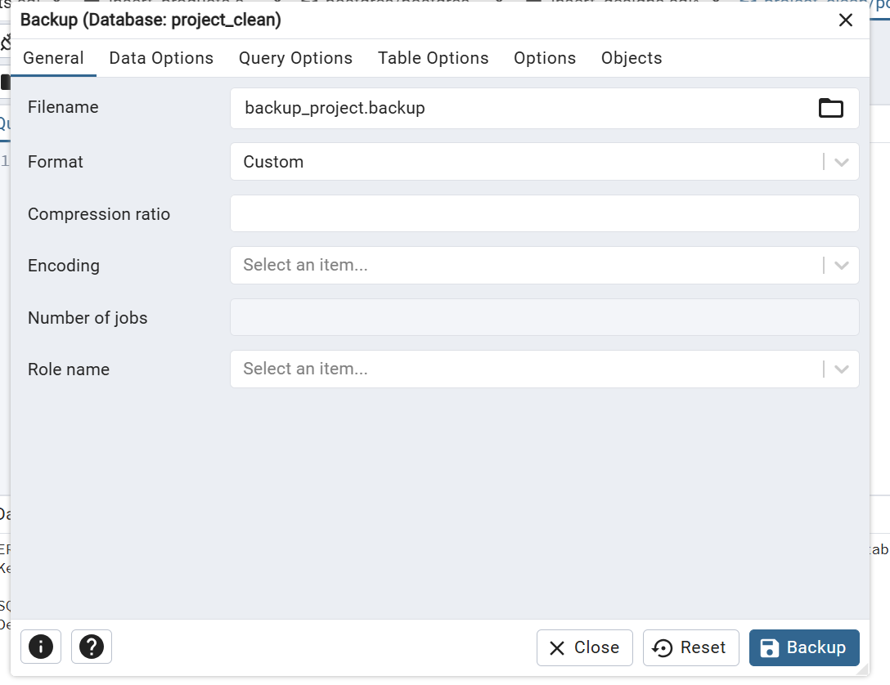

---

<b>שחזור בסיס הנתונים (Restore)</b>

כדי לוודא את תקינות הגיבוי, ביצענו תהליך שחזור.

נוצר בסיס נתונים חדש בשם test_restore, ולאחר מכן בוצע Restore מקובץ הגיבוי.

לאחר השחזור בוצעה בדיקת COUNT על טבלת Product, אשר הראתה כי כל הנתונים שוחזרו בהצלחה.

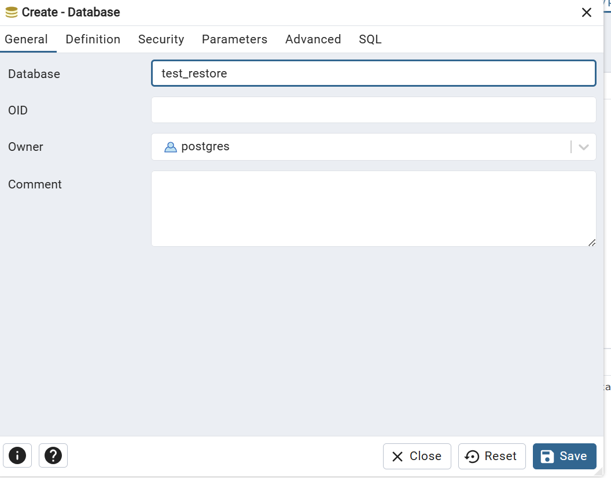

